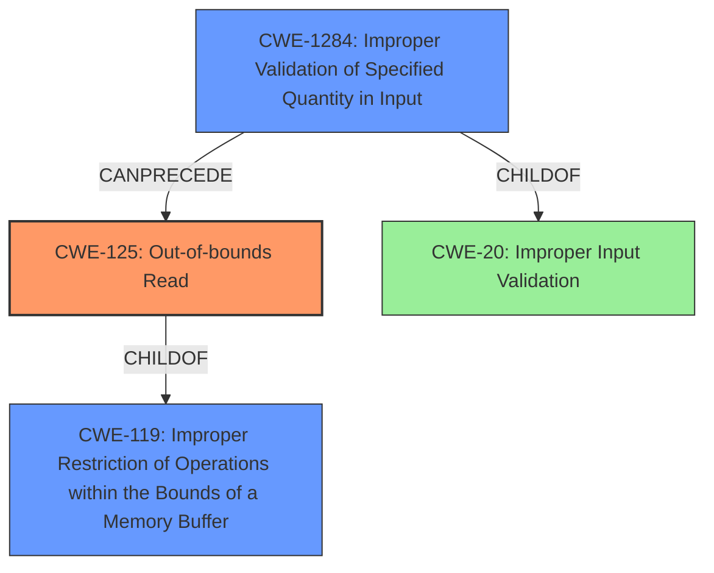

# Final Resolution for CVE-2021-46768

# Summary
| CWE ID   | CWE Name                                                    | Confidence | CWE Abstraction Level | CWE Vulnerability Mapping Label | CWE-Vulnerability Mapping Notes                                                                                                                                                                                                    |
| :------- | :---------------------------------------------------------- | :--------- | :-------------------- | :------------------------------ | :------------------------------------------------------------------------------------------------------------------------------------------------------------------------------------------------------------------------------- |
| CWE-125  | Out-of-bounds Read                                          | 0.9        | Base                  | Allowed                         | Primary CWE                                                                                                                                                                                                                        |
| CWE-1284 | Improper Validation of Specified Quantity in Input | 0.7        | Base                  | Allowed                        | Secondary Candidate - Specifically, the lack of validation of the *size* or *length* parameter is directly leading to the out-of-bounds read.                                                                      |
| CWE-20   | Improper Input Validation                                   | 0.6        | Class                 | Discouraged                         | Tertiary Candidate - CWE-1284 is a child of CWE-20.                                                                                                                                                                             |

## Evidence and Confidence

*   **Confidence Score:** 0.8
*   **Evidence Strength:** MEDIUM

## Relationship Analysis
The primary CWE is CWE-125 (**Out-of-bounds Read**) which is the direct result of the vulnerability. The secondary CWE is CWE-1284 (**Improper Validation of Specified Quantity in Input**), which describes the root cause, where the input is not validated for size or length. CWE-20 (**Improper Input Validation**) is a general class and less specific than CWE-1284.

## Vulnerability Chain
The vulnerability chain starts with **Improper Input Validation (CWE-20)**. A more specific case of this is **Improper Validation of Specified Quantity in Input (CWE-1284)**, where a size or length parameter is not validated. This leads to an **Out-of-bounds Read (CWE-125)**. The final impact is a potential denial of service.

## Summary of Analysis
The initial analysis correctly identified CWE-125 as the primary weakness, based on the vulnerability description stating "**Out-of-bounds memory reads** within the ASP boot loader due to improper input validation". The criticism suggested focusing on the type of input that is not being validated. The retriever results also suggested **CWE-1284 (Improper Validation of Specified Quantity in Input)**. I agree that this is a more specific root cause than CWE-20.

The graph relationships show that CWE-1284 is a child of CWE-20 and can precede CWE-125. Therefore, the final classification includes CWE-125 as the primary, CWE-1284 as the secondary, and CWE-20 as a tertiary.
These CWEs are at the optimal level of specificity because CWE-125 directly describes the out-of-bounds read, and CWE-1284 describes the specific type of input validation that is missing.