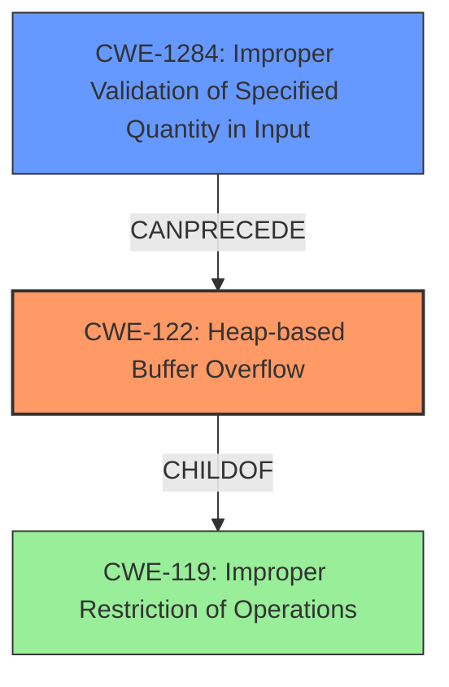

# Final Resolution for CVE-2021-46822

# Summary
| CWE ID | CWE Name | Confidence | CWE Abstraction Level | CWE Vulnerability Mapping Label | CWE-Vulnerability Mapping Notes |
|---|---|---|---|---|---|
| CWE-122 | Heap-based Buffer Overflow | 0.95 | Variant | Allowed | Primary CWE |
| CWE-1284 | Improper Validation of Specified Quantity in Input | 0.75 | Base | Allowed | Secondary Candidate |

## Evidence and Confidence

*   **Confidence Score:** 0.92
*   **Evidence Strength:** HIGH

## Relationship Analysis
The primary relationship is that CWE-122 (Heap-based Buffer Overflow) is a specific type of buffer overflow, making it a child of CWE-119 (Improper Restriction of Operations within the Bounds of a Memory Buffer). CWE-1284 (Improper Validation of Specified Quantity in Input) can precede a heap overflow by failing to validate input that determines the size of a buffer allocated on the heap. The abstraction levels influenced the choice, favoring the Variant (CWE-122) and Base (CWE-1284) levels for their specificity.

## Vulnerability Chain
The vulnerability chain starts with **CWE-1284 (Improper Validation of Specified Quantity in Input)**, where the input image size or format is not properly validated. This leads to **CWE-122 (Heap-based Buffer Overflow)** when an oversized buffer is allocated on the heap based on the unvalidated input, and data is written beyond the buffer's boundaries, resulting in a crash. The root cause is the missing input validation, and the impact is a heap-based buffer overflow.

## Summary of Analysis
The initial analysis correctly identified **CWE-122 (Heap-based Buffer Overflow)** as the primary **weakness**, supported by the explicit mention in the vulnerability description: "heap-based buffer overflow in the `get_word_rgb_row` function." The criticism's suggestion to explicitly state why other CWEs are not the best fit is valid. While **CWE-787 (Out-of-bounds Write)** is a parent, **CWE-122 (Heap-based Buffer Overflow)** is more specific. The mapping guidance for CWE-122 indicates that it is ALLOWED as it is a Variant level of abstraction.

The initial analysis also identified **CWE-1284 (Improper Validation of Specified Quantity in Input)** as a secondary candidate due to the "Lack of Input Validation," where the code does not check the compatibility between input color spaces and bit depths. The criticism suggested strengthening the connection between "specified quantity" and image size/format, which is a valid point. The image dimensions or the size of the data buffer are not validated against the image type or format, which can be considered a specified quantity. The analysis could also mention that the source data explicitly notes that the fix also includes throwing errors for out-of-range values in the input stream. The mapping guidance for CWE-1284 indicates that it is ALLOWED.

The confidence in CWE-1284 has been slightly increased to 0.75 because the fix includes explicitly throwing errors for out-of-range values in the input stream.

The selected CWEs are at the optimal level of specificity because **CWE-122 (Heap-based Buffer Overflow)** directly describes the type of buffer overflow, and **CWE-1284 (Improper Validation of Specified Quantity in Input)** identifies the lack of input validation as a contributing factor.