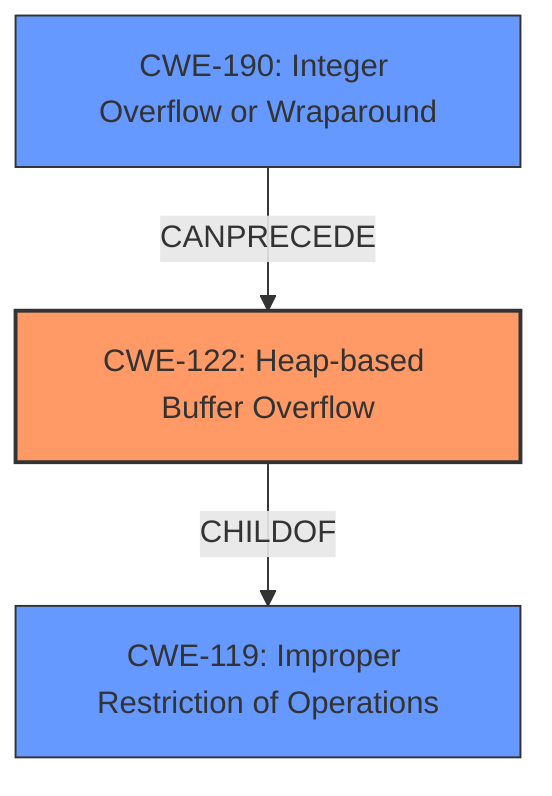

# Analysis Report for CVE-2021-46829

# Vulnerability Analysis Report: CVE-2021-46829

## Description

GNOME GdkPixbuf (aka GDK-PixBuf) before 2.42.8 allows a heap-based buffer overflow when compositing or clearing frames in GIF files, as demonstrated by io-gif-animation.c composite_frame. This overflow is controllable and could be abused for code execution, especially on 32-bit systems.

## Vulnerability Description Key Phrases

**Weakness:** heap-based buffer overflow
**Impact:** code execution
**Vector:** compositing or clearing frames in GIF files
**Product:** GNOME GdkPixbuf
**Version:** before 2.42.8

## Analysis (with Relationship Data)

```markdown
# Summary 
| CWE ID | CWE Name | Confidence | CWE Abstraction Level | CWE Vulnerability Mapping Label | CWE-Vulnerability Mapping Notes |
|---|---|---|---|---|---|
| CWE-122 | Heap-based Buffer Overflow | 0.95 | Variant | Primary | Allowed |
| CWE-190 | Integer Overflow or Wraparound | 0.75 | Base | Secondary Candidate | Allowed |

## Evidence and Confidence

*   **Confidence Score:** 0.85
*   **Evidence Strength:** HIGH

- **Analysis and Justification:**  
  - *Explanation:* The vulnerability description clearly states "**heap-based buffer overflow**" and the CVE Reference Links Content Summary confirms that a heap buffer overflow vulnerability exists in the `composite_frame()` function within `io-gif-animation.c` of the `gdk-pixbuf` library. The description notes that an incorrect offset calculation leads to writing data beyond the allocated buffer, causing the overflow. This aligns directly with CWE-122 (Heap-based Buffer Overflow). The MITRE mapping guidance for CWE-122 designates it as ALLOWED, reinforcing its appropriateness. Furthermore, the CVE Reference Links Content Summary mentions that the overflow is controllable and could be abused for code execution, especially on 32-bit systems.
  
  - *Relationship Analysis:* CWE-122 is a variant of a buffer overflow, specifying its location in the heap. It is related to other buffer overflow CWEs but is the most specific match given the "heap-based" nature of the vulnerability. It is a child of CWE-119 (Improper Restriction of Operations within the Bounds of a Memory Buffer).

- **Confidence Score:**  
  - Confidence: 0.95 (High evidence from technical description and CVE reference materials)

---

- **Analysis and Justification:**  
  - *Explanation:* The CVE Reference Links Content Summary describes a **signed integer overflow** in the calculation of the `offset` variable. When the calculated offset exceeds `INT32_MAX`, it wraps around to a negative value. This aligns with CWE-190 (Integer Overflow or Wraparound). While the primary issue is the heap overflow, the integer overflow is a contributing factor that leads to the out-of-bounds write. The MITRE mapping guidance for CWE-190 designates it as ALLOWED, reinforcing its appropriateness.
  
  - *Relationship Analysis:* CWE-190 is a base weakness and is related to other numeric errors but accurately reflects the signed integer overflow in the offset calculation. It can precede CWE-122 because the integer overflow contributes to the heap overflow.

- **Confidence Score:**  
  - Confidence: 0.75 (Medium evidence from technical description of the signed integer overflow contributing to the heap overflow.)
```

## Criticism of Analysis

Okay, let's review the CWE analysis provided, considering the full CWE specifications.

**Overall Assessment:**

The analysis correctly identifies CWE-122 (Heap-based Buffer Overflow) as the primary vulnerability. The supporting information and reasoning are sound. The identification of CWE-190 (Integer Overflow or Wraparound) as a secondary candidate is also justifiable, as it is a contributing factor to the buffer overflow. The confidence scores are reasonable.

**Detailed Critique:**

**1. CWE-122: Heap-based Buffer Overflow**

*   **Assessment:** Correct and well-supported.
*   **Confidence:** Justified at 0.95. The vulnerability description explicitly mentions "heap-based buffer overflow." The CVE Reference Links Content Summary provides further technical details confirming the overflow occurs in the heap.
*   **Abstraction Level:** Variant, which is appropriate according to the mapping guidance.
*   **CWE Vulnerability Mapping Label:** Primary is accurate.
*   **CWE-Vulnerability Mapping Notes:** "Allowed" is correct, as the Variant level of abstraction is preferred.
*   **Relationship Analysis:** The relationship analysis correctly identifies CWE-122 as a child of CWE-119 and explains the specialization to the heap.
*   **CWE Examples:** The examples provided from the CWE database are relevant and help illustrate how CWE-122 manifests in different scenarios. CVE-2021-43537 and CVE-2007-4268 illustrate chains involving Integer issues and heap overflow, similar to the analyzed vulnerability.
*   **Mitigations:**
    *   The analysis could benefit from mentioning specific mitigation strategies from the CWE specification. For instance, using memory-safe languages or libraries (as suggested in Mitigation 1 and 2) would help to avoid the vulnerability. Mentioning compiler-based buffer overflow detection mechanisms from Mitigation 3 could also be valuable.

**2. CWE-190: Integer Overflow or Wraparound**

*   **Assessment:** Correctly identified as a contributing factor.
*   **Confidence:** Justified at 0.75. The integer overflow is mentioned in the CVE Reference Links Content Summary. While not the primary vulnerability, it contributes to the incorrect offset calculation, leading to the heap overflow.
*   **Abstraction Level:** Base, which is appropriate according to the mapping guidance.
*   **CWE Vulnerability Mapping Label:** Secondary Candidate is accurate.
*   **CWE-Vulnerability Mapping Notes:** "Allowed" is correct, as the Base level of abstraction is preferred.
*   **Relationship Analysis:** The explanation of how the integer overflow contributes to the heap overflow is accurate. It correctly identifies that it can precede CWE-122 in the chain of events.
*   **CWE Examples:** The examples provided from the CWE database accurately represent instances where CWE-190 acts as a precursor to other vulnerabilities. Specifically, CVE-2021-43537 highlights the integer overflow's potential to cause heap corruption, like in the analyzed scenario.
*   **Mitigations:**
    *   The analysis could benefit from mentioning specific mitigation strategies from the CWE specification. Using safe integer handling packages is very important. Ensuring clearly defined protocols and bounds would be helpful.

**Additional Considerations and Potential Improvements:**

*   **CWE-119: Improper Restriction of Operations within the Bounds of a Memory Buffer:** While CWE-119 is discouraged for direct mapping, mentioning it in the *Relationship Analysis* for CWE-122 could be beneficial. It highlights that CWE-122 is a specific type of buffer overflow.
*   **CWE-1284: Improper Validation of Specified Quantity in Input:** While the analysis doesn't include this, it's worth considering. The crafted GIF could be seen as providing a specified quantity (e.g., dimensions, size) that isn't properly validated, which ultimately leads to the overflow. However, this is a weaker argument than the integer overflow, so the current analysis is reasonable in omitting it. If it were included, the confidence would be lower.
*   **Chaining:** Explicitly stating the chain of events in terms of CWEs would increase clarity.  For example: `CWE-20 (Improper Input Validation) -> CWE-190 (Integer Overflow) -> CWE-122 (Heap-based Buffer Overflow)`.  Note that input validation is present, since the dimensions are not checked to see if they'd cause an overflow.

**Summary of Suggested Changes:**

*   In the *Mitigations* sections for both CWE-122 and CWE-190, include specific, actionable mitigation strategies listed in the CWE specifications.
*   Consider adding CWE-119 to the Relationship Analysis for CWE-122.
*   Consider adding a chain of events to the summary table.

By incorporating these suggestions, the analysis will be even more thorough and useful. The existing analysis is already quite good.

## Final Resolution

# Summary
| CWE ID | CWE Name | Confidence | CWE Abstraction Level | CWE Vulnerability Mapping Label | CWE-Vulnerability Mapping Notes |
|---|---|---|---|---|---|
| CWE-122 | Heap-based Buffer Overflow | 0.95 | Variant | Primary | Allowed |
| CWE-190 | Integer Overflow or Wraparound | 0.75 | Base | Secondary Candidate | Allowed |

## Evidence and Confidence

*   **Confidence Score:** 0.9
*   **Evidence Strength:** HIGH

## Relationship Analysis
The primary relationship influencing the classification is the chain relationship where **CWE-190** Integer Overflow can precede **CWE-122** Heap-based Buffer Overflow. This is because the integer overflow leads to an incorrect size calculation, which then results in the heap overflow. **CWE-122** is a child of **CWE-119** Improper Restriction of Operations within the Bounds of a Memory Buffer, providing a hierarchical context.



## Vulnerability Chain
The vulnerability chain starts with potentially **CWE-20** (Improper Input Validation) because the GIF dimensions may not be validated. Then, **CWE-190** (**Integer Overflow or Wraparound**) occurs during the calculation of the offset, leading to an incorrect size. Finally, this incorrect size results in **CWE-122** (**Heap-based Buffer Overflow**) when writing data to the heap buffer.

## Summary of Analysis
The initial analysis and criticism both agree on the primary and secondary CWEs. The vulnerability description states "heap-based buffer overflow" which aligns directly with **CWE-122**. The CVE Reference Links Content Summary confirms the heap buffer overflow in the `composite_frame()` function. The integer overflow in the offset calculation, as described in the CVE Reference Links Content Summary, supports the inclusion of **CWE-190**.

The graph relationships confirm that **CWE-122** is the most specific CWE for a heap-based buffer overflow, being a variant of **CWE-119**. The **CANPRECEDE** relationship between **CWE-190** and **CWE-122** demonstrates the correct order of events.

The selected CWEs are at the optimal level of specificity because **CWE-122** accurately describes the type of buffer overflow, and **CWE-190** highlights the root cause of the incorrect size calculation that leads to the overflow. The evidence provided strongly supports these classifications.


*Report generated on 2025-03-18 05:20:25*
