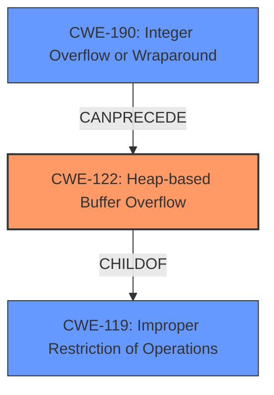

# Final Resolution for CVE-2021-46829

# Summary
| CWE ID | CWE Name | Confidence | CWE Abstraction Level | CWE Vulnerability Mapping Label | CWE-Vulnerability Mapping Notes |
|---|---|---|---|---|---|
| CWE-122 | Heap-based Buffer Overflow | 0.95 | Variant | Primary | Allowed |
| CWE-190 | Integer Overflow or Wraparound | 0.75 | Base | Secondary Candidate | Allowed |

## Evidence and Confidence

*   **Confidence Score:** 0.9
*   **Evidence Strength:** HIGH

## Relationship Analysis
The primary relationship influencing the classification is the chain relationship where **CWE-190** Integer Overflow can precede **CWE-122** Heap-based Buffer Overflow. This is because the integer overflow leads to an incorrect size calculation, which then results in the heap overflow. **CWE-122** is a child of **CWE-119** Improper Restriction of Operations within the Bounds of a Memory Buffer, providing a hierarchical context.

## Vulnerability Chain
The vulnerability chain starts with potentially **CWE-20** (Improper Input Validation) because the GIF dimensions may not be validated. Then, **CWE-190** (**Integer Overflow or Wraparound**) occurs during the calculation of the offset, leading to an incorrect size. Finally, this incorrect size results in **CWE-122** (**Heap-based Buffer Overflow**) when writing data to the heap buffer.

## Summary of Analysis
The initial analysis and criticism both agree on the primary and secondary CWEs. The vulnerability description states "heap-based buffer overflow" which aligns directly with **CWE-122**. The CVE Reference Links Content Summary confirms the heap buffer overflow in the `composite_frame()` function. The integer overflow in the offset calculation, as described in the CVE Reference Links Content Summary, supports the inclusion of **CWE-190**.

The graph relationships confirm that **CWE-122** is the most specific CWE for a heap-based buffer overflow, being a variant of **CWE-119**. The **CANPRECEDE** relationship between **CWE-190** and **CWE-122** demonstrates the correct order of events.

The selected CWEs are at the optimal level of specificity because **CWE-122** accurately describes the type of buffer overflow, and **CWE-190** highlights the root cause of the incorrect size calculation that leads to the overflow. The evidence provided strongly supports these classifications.