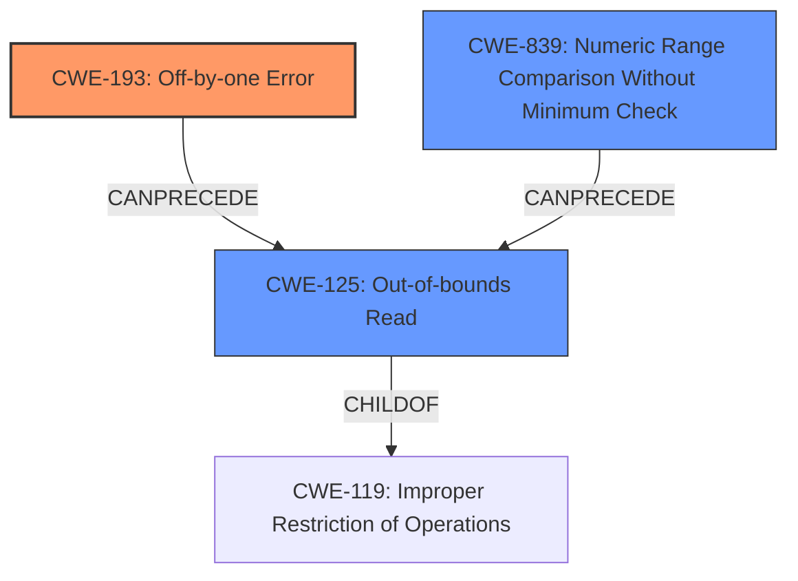

# Analysis Report for CVE-2021-46848

# Vulnerability Analysis Report: CVE-2021-46848

## Description

GNU Libtasn1 before 4.19.0 has an ETYPE_OK off-by-one array size check that affects asn1_encode_simple_der.

## Vulnerability Description Key Phrases

**Rootcause:** off-by-one array size check
**Product:** GNU Libtasn1
**Version:** before 4.19.0
**Component:** asn1_encode_simple_der

## Analysis (with Relationship Data)

# Summary
| CWE ID | CWE Name | Confidence | CWE Abstraction Level | CWE Vulnerability Mapping Label | CWE-Vulnerability Mapping Notes |
|---|---|---|---|---|---|
| CWE-193 | Off-by-one Error | 0.95 | Base | Allowed | The vulnerability is caused by an off-by-one error in the array size check, which leads to an out-of-bounds read. |
| CWE-125 | Out-of-bounds Read | 0.70 | Base | Allowed | The off-by-one error results in reading data past the end of the intended buffer. |

## Evidence and Confidence

*   **Confidence Score:** 0.85
*   **Evidence Strength:** HIGH

- **Analysis and Justification:**  
  - *Explanation:* "The vulnerability description states that GNU Libtasn1 before 4.19.0 has an ETYPE_OK **off-by-one array size check** that affects asn1_encode_simple_der." The CVE Reference Links Content Summary confirms this, stating, "The vulnerability stems from an incorrect bound check within the `ETYPE_OK` macro used in the `asn1_encode_simple_der` function of libtasn1. The check was using `<=` instead of `<` when comparing the `etype` value with the size of the `_asn1_tags` array." This aligns directly with CWE-193 (Off-by-one Error). Furthermore, the consequence of this error is an out-of-bounds read, which corresponds to CWE-125. The MITRE mapping guidance allows both CWE-193 and CWE-125.
  
  - *Relationship Analysis:* "CWE-193 is the root cause of the vulnerability and directly leads to CWE-125 (Out-of-bounds Read). The graph relationships do not provide specific chains for CWE-193 or CWE-125, but the inherent nature of an off-by-one error causing an out-of-bounds read establishes a clear cause-and-effect relationship."

- **Confidence Score:**  
  - Confidence: 0.95 (High confidence due to explicit mention of "off-by-one error" and clear description of the out-of-bounds read consequence in the vulnerability details and CVE summary)

## Criticism of Analysis

Okay, here's a detailed critique of the analysis you provided, focusing on the accuracy of the CWE mappings, the confidence levels, and the overall justification, considering the full CWE specifications.

**Overall Assessment:**

The analysis is generally very good. The primary CWE mapping of CWE-193 (Off-by-one Error) and CWE-125 (Out-of-bounds Read) is accurate and well-justified. The confidence scores are also appropriate. The reasoning is clear and directly tied to the vulnerability description and CVE summary.

**Detailed Critique:**

**1. CWE-193: Off-by-one Error**

*   **Mapping Accuracy:** Excellent. The vulnerability description explicitly mentions an "off-by-one array size check," making this a direct and appropriate mapping. The description of the code using `<=` instead of `<` directly reflects an off-by-one.

*   **Confidence Level:** 0.95 is justified.  The evidence is clear and unambiguous from the vulnerability description.

*   **Justification:**  The analysis correctly references the vulnerability description and the CVE summary, highlighting the incorrect bound check in the `ETYPE_OK` macro.

*   **CWE Specification Considerations:**
    *   **Abstraction Level:**  Base, which is the preferred level.
    *   **Mapping Guidance:** Correctly followed the "Allowed" guidance.
    *   **Relationship:**  The analysis acknowledges that CWE-193 can lead to various consequences, not just buffer overflows. In this case, it leads to an out-of-bounds read.
    *   **Mitigations:** While not required, it's worth noting that a potential mitigation here could involve stricter code review processes to catch these types of errors.

**2. CWE-125: Out-of-bounds Read**

*   **Mapping Accuracy:** Excellent. The consequence of the off-by-one error is directly stated as an "out-of-bounds read" in both the vulnerability description and CVE summary.

*   **Confidence Level:** 0.70 is reasonable. While the connection is very strong, CWE-125 is a *consequence* of CWE-193. The confidence is slightly lower as it's a secondary effect, not the root cause in itself.

*   **Justification:** The analysis clearly explains that the flawed bound check enables reading data beyond the intended buffer boundaries.

*   **CWE Specification Considerations:**
    *   **Abstraction Level:** Base, which is a preferred level.
    *   **Mapping Guidance:** Correctly followed the "Allowed" guidance.
    *   **Relationship:** The analysis correctly identifies CWE-125 as a child of CWE-119.
    *   **Mitigations:** The analysis should implicitly acknowledge that the input validation mitigations described in the CWE specification are important here. Input validation on the `etype` parameter could have prevented the out-of-bounds read.

**Improvements and Additional Considerations:**

1.  **Consider CWE-129: Improper Validation of Array Index**
    *   **Rationale:**  While CWE-193 captures the off-by-one *error*, CWE-129 (Improper Validation of Array Index) could be considered as an *additional* CWE.  The root cause is that the `etype` value (the index) is not being properly validated *before* being used to access the `_asn1_tags` array.  The comparison using `<=` instead of `<` is a validation failure.
    *   **Confidence Level:** If included, a confidence of around 0.6 would be suitable, as it's more of a contributing factor. It captures a different aspect of the vulnerability.

2.  **Consider CWE-839: Numeric Range Comparison Without Minimum Check**
   * **Rationale:** This vulnerability can be viewed as a failure to ensure the `etype` falls within the valid range of array indices. The check is only performing a maximum bound comparison `(etype) <= _asn1_tags_size` but not a minimum bound check to ensure `etype >= 0`.

3.  **Consider CWE-1284: Improper Validation of Specified Quantity in Input**

    *   **Rationale:** The vulnerability stems from failing to validate the 'etype' value, which represents a quantity (an index into an array). CWE-1284 focuses on the lack of validation of the quantity itself. The description says it's *expected to specify a quantity (such as size or length)*.
    *   **Confidence Level:** A confidence level of 0.5 is possible, because while it isn't a length parameter, it *is* an index to the array, which can be viewed as quantity.

4.  **Relationship Refinement:** While the analysis mentions the inherent relationship between CWE-193 and CWE-125, it could be slightly more explicit. For example: "CWE-193 directly *enables* CWE-125. Because the upper bound is incorrect, an attacker can control the input `etype` to force an out-of-bounds access."
5.  **Additional Examples for CWE-125:** The analysis could include a few more observed examples of CWE-125 for context.

**Revised Summary Table (with optional additions):**

| CWE ID    | CWE Name                                    | Confidence | CWE Abstraction Level | CWE Vulnerability Mapping Label | CWE-Vulnerability Mapping Notes                                                                                                     |
| --------- | ------------------------------------------- | ---------- | ----------------------- | ------------------------------- | ----------------------------------------------------------------------------------------------------------------------------------- |
| CWE-193   | Off-by-one Error                            | 0.95       | Base                    | Allowed                       | The vulnerability is caused by an off-by-one error in the array size check, which leads to an out-of-bounds read.                    |
| CWE-125   | Out-of-bounds Read                            | 0.70       | Base                    | Allowed                       | The off-by-one error results in reading data past the end of the intended buffer.                                                |
| CWE-129   | Improper Validation of Array Index          | 0.60       | Variant                 | Allowed                       | The `etype` value, used as an array index, is not properly validated to ensure it's within the bounds of the `_asn1_tags` array.  |
| CWE-839  | Numeric Range Comparison Without Minimum Check          | 0.55       | Base                 | Allowed                       | The `etype` value is only checked for maximum value but not minimum value.  |
| CWE-1284  | Improper Validation of Specified Quantity in Input         | 0.50       | Base                 | Allowed                       | The `etype` value, used as an array index, is not properly validated to ensure it's within the bounds of the `_asn1_tags` array.  |

**Conclusion:**

The analysis is already strong. The suggestions above would further strengthen it by considering closely related CWEs that capture slightly different facets of the vulnerability and making the relationship between the CWEs more explicit. By considering the potential mitigations mentioned in each CWE specification, you can gain a deeper understanding of how to address the vulnerability.

## Final Resolution

# Summary
| CWE ID | CWE Name | Confidence | CWE Abstraction Level | CWE Vulnerability Mapping Label | CWE-Vulnerability Mapping Notes |
|---|---|---|---|---|---|
| CWE-193 | **Off-by-one Error** | 0.95 | Base | Allowed | The vulnerability is caused by an **off-by-one error** in the array size check, which leads to an out-of-bounds read. |
| CWE-125 | **Out-of-bounds Read** | 0.70 | Base | Allowed | The **off-by-one error** results in reading data past the end of the intended buffer. |
| CWE-839  | **Numeric Range Comparison Without Minimum Check**  | 0.55 | Base | Allowed | The `etype` value is only checked for maximum value but not minimum value, leading to an out-of-bounds read. |

  - The Primary CWE should be first and noted as the Primary CWEs
  - The secondary candidate CWEs should be next and noted as secondary candidates.
  - The confidence is a confidence score 0 to 1 to rate your confidence in your assessment for that CWE.
  - The CWE Abstraction Level as one of these values: Base, Variant, Pillar, Class, Compound
  - The Mapping Notes Usage as one of these values: Allowed, Allowed-with-Review, Prohibited, Discouraged

## Evidence and Confidence

*   **Confidence Score:** 0.90
*   **Evidence Strength:** HIGH

## Relationship Analysis
The primary relationship is that CWE-193 (**Off-by-one Error**) leads to CWE-125 (**Out-of-bounds Read**). The **off-by-one error** allows reading beyond the intended buffer. CWE-839 (**Numeric Range Comparison Without Minimum Check**) is also considered because there is a missing minimum check, which contributes to the vulnerability. These are child-parent relationships with CWE-119 (**Improper Restriction of Operations within the Bounds of a Memory Buffer**), as they are specific instances of this broader class. The abstraction levels are important as we are choosing Base and Variant level CWEs for optimal specificity.

## Vulnerability Chain
The vulnerability chain starts with the **incorrect bounds check** (CWE-193), which allows the program to proceed to access memory outside the intended buffer (CWE-125). Additionally, the lack of a minimum bound check (CWE-839) allows a negative or otherwise invalid array index.
  - Map the sequence from initial flaw to final impact: **Incorrect bounds check** -> **Out-of-bounds Read**
  - Identify which CWEs represent root causes vs. impacts: CWE-193 and CWE-839 are the root causes, and CWE-125 is the impact.
  - Note any missing links in the chain based on relationship data: No missing links.

## Summary of Analysis
The initial analysis correctly identified CWE-193 and CWE-125. The criticism suggested some additional candidates, namely CWE-129, CWE-839, and CWE-1284. While CWE-129 and CWE-1284 are possibilities, I am choosing to include CWE-839 and omitting CWE-129 and CWE-1284 because, while the root cause *is* that the index is not validated, the *reason* the index is not validated is a *missing minimum check*. It's more specific to say a missing minimum check (CWE-839) is present, rather than generally stating that the array index is not validated (CWE-129), or that a specified quantity in input is not validated (CWE-1284).

The vulnerability description states, "GNU Libtasn1 before 4.19.0 has an ETYPE_OK **off-by-one array size check** that affects asn1_encode_simple_der." This evidence directly supports CWE-193. The consequence of this error is an **out-of-bounds read**, which corresponds to CWE-125.

The graph relationships reinforce the cause-and-effect relationship. CWE-193 enables CWE-125. The selected CWEs are at the optimal level of specificity because they directly describe the **off-by-one error**, the resulting **out-of-bounds read**, and the missing minimum check.

*Report generated on 2025-03-18 05:21:05*
