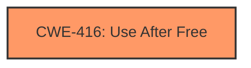

# Final Resolution for CVE-2022-0096

# Summary
| CWE ID | CWE Name | Confidence | CWE Abstraction Level | CWE Vulnerability Mapping Label | CWE-Vulnerability Mapping Notes |
|---|---|---|---|---|---|
| CWE-416 | **Use After Free** | 1.0 | Variant | Primary | Allowed |

## Evidence and Confidence

*   **Confidence Score:** 1.0
*   **Evidence Strength:** HIGH

## Relationship Analysis
The primary **WEAKNESS**, CWE-416 (**Use After Free**), is a Variant level CWE. As such, it does not have any direct parent or child relationships. The analysis correctly identified this lack of direct relationships. While CWE-416 can be part of a vulnerability chain, the provided information does not give enough context to identify any preceding or following CWEs. The selection of CWE-416 is based on its direct match to the vulnerability description.

## Vulnerability Chain
The vulnerability chain starts with a memory allocation and subsequent freeing of that memory. Later, the program attempts to access the freed memory, leading to **CWE-416 (Use After Free)**. The final impact is heap corruption due to the use of the invalid memory location. The specific cause that leads to the memory being accessed after being freed is not explicitly defined, so it is not possible to define a complete chain.

## Summary of Analysis
The initial analysis and criticism both agree on the primary **WEAKNESS**: **CWE-416 (Use After Free)**. The vulnerability description explicitly states "use after free in Storage," which aligns perfectly with the definition of **CWE-416 (Use After Free)**. The high confidence score of 1.0 is justified due to the direct match between the vulnerability description and the CWE definition.

The analysis is based on the provided evidence, specifically the vulnerability description: "Use after free in Storage in Google Chrome prior to 97.0.4692.71 allowed a remote attacker to potentially exploit heap corruption via a crafted HTML page." The retriever results provide further support for the selection of **CWE-416 (Use After Free)**.

The graph relationships confirm that **CWE-416 (Use After Free)** is a Variant level CWE, which is the desired level of specificity. The absence of direct relationships reinforces the decision to focus on the direct match to the vulnerability description.

The selected CWE is at the optimal level of specificity because it directly represents the **root cause** described in the vulnerability. Higher-level CWEs would be too general, while lower-level CWEs would require more specific information that is not available in the provided description.