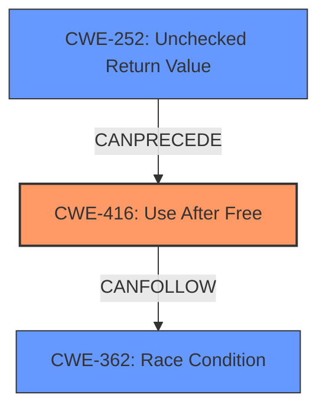

# Final Resolution for CVE-2022-0099

# Summary
| CWE ID | CWE Name | Confidence | CWE Abstraction Level | CWE Vulnerability Mapping Label | CWE-Vulnerability Mapping Notes |
|---|---|---|---|---|---|
| CWE-416 | Use After Free | 1.0 | Variant | Allowed | Primary CWE |
| CWE-362 | Concurrent Execution using Shared Resource with Improper Synchronization ('Race Condition') | 0.3 | Class | Allowed-with-Review | Secondary Candidate: Possible contributing factor, requires further investigation. |
| CWE-252 | Unchecked Return Value | 0.2 | Base | Allowed | Secondary Candidate: Possible contributing factor, requires further investigation. |

## Evidence and Confidence

*   **Confidence Score:** 0.9
*   **Evidence Strength:** MEDIUM

## Relationship Analysis
The primary relationship considered was the direct match of the vulnerability description to **CWE-416 (Use After Free)**. However, the criticism prompted consideration of other potential contributing factors. The possibility of **CWE-362 (Race Condition)** was evaluated due to the nature of user gestures potentially leading to concurrent operations. **CWE-252 (Unchecked Return Value)** was also considered as a potential precursor to the UAF, where a failed memory operation might not have been properly handled. These relationships are considered as potential contributing factors, not as the primary cause. The abstraction levels were also considered, favoring the Variant level for the primary **CWE-416** and Base level for **CWE-252**. **CWE-362** is a Class, and ideally a more specific child would be selected, but given the limited evidence, the Class level is deemed sufficient for a secondary candidate.

## Vulnerability Chain
The vulnerability chain starts with a potential **rootcause** like an **unchecked return value (CWE-252)** from a memory allocation or deallocation function. This could lead to memory being freed prematurely or incorrectly. If a race condition (**CWE-362**) exists where another thread attempts to access this freed memory, it results in a **use-after-free vulnerability (CWE-416)**. The final impact is potential heap corruption, as stated in the vulnerability description. Missing links include concrete evidence of the race condition or the unchecked return value in the specific code.

## Summary of Analysis
The initial analysis correctly identified **CWE-416 (Use After Free)** as the primary weakness, supported by the vulnerability description stating "use after free." The criticism suggested considering related CWEs. While the primary mapping remains **CWE-416** with high confidence, the possibility of contributing factors such as **CWE-362 (Race Condition)** and **CWE-252 (Unchecked Return Value)** were considered. The decision is based on the provided evidence, which directly points to a use-after-free condition. The relationships between CWEs and the abstraction levels were also factored in. The selected CWEs are at the optimal level of specificity given the available evidence. While a more specific CWE than **CWE-362** would be ideal if a race condition were confirmed, the lack of concrete evidence justifies using the Class level for now. The final decision emphasizes the direct evidence of **CWE-416** while acknowledging the potential for contributing factors suggested by the criticism.