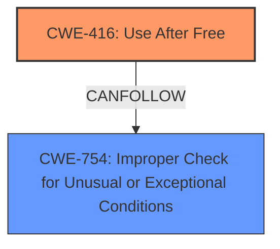

# Final Resolution for CVE-2022-0105

# Summary
| CWE ID | CWE Name | Confidence | CWE Abstraction Level | CWE Vulnerability Mapping Label | CWE-Vulnerability Mapping Notes |
|---|---|---|---|---|---|
| CWE-416 | Use After Free | 1.0 | Variant | Allowed | Primary CWE |
| CWE-754 | Improper Check for Unusual or Exceptional Conditions | 0.4 | Class | Allowed-with-Review | Secondary Candidate |

## Evidence and Confidence

*   **Confidence Score:** 0.9
*   **Evidence Strength:** MEDIUM

## Relationship Analysis
The primary relationship impacting the decision is the direct match of the vulnerability description to CWE-416. The analysis also considered CWE-754 as a potential contributing factor, acknowledging that improper error handling might lead to premature freeing of memory. The hierarchical relationships were considered to ensure the selected CWE was at the optimal level of specificity. The 'CanFollow' relationship from CWE-416 to CWE-754 suggests that failure to check for errors can lead to use-after-free vulnerabilities.

## Vulnerability Chain
The vulnerability chain starts with a potential **ROOTCAUSE** of improper resource management, possibly related to a failure to check for unusual conditions (**CWE-754**). This leads to premature freeing of memory, resulting in a **WEAKNESS** of **CWE-416** (Use After Free). The consequence is heap corruption, which can be exploited by a remote attacker via a crafted HTML page.

## Summary of Analysis
The initial analysis correctly identifies **CWE-416** (Use After Free) as the primary **WEAKNESS**. The criticism highlights the importance of considering related CWEs and potential vulnerability chains. Based on the evidence, including the vulnerability description ("**use after free**") and the CVE reference materials, **CWE-416** remains the most appropriate primary classification.

However, the analysis is enhanced by acknowledging that **CWE-754** (Improper Check for Unusual or Exceptional Conditions) *could* be a contributing factor, as failure to properly handle errors during resource management could lead to the premature freeing of memory. This is based on the "CANFOLLOW" relationship between **CWE-416** and **CWE-754**.

The decision to include **CWE-754** as a secondary candidate, with a lower confidence score, reflects the understanding that while the direct cause is the use of freed memory, the underlying reason *why* the memory was freed prematurely may involve improper error checking. This represents a more complete vulnerability chain analysis and provides additional context to the vulnerability.

The selection of **CWE-416** as the primary **WEAKNESS** is at the optimal level of specificity because it directly describes the core issue: the use of memory after it has been freed.