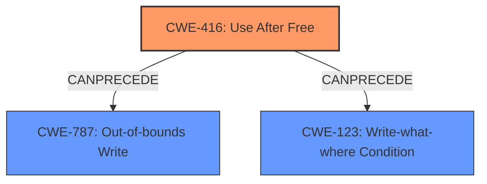

# Analysis Report for CVE-2022-0107

# Vulnerability Analysis Report: CVE-2022-0107

## Description

Use after free in File Manager API in Google Chrome on Chrome OS prior to 97.0.4692.71 allowed an attacker who convinced a user to install a malicious extension to potentially exploit heap corruption via a crafted HTML page.

## Vulnerability Description Key Phrases

**Rootcause:** use after free
**Weakness:** heap corruption
**Vector:** crafted HTML page
**Attacker:** attacker who convinced a user to install a malicious extension
**Product:** Google Chrome on Chrome OS
**Version:** prior to 97.0.4692.71
**Component:** File Manager API

## Analysis (with Relationship Data)

# Summary
| CWE ID | CWE Name | Confidence | CWE Abstraction Level | CWE Vulnerability Mapping Label | CWE-Vulnerability Mapping Notes |
|---|---|---|---|---|---|
| CWE-416 | Use After Free | 1.0 | Variant | Allowed | Primary CWE |

## Evidence and Confidence

*   **Confidence Score:** 1.0
*   **Evidence Strength:** HIGH

- **Analysis and Justification:**  
  - *Explanation:* The vulnerability description explicitly states "**use after free** in File Manager API". The CVE Reference Links Content Summary confirms that the **root cause** of the vulnerability is "**Use-after-free (UAF)** vulnerability". CWE-416 (Use After Free) precisely describes this condition: "The product reuses or references memory after it has been freed." The description aligns perfectly with the vulnerability. The Retriever Results also lists CWE-416 as the top candidate with a score of 0.8866. Its Abstraction is Variant, and Usage is Allowed, which is desirable.
  
  - *Relationship Analysis:* No direct relationships are identified. However, Use-After-Free can often result from other weaknesses or lead to other weaknesses.

- **Confidence Score:**  
  - Confidence: 1.0 (Direct and explicit evidence supports this mapping.)

## Criticism of Analysis

## Critique of the Analysis

The analysis correctly identifies CWE-416 (Use After Free) as the primary weakness with high confidence. The reasoning and justification are sound, based on the explicit mention of "use after free" in the vulnerability description. The retriever results also support this conclusion.

Here's a breakdown of strengths and potential areas for improvement:

**Strengths:**

*   **Accurate Identification of Primary Weakness:** The analysis directly and correctly maps the vulnerability to CWE-416, supported by clear evidence and justification.
*   **High Confidence:** Assigning a confidence score of 1.0 is appropriate given the explicit nature of the vulnerability description.
*   **Justification Clarity:** The reasoning is well-articulated and easy to follow.
*   **Use of Retriever Results:** Properly leveraging the Retriever results to corroborate the identification.
*   **Consideration of Abstraction Level:** The analysis notes that CWE-416 is a "Variant" level, which is a preferred level of abstraction.
*   **Inclusion of CWE Examples:** Provides useful context by including known examples of CWE-416 from the CVE database.
*   **Complete CWE Specifications:** Includes the complete CWE specifications for all considered CWEs, providing comprehensive context.

**Potential Areas for Improvement:**

*   **Exploration of Relationships/Chains (Most Important):** While the analysis briefly mentions relationships, it doesn't deeply explore potential preceding or following CWEs. Specifically, the "heap corruption" aspect of the vulnerability description should be explored in the context of *how* the use-after-free leads to heap corruption. A more thorough analysis would consider potential chains, such as:
    *   **CWE-416 -> CWE-787 (Heap-based Buffer Overflow) or CWE-123 (Write-what-where Condition):**  A use-after-free can allow an attacker to overwrite memory in the heap, leading to either a buffer overflow (if the memory is adjacent to a buffer) or a write-what-where condition (if the attacker controls the content being written). This is directly related to the "heap corruption" mentioned in the description.  This is likely the MOST relevant relationship to explore.
    *   **CWE-362 (Race Condition) -> CWE-416:** In concurrent environments, a race condition could *lead* to a use-after-free if one thread frees memory that another thread is still using. While not explicitly stated, concurrency is common in browser implementations.  The retriever also surfaced this relationship.
*   **Contextual Application of Potential Mitigations:** The analysis should briefly discuss the applicability of the potential mitigations for CWE-416 *in the context of the Google Chrome File Manager API*. For example:
    *   "While choosing a language with automatic memory management (Mitigation 1) is not feasible for an existing codebase, implementing robust memory management practices, such as setting pointers to NULL after freeing them (Mitigation 2), can help reduce the likelihood of use-after-free vulnerabilities in the File Manager API."
*   **Overlooked Retriever Results:** Some of the Retriever Results could be more closely examined for their relevance, particularly if they could be related to a possible chain.  For instance:
    *   **CWE-843 (Type Confusion):** In scenarios where a use-after-free occurs, and new data is allocated in the same memory region, there is the possibility that data of a different type than expected is now in that region. When the original pointer is dereferenced, the data can be interpreted in wrong way, possibly leading to code execution.
    *   **CWE-122 (Heap-based Buffer Overflow):** This should be explored as noted above.
*   **Relationship to User-Installed Extension:** The vulnerability description highlights that the attacker requires convincing the user to install a malicious extension. The role of the extension is to provide the attacker with the ability to trigger the vulnerable code path. This is a form of *privilege escalation*. Consider if this has a relevant CWE or a related CWE chain.
*   **Lack of Specificity:** While correctly identifying CWE-416, the analysis could be more specific about *how* the File Manager API is vulnerable. What type of data structures are involved? What operations lead to the premature freeing of memory? This would require a deeper understanding of the Chromium codebase. This is understandable given the scope of the provided information.

**Revised Summary Table (Illustrative):**

| CWE ID | CWE Name | Confidence | CWE Abstraction Level | CWE Vulnerability Mapping Label | CWE-Vulnerability Mapping Notes |
|---|---|---|---|---|---|
| CWE-416 | Use After Free | 1.0 | Variant | Allowed | Primary CWE |
| CWE-787 | Heap-based Buffer Overflow | 0.5 | Base | Allowed | Secondary CWE, resulting from the UAF causing heap corruption|

**In summary:**

The analysis is a good starting point, accurately identifying the primary weakness. However, it could be strengthened by exploring potential relationships to other CWEs (particularly CWE-787 or CWE-123 related to heap corruption) and contextualizing the potential mitigations. The role of user-installed extensions should be touched upon.  Addressing these points would provide a more complete and nuanced understanding of the vulnerability.

## Final Resolution

# Summary
| CWE ID | CWE Name | Confidence | CWE Abstraction Level | CWE Vulnerability Mapping Label | CWE-Vulnerability Mapping Notes |
|---|---|---|---|---|---|
| CWE-416 | Use After Free | 0.95 | Variant | Allowed | Primary CWE |
| CWE-787 | Out-of-bounds Write | 0.6 | Base | Allowed | Secondary CWE, resulting from the UAF causing heap corruption|

## Evidence and Confidence

*   **Confidence Score:** 0.8
*   **Evidence Strength:** MEDIUM

## Relationship Analysis
The primary relationship considered is that a **CWE-416 (Use After Free)** can **CANPRECEDE** a **CWE-787 (Out-of-bounds Write)**, leading to heap corruption. The vulnerability description mentions "heap corruption," suggesting that the **USE AFTER FREE** might have resulted in an out-of-bounds write. While **CWE-123 (Write-what-where Condition)** is also a possibility, **CWE-787** is a more likely outcome given the mention of heap corruption, which often involves writing beyond the boundaries of allocated memory.

## Vulnerability Chain
The vulnerability chain starts with the **CWE-416 (Use After Free)**. After the memory is freed, a malicious extension triggers the use of this freed memory. This leads to heap corruption, which is best represented by **CWE-787 (Out-of-bounds Write)**. The initial flaw is the improper memory management leading to the **USE AFTER FREE**. The consequence is the ability to overwrite heap memory, leading to potential arbitrary code execution.

## Summary of Analysis
The initial analysis correctly identifies **CWE-416 (Use After Free)** as the primary weakness. The criticism highlights the importance of exploring relationships, particularly how the **USE AFTER FREE** leads to heap corruption. The vulnerability description explicitly states "Use after free in File Manager API in Google Chrome on Chrome OS prior to 97.0.4692.71 allowed an attacker who convinced a user to install a malicious extension to potentially exploit heap corruption via a crafted HTML page."

Based on the vulnerability description and the relationship analysis, adding **CWE-787 (Out-of-bounds Write)** as a secondary CWE is justified. The **USE AFTER FREE** allows the attacker to potentially overwrite heap memory, leading to **OUT-OF-BOUNDS WRITE**.

The selected CWEs are at the optimal level of specificity. **CWE-416** is a Variant, which is a preferred level. **CWE-787** is a Base level, also a preferred level.

*Report generated on 2025-03-18 05:37:47*
