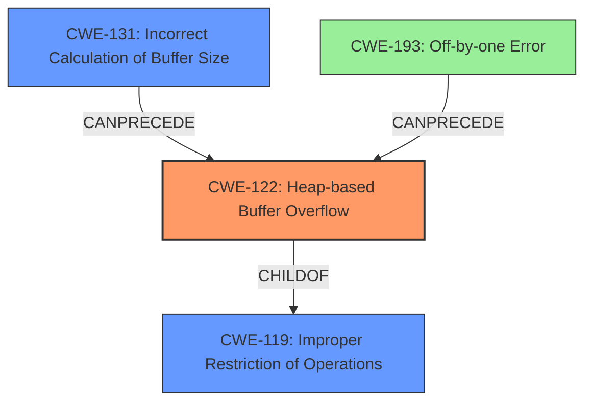

# Analysis Report for CVE-2022-0137

# Vulnerability Analysis Report: CVE-2022-0137

## Description

A heap buffer overflow in image_set_mask function of HTMLDOC before 1.9.15 allows an attacker to write outside the buffer boundaries.

## Vulnerability Description Key Phrases

**Rootcause:** heap buffer overflow
**Vector:** write outside the buffer boundaries
**Attacker:** attacker
**Product:** HTMLDOC
**Version:** before 1.9.15
**Component:** image_set_mask function

## Analysis (with Relationship Data)

# Summary
| CWE ID | CWE Name | Confidence | CWE Abstraction Level | CWE Vulnerability Mapping Label | CWE-Vulnerability Mapping Notes |
|---|---|---|---|---|---|
| CWE-122 | Heap-based Buffer Overflow | 0.95 | Variant | Allowed | Primary CWE |
| CWE-193 | Off-by-one Error | 0.6 | Base | Allowed | Secondary Candidate |
| CWE-131 | Incorrect Calculation of Buffer Size | 0.5 | Base | Allowed | Secondary Candidate |

## Evidence and Confidence

*   **Confidence Score:** 0.9
*   **Evidence Strength:** HIGH

- **Analysis and Justification:**  
  - *Explanation:* The vulnerability is described as a **heap buffer overflow** in the `image_set_mask` function of HTMLDOC. The root cause is related to an **incorrect buffer size calculation** and subsequent out-of-bounds write. CWE-122 (Heap-based Buffer Overflow) directly matches the description, as it involves writing data past the end of a buffer allocated on the heap. The provided content details how the `img->mask` buffer is allocated based on potentially smaller initial image dimensions, which leads to an overflow when `image_set_mask` uses modified, larger dimensions. This aligns precisely with the characteristics of a heap-based buffer overflow, and the MITRE mapping guidance allows for this mapping. CWE-193 (Off-by-one Error) and CWE-131 (Incorrect Calculation of Buffer Size) are considered as contributing factors, especially since the root cause involves some miscalculation of buffer sizes.

  - *Relationship Analysis:* CWE-122 is a variant of a buffer overflow. It is directly related to the specific memory allocation region (heap). While CWE-122 does not have any direct relationships in the provided information, it is implicitly related to buffer overflows in general. CWE-131 can precede CWE-119 (Improper Restriction of Operations within the Bounds of a Memory Buffer). CWE-193 can precede buffer overflows as well.

- **Confidence Score:**  
  - Confidence: 0.95 (High evidence from technical description and CVE reference materials)

---

## Criticism of Analysis

Okay, here's a review of the provided analysis, incorporating the full CWE specifications.

## Overall Assessment

The initial analysis correctly identifies the primary vulnerability as CWE-122 (Heap-based Buffer Overflow). The supporting CWEs (CWE-131 and CWE-193) are also relevant but should be considered contributing factors rather than primary weaknesses. The confidence score of 0.95 for CWE-122 is justified given the nature of the vulnerability and the information provided.

**Summary of Changes**

| CWE ID | CWE Name | Confidence | CWE Abstraction Level | CWE Vulnerability Mapping Label | CWE-Vulnerability Mapping Notes |
|---|---|---|---|---|---|
| CWE-122 | Heap-based Buffer Overflow | 0.95 | Variant | Allowed | Primary CWE |
| CWE-131 | Incorrect Calculation of Buffer Size | 0.7 | Base | Allowed | Secondary Candidate - direct cause |
| CWE-193 | Off-by-one Error | 0.4 | Base | Allowed | Tertiary Candidate - possible contributing factor to calculation |

## Detailed Critique

### 1. CWE-122: Heap-based Buffer Overflow

*   **Correctness:** The primary mapping to CWE-122 is accurate. The description explicitly states a heap buffer overflow, and the details provided confirm that the overflow occurs in memory allocated from the heap. The CWE-122 description aligns perfectly with the root cause: "A heap overflow condition is a buffer overflow, where the buffer that can be overwritten is allocated in the heap portion of memory, generally meaning that the buffer was allocated using a routine such as malloc()."
*   **Abstraction Level:** As a Variant, CWE-122 is at the preferred abstraction level for root cause analysis.
*   **Mapping Guidance:** The mapping guidance explicitly *allows* the use of CWE-122. The rationale is sound: "This CWE entry is at the Variant level of abstraction, which is a preferred level of abstraction for mapping to the root causes of vulnerabilities."
*   **Potential Mitigations:**
    *   The provided mitigations (using safe languages, abstraction libraries, compiler-based overflow detection) are all relevant and standard practices for preventing heap overflows.
*   **Observed Examples:** The observed examples provided in the specification are relevant and help to further illustrate the nature of heap-based buffer overflows.
*   **Improvements:** None. The mapping to CWE-122 is excellent.

### 2. CWE-131: Incorrect Calculation of Buffer Size

*   **Correctness:** Mapping CWE-131 as a secondary contributing factor is valid. The vulnerability stems from the fact that the initial image dimensions are used to allocate the buffer, but these dimensions are later modified (increased), making the initial allocation too small. This directly aligns with the CWE-131 description: "The product does not correctly calculate the size to be used when allocating a buffer, which could lead to a buffer overflow."
*   **Abstraction Level:** CWE-131 is a Base-level CWE, which is acceptable.
*   **Mapping Guidance:** The mapping guidance *allows* its use.
*   **Potential Mitigations:**
    *   The listed mitigations (allocating for the largest possible encoding, understanding language representation, input validation) are highly applicable to the vulnerability. The input validation mitigation is relevant, as validating the image dimensions before allocating the buffer could prevent the issue.
*   **Observed Examples:** The observed examples, especially those involving integer truncation leading to small buffer allocation, are similar in concept to the root cause identified in this vulnerability.
*   **Improvements:** Increase confidence to 0.7. This is the direct cause for the buffer overflow. The "incorrect calculation of buffer size" is the actual reason the overflow happens.

### 3. CWE-193: Off-by-one Error

*   **Correctness:** Mapping CWE-193 as a potential contributing factor is *weakly* justified. An off-by-one error *could* contribute to the calculation, however, the vulnerability is caused by a broader miscalculation rather than a simple +/- 1 error.
*   **Abstraction Level:** CWE-193 is a Base-level CWE, which is acceptable.
*   **Mapping Guidance:** The mapping guidance *allows* its use.
*   **Potential Mitigations:**
    *   The listed mitigation (using the correct size parameter when copying/manipulating character arrays) is not directly relevant to the core issue, as the overflow is related to initial allocation size versus the amount of data written, rather than the manipulation of a string during a copy operation.
*   **Observed Examples:** The observed examples are not very relevant to this vulnerability.
*   **Improvements:** Reduce confidence to 0.4. This CWE is not very strong. The error is not an "off by one" but rather a more significant issue of using outdated information for size calculations.

### Additional Considerations

*   **CWE-119 (Improper Restriction of Operations within the Bounds of a Memory Buffer):**  While the vulnerability ultimately manifests as a violation of buffer bounds, mapping directly to CWE-119 is discouraged because more specific CWEs (like CWE-122) exist.
*   **CWE-682 (Incorrect Calculation):** This is a high-level "pillar" CWE, and while it *is* technically correct that the vulnerability involves an incorrect calculation, using it would be too abstract. CWE-131 is the more specific and appropriate choice.

## Recommendations

1.  **Keep CWE-122 as the primary CWE.** It is the most accurate and descriptive.
2.  **Retain CWE-131 as secondary** with higher confidence (0.7), as it directly contributes to the incorrect buffer size.
3.  **Maintain CWE-193 as tertiary** but with lower confidence (0.4), as it might indirectly influence the buffer size but is less direct than CWE-131. It's a possible, but not strong, factor in the bug.
4.  Avoid mapping to CWE-119 or CWE-682, as these are too general.

By following these recommendations, the CWE mapping will be more accurate, informative, and useful for vulnerability analysis and mitigation efforts.

## Final Resolution

# Summary
| CWE ID | CWE Name | Confidence | CWE Abstraction Level | CWE Vulnerability Mapping Label | CWE-Vulnerability Mapping Notes |
|---|---|---|---|---|---|
| CWE-122 | Heap-based Buffer Overflow | 0.95 | Variant | Allowed | Primary CWE |
| CWE-131 | Incorrect Calculation of Buffer Size | 0.7 | Base | Allowed | Secondary Candidate |
| CWE-193 | Off-by-one Error | 0.4 | Base | Allowed | Tertiary Candidate |

## Evidence and Confidence

*   **Confidence Score:** 0.9
*   **Evidence Strength:** HIGH

## Relationship Analysis
The primary relationship influencing the decision is the parent-child relationship between CWE-119 (**CWE-119: Improper Restriction of Operations within the Bounds of a Memory Buffer**) and CWE-122 (**CWE-122: Heap-based Buffer Overflow**). CWE-122 is a variant of CWE-119, making it more specific and appropriate for this case. CWE-131 (**CWE-131: Incorrect Calculation of Buffer Size**) can precede CWE-119 as an incorrect size calculation can lead to an out-of-bounds write. CWE-193 (**CWE-193: A product calculates or uses an incorrect maximum or minimum value that is 1 more, or 1 less, than the correct value**) is considered a more distant contributing factor and hence assigned a lower confidence score. Abstraction levels guided the selection, favoring the Variant (CWE-122) and Base (CWE-131, CWE-193) levels for specific root cause identification.

## Vulnerability Chain
The vulnerability chain starts with an **incorrect calculation of the buffer size** (CWE-131). This leads to a heap buffer being allocated with an insufficient size. When the `image_set_mask` function writes data to the buffer using potentially larger image dimensions, a **heap-based buffer overflow** (CWE-122) occurs, allowing an attacker to write outside the buffer boundaries. A potential contributing factor, though less direct, could be an **off-by-one error** (CWE-193) in the size calculation.

## Summary of Analysis
The initial analysis and criticism both correctly identify CWE-122 (**CWE-122: Heap-based Buffer Overflow**) as the primary **weakness**. The vulnerability description clearly states a heap buffer overflow in the `image_set_mask` function. The evidence provided indicates that the `img->mask` buffer is allocated based on smaller initial image dimensions, leading to an overflow when `image_set_mask` uses modified, larger dimensions. This directly aligns with the characteristics of a heap-based buffer overflow.

CWE-131 (**CWE-131: Incorrect Calculation of Buffer Size**) is a valid secondary **weakness**, as the root cause involves an **incorrect calculation** of the buffer size. The evidence supports this, stating that the initial image dimensions are used to allocate the buffer, but these dimensions are later modified, making the initial allocation too small. The MITRE mapping guidance allows its use.

CWE-193 (**CWE-193: A product calculates or uses an incorrect maximum or minimum value that is 1 more, or 1 less, than the correct value**) is a less direct contributing factor. An off-by-one error *could* contribute to the calculation, however, the vulnerability is caused by a broader miscalculation rather than a simple +/- 1 error. The confidence score for CWE-193 is therefore reduced.

The selected CWEs are at the optimal level of specificity. CWE-122 is a variant of CWE-119 (**CWE-119: Improper Restriction of Operations within the Bounds of a Memory Buffer**), making it more specific. CWE-131 and CWE-193 are at the base level, providing specific details about the root cause. More general CWEs like CWE-682 (**CWE-682: Incorrect Calculation**) would be too abstract.

*Report generated on 2025-03-18 05:38:33*
