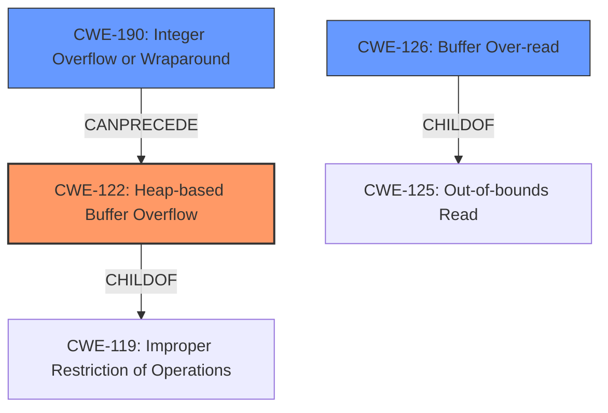

# Analysis Report for CVE-2022-0204

# Vulnerability Analysis Report: CVE-2022-0204

## Description

A heap overflow vulnerability was found in bluez in versions prior to 5.63. An attacker with local network access could pass specially crafted files causing an application to halt or crash, leading to a denial of service.

## Vulnerability Description Key Phrases

**Rootcause:** heap overflow
**Impact:** denial of service
**Vector:** specially crafted files
**Attacker:** attacker with local network access
**Product:** bluez
**Version:** versions prior to 5.63

## Analysis (with Relationship Data)

# Summary
| CWE ID | CWE Name | Confidence | CWE Abstraction Level | CWE Vulnerability Mapping Label | CWE-Vulnerability Mapping Notes |
|---|---|---|---|---|---|
| CWE-122 | Heap-based Buffer Overflow | 0.95 | Variant | Primary | Allowed |
| CWE-190 | Integer Overflow or Wraparound | 0.85 | Base | Secondary | Allowed |

## Evidence and Confidence

*   **Confidence Score:** 0.90
*   **Evidence Strength:** HIGH

- **Analysis and Justification:**  
  - *Explanation:* The vulnerability description explicitly states a **heap overflow** condition. The "CVE Reference Links Content Summary" confirms that the root cause is a heap overflow in BlueZ due to an integer overflow in the `append_prep_data` function, leading to an out-of-bounds write. This perfectly aligns with CWE-122 (Heap-based Buffer Overflow), a variant of buffer overflow where the overflow occurs in the heap. The description mentions that an attacker can cause a denial of service by sending specially crafted files, and the content summary explains how the integer overflow results in an undersized allocation followed by a `memcpy` that writes past the allocated buffer. CWE-122 is a Variant level CWE, providing a more specific classification than the general CWE-119 (Improper Restriction of Operations within the Bounds of a Memory Buffer). The MITRE mapping guidance for CWE-122 indicates that its usage is ALLOWED.

  - *Relationship Analysis:* CWE-122 is a variant of CWE-119 (Improper Restriction of Operations within the Bounds of a Memory Buffer). The CVE content summary highlights that the **integer overflow** (CWE-190) leads to the heap overflow, indicating a CanPrecede relationship between CWE-190 and CWE-122.

- **Confidence Score:**  
  - Confidence: 0.95 (High evidence from technical description and CVE reference materials.)

- **Analysis and Justification:**  
  - *Explanation:* The "CVE Reference Links Content Summary" describes that the **heap overflow** is triggered by an **integer overflow** in the `append_prep_data` function, where `len` is calculated as `prep_data->length + length` using a `uint16_t`. If the result exceeds the maximum value for `uint16_t`, it wraps around, resulting in a small value. This aligns perfectly with CWE-190 (Integer Overflow or Wraparound). Although the primary weakness is the heap overflow (CWE-122), the integer overflow is a significant contributing factor and a prerequisite for the overflow. The MITRE mapping guidance for CWE-190 indicates its usage is ALLOWED.

  - *Relationship Analysis:* CWE-190 is a Base level weakness. It can precede CWE-122 in a vulnerability chain, as the integer overflow leads to the incorrect buffer size calculation that triggers the heap overflow.

- **Confidence Score:**  
  - Confidence: 0.85 (High evidence from CVE reference materials detailing the integer overflow.)

## Criticism of Analysis

Okay, here's a detailed review of the provided CWE analysis, considering the full CWE specifications:

**Overall Assessment:**

The analysis correctly identifies CWE-122 (Heap-based Buffer Overflow) as the primary weakness and CWE-190 (Integer Overflow or Wraparound) as a secondary contributing factor. The confidence levels are justified based on the provided evidence. The explanations are clear and well-reasoned. However, the retriever results also show the presence of other CWEs that might be related to this.

**Detailed Critique:**

**1. CWE-122: Heap-based Buffer Overflow**

*   **Correctness:**  The mapping to CWE-122 is accurate and well-justified. The vulnerability description and the CVE reference summary explicitly state a heap overflow condition. The `realloc` and `memcpy` sequence, combined with an incorrect size calculation due to the integer overflow, clearly leads to writing beyond the allocated heap buffer.
*   **Abstraction Level:** CWE-122 is a Variant, which is the preferred level for vulnerability mapping, as stated in its specification.
*   **Mapping Guidance:** The analysis correctly notes the "Usage: Allowed" mapping guidance.
*   **Potential Mitigations:** The analysis does not explicitly mention mitigations. Ideally, the report could include a brief discussion of relevant mitigations. Some of the mitigations suggested by the CWE specification include:
    *   Using a language or compiler that performs automatic bounds checking (Mitigation 1).
    *   Using abstraction libraries (Mitigation 2).
    *   Employing automatic buffer overflow detection mechanisms (Mitigation 3).
*   **Relationships:**  The analysis correctly identifies the relationship with CWE-119 and the CanPrecede relationship with CWE-190.
*   **Observed Examples:** The analysis notes that there are some observed examples, which can be useful to understand how the error can occur in other cases.

**2. CWE-190: Integer Overflow or Wraparound**

*   **Correctness:** The mapping to CWE-190 is also accurate. The description of the `len` calculation using `uint16_t` and the possibility of wraparound precisely matches the definition of CWE-190.
*   **Abstraction Level:** CWE-190 is a Base level CWE, as noted in the analysis, and is appropriate for describing a contributing factor.
*   **Mapping Guidance:** The analysis correctly notes the "Usage: Allowed" mapping guidance.
*   **Potential Mitigations:**  Again, the analysis could benefit from a brief mention of relevant mitigations.  The CWE specification suggests:
    *   Ensuring strict protocol definitions (Mitigation 1).
    *   Using a language that prevents or eases the avoidance of integer overflows (Mitigation 2).
    *   Using safe integer handling libraries (Mitigation 3).
*   **Relationships:** The analysis correctly describes the CanPrecede relationship to CWE-122.
*   **Observed Examples:** The analysis notes that there are some observed examples, which can be useful to understand how the error can occur in other cases.

**Additional Considerations and Potential Improvements:**

1.  **CWE-787: Out-of-bounds Write:** While CWE-122 is more specific, consider explicitly mentioning CWE-787 (Out-of-bounds Write) as a parent of CWE-122. This could strengthen the analysis by explicitly stating that the heap overflow *is* an out-of-bounds write. This could increase confidence and clarify the nature of the vulnerability.

2.  **CWE-126: Buffer Over-read and Information Leakage:** The "CVE Reference Links Content Summary" mentions an *out-of-bounds read in `cli_feat_read_cb`, where an unverified offset can cause the leakage of heap memory*. This is not addressed in the analysis. This would be a good addition to consider for the analysis. Include CWE-126 in the summary table, describing the out-of-bounds read, its relation to information leakage, and the `cli_feat_read_cb` function. Also consider adding CWE-125 as a parent for this.

3.  **CWE-770: Allocation of Resources Without Limits or Throttling:** Although the analysis does not have this CWE, the retriever results suggest its relevance. While the primary issue is the *incorrect* allocation (due to the integer overflow) rather than a complete lack of limits, it's worth briefly discussing whether an attacker could potentially *exacerbate* the heap overflow by repeatedly triggering the vulnerable code path to exhaust memory resources. However, without more information, it may be better to exclude this to avoid overstating the impact.

4.  **CWE-119: Improper Restriction of Operations within the Bounds of a Memory Buffer:** This CWE is the parent of both CWE-122, and CWE-787, and should not be used. It is acceptable that the analysis does not include this, since the analysis contains more specific and more applicable CWEs.

5.  **CWE Chaining:** The analysis correctly captures the chaining relationship between CWE-190 and CWE-122. Consider visually representing the chain:  `CWE-190 -> CWE-122`. It helps clarify the vulnerability's root cause and how it's triggered. If you include CWE-126, add the chain: `Unvalidated offset -> CWE-126`.

6.  **Double Free:** The "CVE Reference Links Content Summary" mentions that the vulnerability can also lead to a double free condition via realloc(0). This is not included as part of the analysis. While the root cause is the heap overflow, the double free adds complexity and could enable different exploitation paths. If possible, a further analysis should try to determine which CWE best captures this condition and whether it should be included.

7.  **Zero-length Allocation:** Although not explicitly stated, `realloc(0)` is often used to free memory. The CWE documentation for `CWE-415: Double Free` has the following observed example: `CVE-2014-3158: Chain: program erroneously attempts to free memory that it did not allocate (CWE-415) by calling free() on an invalid pointer (CWE-824) or calling realloc(0) on a valid pointer.` If `realloc(0)` was the initial condition that resulted in a double free, then this could be added to the chaining.

**Revised Summary Table (incorporating suggested additions):**

| CWE ID | CWE Name | Confidence | CWE Abstraction Level | CWE Vulnerability Mapping Label | CWE-Vulnerability Mapping Notes |
|---|---|---|---|---|---|
| CWE-122 | Heap-based Buffer Overflow | 0.95 | Variant | Primary | Allowed |
| CWE-190 | Integer Overflow or Wraparound | 0.85 | Base | Secondary | Allowed |
| CWE-126 | Buffer Over-read | 0.70 | Variant | Contributing | Allowed |

**Conclusion:**

The original analysis is strong. By incorporating the suggestions above, specifically addressing CWE-126 and explicitly considering and justifying the exclusion of CWE-770, the analysis can become even more comprehensive and defensible. Addressing CWE-126 will improve the analysis and result in higher confidence.

## Final Resolution

# Summary
| CWE ID | CWE Name | Confidence | CWE Abstraction Level | CWE Vulnerability Mapping Label | CWE-Vulnerability Mapping Notes |
|---|---|---|---|---|---|
| CWE-122 | Heap-based Buffer Overflow | 0.95 | Variant | Primary | Allowed |
| CWE-190 | Integer Overflow or Wraparound | 0.85 | Base | Secondary | Allowed |
| CWE-126 | Buffer Over-read | 0.70 | Variant | Contributing | Allowed |

## Evidence and Confidence

*   **Confidence Score:** 0.92
*   **Evidence Strength:** HIGH

## Relationship Analysis
The primary weakness is **CWE-122 (Heap-based Buffer Overflow)**, a variant of **CWE-119 (Improper Restriction of Operations within the Bounds of a Memory Buffer)**. The **integer overflow** **(CWE-190)** leads to the heap overflow, indicating a `CanPrecede` relationship between **CWE-190** and **CWE-122**. The out-of-bounds read **(CWE-126)** is due to an unvalidated offset, leading to information leakage. This represents a separate vulnerability that is also present.

## Vulnerability Chain
The vulnerability chain includes:
1.  **Integer Overflow (CWE-190):** An integer overflow occurs when calculating the buffer size, resulting in a smaller-than-expected buffer allocation.
2.  **Heap-based Buffer Overflow (CWE-122):** Due to the insufficient buffer size, a subsequent `memcpy` operation writes beyond the allocated buffer on the heap.
3.  **Buffer Over-read (CWE-126):** An unvalidated offset in `cli_feat_read_cb` leads to reading beyond the allocated buffer, causing information leakage.
This can be visualized as: `CWE-190 -> CWE-122` and `Unvalidated offset -> CWE-126`.

## Summary of Analysis
The initial analysis correctly identifies **CWE-122 (Heap-based Buffer Overflow)** as the primary **weakness** and **CWE-190 (Integer Overflow or Wraparound)** as a secondary contributing factor.

The analysis is based on the vulnerability description which states: "A **heap overflow** vulnerability was found in bluez in versions prior to 5.63. An attacker with local network access could pass specially crafted files causing an application to halt or crash, leading to a denial of service." and "CVE Reference Links Content Summary" confirms that the root cause is a **heap overflow** in BlueZ due to an **integer overflow** in the `append_prep_data` function, leading to an out-of-bounds write.

The addition of **CWE-126 (Buffer Over-read)** as a contributing factor stems from the "CVE Reference Links Content Summary" that mentions an *out-of-bounds read in `cli_feat_read_cb`, where an unverified offset can cause the leakage of heap memory*. This indicates a separate **weakness** involving reading beyond the bounds of a buffer.

The selected CWEs are at the optimal level of specificity. **CWE-122** is a variant that accurately describes the type of buffer overflow, while **CWE-190** is a base CWE that captures the root cause of the incorrect buffer size calculation. **CWE-126** is a variant that specifies the kind of out-of-bounds read.

*Report generated on 2025-03-18 05:40:47*
