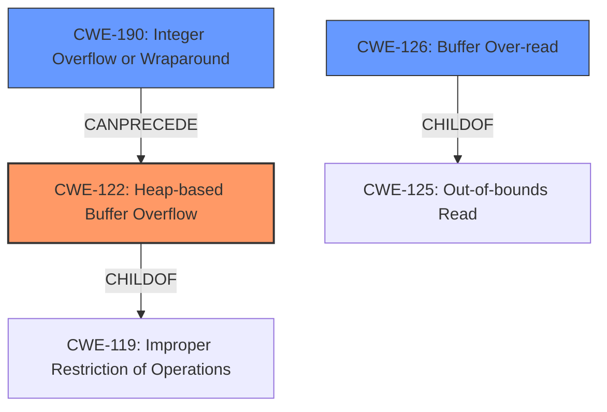

# Final Resolution for CVE-2022-0204

# Summary
| CWE ID | CWE Name | Confidence | CWE Abstraction Level | CWE Vulnerability Mapping Label | CWE-Vulnerability Mapping Notes |
|---|---|---|---|---|---|
| CWE-122 | Heap-based Buffer Overflow | 0.95 | Variant | Primary | Allowed |
| CWE-190 | Integer Overflow or Wraparound | 0.85 | Base | Secondary | Allowed |
| CWE-126 | Buffer Over-read | 0.70 | Variant | Contributing | Allowed |

## Evidence and Confidence

*   **Confidence Score:** 0.92
*   **Evidence Strength:** HIGH

## Relationship Analysis
The primary weakness is **CWE-122 (Heap-based Buffer Overflow)**, a variant of **CWE-119 (Improper Restriction of Operations within the Bounds of a Memory Buffer)**. The **integer overflow** **(CWE-190)** leads to the heap overflow, indicating a `CanPrecede` relationship between **CWE-190** and **CWE-122**. The out-of-bounds read **(CWE-126)** is due to an unvalidated offset, leading to information leakage. This represents a separate vulnerability that is also present.

## Vulnerability Chain
The vulnerability chain includes:
1.  **Integer Overflow (CWE-190):** An integer overflow occurs when calculating the buffer size, resulting in a smaller-than-expected buffer allocation.
2.  **Heap-based Buffer Overflow (CWE-122):** Due to the insufficient buffer size, a subsequent `memcpy` operation writes beyond the allocated buffer on the heap.
3.  **Buffer Over-read (CWE-126):** An unvalidated offset in `cli_feat_read_cb` leads to reading beyond the allocated buffer, causing information leakage.
This can be visualized as: `CWE-190 -> CWE-122` and `Unvalidated offset -> CWE-126`.

## Summary of Analysis
The initial analysis correctly identifies **CWE-122 (Heap-based Buffer Overflow)** as the primary **weakness** and **CWE-190 (Integer Overflow or Wraparound)** as a secondary contributing factor.

The analysis is based on the vulnerability description which states: "A **heap overflow** vulnerability was found in bluez in versions prior to 5.63. An attacker with local network access could pass specially crafted files causing an application to halt or crash, leading to a denial of service." and "CVE Reference Links Content Summary" confirms that the root cause is a **heap overflow** in BlueZ due to an **integer overflow** in the `append_prep_data` function, leading to an out-of-bounds write.

The addition of **CWE-126 (Buffer Over-read)** as a contributing factor stems from the "CVE Reference Links Content Summary" that mentions an *out-of-bounds read in `cli_feat_read_cb`, where an unverified offset can cause the leakage of heap memory*. This indicates a separate **weakness** involving reading beyond the bounds of a buffer.

The selected CWEs are at the optimal level of specificity. **CWE-122** is a variant that accurately describes the type of buffer overflow, while **CWE-190** is a base CWE that captures the root cause of the incorrect buffer size calculation. **CWE-126** is a variant that specifies the kind of out-of-bounds read.