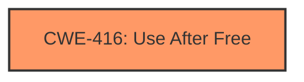

# Final Resolution for CVE-2022-0289

# Summary
| CWE ID | CWE Name | Confidence | CWE Abstraction Level | CWE Vulnerability Mapping Label | CWE-Vulnerability Mapping Notes |
|---|---|---|---|---|---|
| CWE-416 | Use After Free | 1.0 | Variant | Allowed | Primary CWE. Root cause vulnerability. |

## Evidence and Confidence

*   **Confidence Score:** 1.0
*   **Evidence Strength:** HIGH

## Relationship Analysis
The primary relationship considered was the lack of strong "CanFollow" or "CanPrecede" relationships that would strongly suggest another CWE should be included. While the criticism pointed out that there *are* `canFollow` relationships, for example, `CanFollow -> CWE-362`, there is no indication of concurrency in the vulnerability description to justify adding `CWE-362` to the summary table. The relationship of CWE-416 being a variant, and thus having a parent, suggests an appropriate level of specificity.

## Vulnerability Chain
The vulnerability chain starts with a crafted HTML page leading to a **use after free** (**CWE-416**) in the Safe browsing component of Google Chrome. This **weakness** can lead to potential **heap corruption**, allowing a remote attacker to exploit the vulnerability. The root cause is the improper handling of memory, where memory is accessed after it has been freed.

## Summary of Analysis
The initial analysis and the criticism both agree that **CWE-416 (Use After Free)** is the most appropriate primary CWE for this vulnerability. The vulnerability description explicitly states a "use after free" condition, aligning directly with the description of CWE-416. The evidence strength is high, with the vulnerability description and CVE reference confirming the **rootcause** as "use-after-free".

The relationship analysis further supports this decision, as CWE-416 is a Variant-level CWE, providing an adequate level of specificity. The criticism suggested including mitigations and noting `canFollow` relationships. While there are `canFollow` relationships, there is no evidence to suggest that these relationships are relevant to this specific vulnerability, so they should not be included.
The final decision is based on the provided evidence, the CWE description, and the relationship analysis, all of which support the selection of CWE-416 as the primary CWE at the optimal level of specificity.