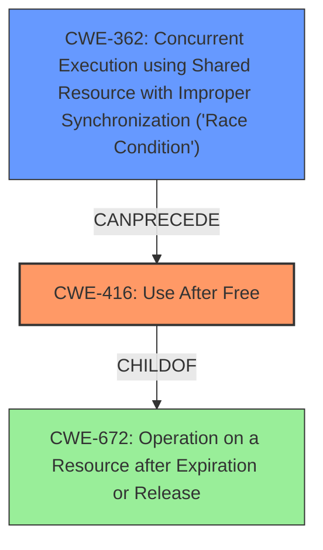

# Final Resolution for CVE-2022-0293

# Summary
| CWE ID | CWE Name | Confidence | CWE Abstraction Level | CWE Vulnerability Mapping Label | CWE-Vulnerability Mapping Notes |
|---|---|---|---|---|---|
| CWE-416 | Use After Free | 0.95 | Variant | Allowed | Primary CWE: The vulnerability description explicitly states "use after free". |
| CWE-362 | Concurrent Execution using Shared Resource with Improper Synchronization ('Race Condition') | 0.5 | Class | Allowed-with-Review | Secondary Candidate: A race condition might precede the use-after-free. |

## Evidence and Confidence

*   **Confidence Score:** 0.9
*   **Evidence Strength:** MEDIUM

## Relationship Analysis
The primary CWE is CWE-416 (**Use After Free**), which is a Variant of CWE-672 (**Operation on a Resource after Expiration or Release**). While CWE-672 is a broader category, CWE-416 is more specific and directly matches the vulnerability description.

CWE-362 (**Concurrent Execution using Shared Resource with Improper Synchronization ('Race Condition')**) is considered as a secondary CWE because a race condition can potentially lead to a use-after-free. The CWE specifications say that CWE-362 can precede CWE-416.

## Vulnerability Chain
The vulnerability chain starts with a potential race condition (CWE-362) if the "Web packaging" component uses multiple threads. This race condition can lead to a situation where memory is freed while another thread still holds a reference to it. When the second thread attempts to use this freed memory, a **use-after-free** (CWE-416) occurs, leading to **heap corruption** and potentially allowing a remote attacker to execute arbitrary code via a crafted HTML page.

## Summary of Analysis
The initial analysis correctly identified CWE-416 (**Use After Free**) as the primary weakness due to the explicit mention of "use after free" in the vulnerability description. The confidence score of 1.0 was initially assigned, but I am reducing this to 0.95 to allow for the possibility of a contributing factor, namely CWE-362.

The criticism raised valid points, particularly regarding the potential for other CWEs to be involved. Specifically, the suggestion to consider CWE-362 (**Concurrent Execution using Shared Resource with Improper Synchronization ('Race Condition')**) is reasonable. While the description doesn't explicitly mention a race condition, the "Web packaging" component *could* involve multiple threads, making a race condition a plausible precursor to the **use-after-free**.

Therefore, I am adding CWE-362 as a secondary candidate CWE with a confidence score of 0.5. This acknowledges the possibility of a race condition contributing to the vulnerability. The evidence for this is weaker, as it relies on an assumption about the internal workings of the "Web packaging" component, but the relationship between CWE-362 and CWE-416 (CWE-362 can precede CWE-416) supports this consideration.

The decision to classify CWE-416 as the primary CWE is based on the direct evidence in the vulnerability description. The addition of CWE-362 as a secondary CWE is based on relationship analysis and the potential for a race condition to contribute to the vulnerability.

Both CWE-416 and CWE-362 are at appropriate levels of specificity. CWE-416 is a Variant, which is generally preferred for mapping to specific vulnerabilities. CWE-362 is a Class, but a more specific Base CWE is not clearly indicated in the provided information.