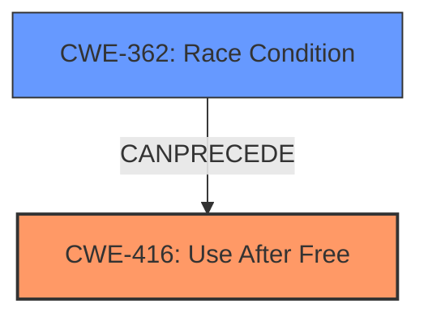

# Final Resolution for CVE-2022-0295

# Summary
| CWE ID | CWE Name | Confidence | CWE Abstraction Level | CWE Vulnerability Mapping Label | CWE-Vulnerability Mapping Notes |
|---|---|---|---|---|---|
| CWE-416 | Use After Free | 0.95 | Variant | Allowed | Primary CWE |
| CWE-362 | Concurrent Execution using Shared Resource with Improper Synchronization ('Race Condition') | 0.6 | Class | Allowed-with-Review | Secondary Candidate |

## Evidence and Confidence

*   **Confidence Score:** 0.8
*   **Evidence Strength:** MEDIUM

## Relationship Analysis
The primary relationship considered was CANPRECEDE from CWE-362 to CWE-416, suggesting a potential race condition leading to the use-after-free. The abstraction levels influenced the decision to keep CWE-416 as primary due to its direct match to the vulnerability description. CWE-362 remains a secondary candidate due to the circumstantial evidence of user interactions and crafted HTML page, indicating a possible concurrency issue.

## Vulnerability Chain
The vulnerability chain starts potentially with a **CWE-362 (Race Condition)**, where concurrent code sequences improperly synchronize access to shared resources. This leads to premature freeing of memory. Subsequently, **CWE-416 (Use After Free)** occurs when the product reuses the freed memory, resulting in heap corruption and potentially allowing a remote attacker to execute arbitrary code.

## Summary of Analysis
The initial analysis correctly identified **CWE-416 (Use After Free)** as the primary weakness, supported by the vulnerability description explicitly stating "use after free." However, the criticism highlighted the potential for an underlying **ROOTCAUSE**, specifically **CWE-362 (Race Condition)**. The attack vector involving user interactions and a crafted HTML page suggests a possible concurrency issue. While **CWE-416** directly describes the observed vulnerability, **CWE-362** could be the underlying condition that allows the use-after-free to occur.

The decision to include **CWE-362** as a secondary candidate is based on the CANPRECEDE relationship between **CWE-362** and **CWE-416**, as well as the nature of the attack vector. The confidence in **CWE-362** is lower (0.6) because it is not explicitly mentioned in the vulnerability description, and requires further investigation to confirm.

The selection of **CWE-416** as the primary CWE remains justified because it is the direct manifestation of the vulnerability. The addition of **CWE-362** as a secondary candidate acknowledges the potential for a deeper, underlying **ROOTCAUSE**. The use of both a Variant (CWE-416) and Class (CWE-362) level CWE provides a more comprehensive understanding of the vulnerability, while acknowledging that more information is needed.