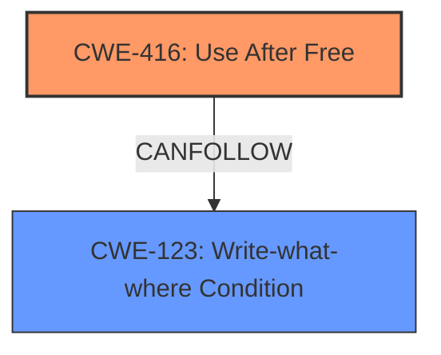

# Analysis Report for CVE-2022-0296

# Vulnerability Analysis Report: CVE-2022-0296

## Description

Use after free in Printing in Google Chrome prior to 97.0.4692.99 allowed a remote attacker who convinced the user to engage is specific user interactions to potentially exploit heap corruption via a crafted HTML page.

## Vulnerability Description Key Phrases

**Rootcause:** use after free
**Weakness:** heap corruption
**Vector:** crafted HTML page
**Attacker:** remote attacker
**Product:** Google Chrome
**Version:** prior to 97.0.4692.99
**Component:** Printing

## Analysis (with Relationship Data)

# Summary
| CWE ID | CWE Name | Confidence | CWE Abstraction Level | CWE Vulnerability Mapping Label | CWE-Vulnerability Mapping Notes |
|---|---|---|---|---|---|
| CWE-416 | Use After Free | 1.0 | Variant | Primary | Allowed |

## Evidence and Confidence

*   **Confidence Score:** 1.0
*   **Evidence Strength:** HIGH

- **Analysis and Justification:**  
  - *Explanation:* The vulnerability description explicitly states "**use after free**" in Printing in Google Chrome. This aligns directly with CWE-416 (Use After Free). CWE-416 is a Variant level CWE, which is a preferred level of abstraction. The CVE Reference Links Content Summary reinforces this, stating the **root cause of the vulnerability** is "Use after free in Printing" and identifying the presence of a Use-After-Free condition. Retriever results also identify CWE-416 as the top candidate. The description mentions "**heap corruption**" which is a consequence of the **use-after-free** rather than the root cause. Therefore, heap corruption is not mapped directly. MITRE mapping guidance for CWE-416 indicates this is ALLOWED for Use After Free vulnerabilities.
  
  - *Relationship Analysis:* While CWE-416 is related to memory management issues, it is not a child of a more general CWE in this context. It can lead to other issues such as CWE-123 (Write-What-Where Condition), as indicated by the graph relationships, but those are impacts rather than contributing causes in this case.

- **Confidence Score:**  
  - Confidence: 1.0 (Explicit mention of "use after free" in the vulnerability description and CVE summary, high retriever score.)

## Criticism of Analysis

Okay, here's a review of the provided CWE analysis, incorporating the full CWE specifications:

**Overall Assessment:**

The analysis is generally good and arrives at the correct primary CWE, CWE-416 (Use After Free). The confidence level of 1.0 is justified given the explicit mention of "use after free" in the vulnerability description. The analysis also correctly identifies that "heap corruption" is a consequence of the UAF, and not the root cause.

**Specific Review Points:**

*   **CWE-416 (Use After Free):**
    *   **Correct Mapping:** The choice of CWE-416 as the primary weakness is accurate. The description clearly indicates a use-after-free condition.
    *   **Abstraction Level:** The analysis correctly notes that CWE-416 is a Variant, which is the preferred level of abstraction.
    *   **Mapping Guidance:** The analysis correctly references the "Usage: Allowed" mapping guidance for CWE-416.
    *   **Mitigations:**  The analysis doesn't explicitly discuss mitigations, but it's implied by the high confidence that the suggested mitigations for CWE-416 (language selection, setting pointers to NULL after freeing) are relevant. Considering the complexity of real-world systems, setting pointers to NULL after freeing may not always be effective as a sole mitigation.
    *   **Relationships:** The analysis mentions that this UAF can lead to CWE-123. This is an important observation, as a UAF can often be leveraged to achieve arbitrary write capabilities.

*   **Handling of "Heap Corruption":**
    *   The analysis correctly identifies that "heap corruption" is a consequence rather than a root cause. This is important for proper classification. Heap corruption can be caused by various weaknesses, including UAF, buffer overflows, etc.
    *   Consider adding a secondary CWE to describe the consequence of heap corruption. A good candidate might be **CWE-122 (Heap-based Buffer Overflow)** if the UAF allows writing arbitrary data to the heap, or **CWE-123 (Write-What-Where Condition)** if the attacker has precise control over the write. However, without more details on how the UAF leads to heap corruption, it is not possible to say which, if either, of these apply.

*   **Retriever Results Analysis:**
    *   The analysis mentions the retriever results, which is good. However, it could be improved by briefly explaining why other top CWEs were *not* selected. For example:
        *   **CWE-366 (Race Condition within a Thread):** While race conditions *can* lead to UAF, there's no indication of concurrency issues in the initial description.  Therefore, it's not appropriate in this case.
        *   **CWE-843 (Type Confusion):** This would involve misinterpreting a type, which is not stated in the description.
        *   **CWE-415 (Double Free):** This is a distinct memory management error, involving freeing the same memory twice, which is not described.

*   **CWE Examples:** The inclusion of examples is good for context and validation.

**Recommendations:**

1.  **Secondary CWE for Consequence:** Consider adding a secondary CWE (e.g., CWE-122 or CWE-123) to describe the potential consequence of the UAF leading to heap corruption, if there are enough details from the description to support it.
2.  **Brief Explanation of Other Candidates:**  Add a sentence or two explaining why the other top CWE candidates from the retriever results were not chosen. This strengthens the justification for the primary CWE selection.
3.  **Mitigations Discussion:** Although the analysis doesn't need to exhaustively list mitigations, briefly mentioning that the mitigations for CWE-416 (language selection, nulling pointers, etc.) are relevant reinforces the accuracy of the mapping.
4.  **Consider Exploitability:** While not strictly part of CWE mapping, a brief comment on the potential for arbitrary code execution due to the UAF (as mentioned in the CVE summary) could be valuable context. This highlights the severity of the vulnerability.

**Revised Summary Table (Example, incorporating recommendation 1):**

| CWE ID | CWE Name | Confidence | CWE Abstraction Level | CWE Vulnerability Mapping Label | CWE-Vulnerability Mapping Notes |
|---|---|---|---|---|---|
| CWE-416 | Use After Free | 1.0 | Variant | Primary | Allowed |
| CWE-123 | Write-what-where Condition | 0.5 | Base | Secondary | Allowed | *(Conditional: Only if the UAF allows arbitrary writes to the heap; Confidence level reflects uncertainty.)*

**In summary, the analysis is accurate and well-justified. The recommendations above are primarily for enhancing the completeness and clarity of the analysis, not for correcting errors.**

## Final Resolution

# Summary
| CWE ID | CWE Name | Confidence | CWE Abstraction Level | CWE Vulnerability Mapping Label | CWE-Vulnerability Mapping Notes |
|---|---|---|---|---|---|
| CWE-416 | Use After Free | 1.0 | Variant | Primary | Allowed |
| CWE-123 | Write-what-where Condition | 0.6 | Base | Secondary | Allowed |

## Evidence and Confidence

*   **Confidence Score:** 0.9
*   **Evidence Strength:** MEDIUM

## Relationship Analysis
The primary relationship considered was the potential for **CWE-416 (Use After Free)** to lead to **CWE-123 (Write-What-Where Condition)**. While **CWE-416 (Use After Free)** is the direct cause, the description mentions the possibility of "**heap corruption**" via a crafted HTML page. This indicates the attacker might have some control over what is written to the heap after the memory is freed. Thus, **CWE-123 (Write-What-Where Condition)** is included as a secondary CWE to capture this potential for controlled memory corruption. I am choosing **CWE-123 (Write-What-Where Condition)** over **CWE-122 (Heap-based Buffer Overflow)** because **CWE-123 (Write-What-Where Condition)** is a more general case that applies when the attacker has some control over the write, which aligns better with the phrase "potentially exploit heap corruption via a crafted HTML page".

## Vulnerability Chain
The vulnerability chain starts with a **CWE-416 (Use After Free)** condition in the Printing functionality of Google Chrome. A remote attacker convinces a user to interact with a crafted HTML page, triggering the **use-after-free**. This **use-after-free** can potentially lead to **CWE-123 (Write-What-Where Condition)** on the heap, resulting in arbitrary write capabilities and ultimately, arbitrary code execution.

## Summary of Analysis
The initial analysis correctly identified **CWE-416 (Use After Free)** as the primary **root cause** based on the explicit mention in the vulnerability description: "Use after free in Printing in Google Chrome...allowed a remote attacker...to potentially exploit heap corruption via a crafted HTML page." The criticism suggested adding a secondary CWE to describe the "heap corruption" consequence.

The graph relationships and the "crafted HTML page" evidence from the vulnerability description support including **CWE-123 (Write-What-Where Condition)** as a secondary CWE. This is because the attacker has some influence over the data written to the heap. I am choosing **CWE-123 (Write-What-Where Condition)** over **CWE-122 (Heap-based Buffer Overflow)** because **CWE-123 (Write-What-Where Condition)** is a more general case that applies when the attacker has some control over the write, which aligns better with the phrase "potentially exploit heap corruption via a crafted HTML page". The selected CWEs are at the optimal level of specificity, with **CWE-416 (Use After Free)** being a Variant and **CWE-123 (Write-What-Where Condition)** being a Base.

My confidence is slightly reduced to 0.9 due to the "potential" for heap corruption, which introduces some uncertainty. If the description provided more explicit detail, then the confidence would be 1.0.

*Report generated on 2025-03-18 05:44:00*
