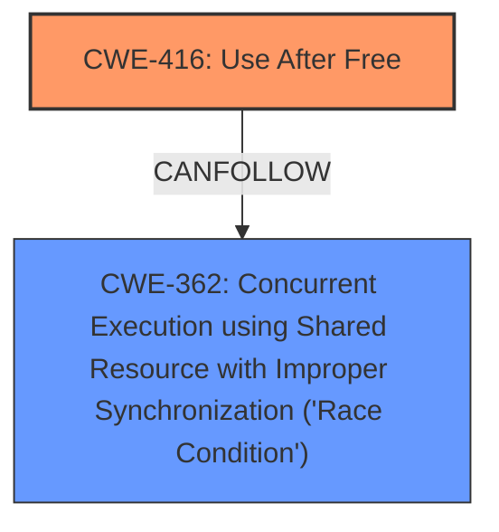

# Analysis Report for CVE-2022-0300

# Vulnerability Analysis Report: CVE-2022-0300

## Description

Use after free in Text Input Method Editor in Google Chrome on Android prior to 97.0.4692.99 allowed a remote attacker who convinced a user to engage in specific user interactions to potentially exploit heap corruption via a crafted HTML page.

## Vulnerability Description Key Phrases

**Rootcause:** use after free
**Weakness:** heap corruption
**Vector:** crafted HTML page
**Attacker:** remote attacker
**Product:** Google Chrome on Android
**Version:** prior to 97.0.4692.99
**Component:** Text Input Method Editor

## Analysis (with Relationship Data)

# Summary
| CWE ID | CWE Name | Confidence | CWE Abstraction Level | CWE Vulnerability Mapping Label | CWE-Vulnerability Mapping Notes |
|---|---|---|---|---|---|
| CWE-416 | Use After Free | 1.0 | Variant | Allowed | Primary CWE |

## Evidence and Confidence

*   **Confidence Score:** 1.0
*   **Evidence Strength:** HIGH

- **Analysis and Justification:**
  - *Explanation:* The vulnerability description explicitly states "**use after free**" as the root cause. The CVE Reference Links Content Summary also confirms "**Use after free in Text Input Method Editor**." CWE-416 (Use After Free) is a Variant level CWE, which is a preferred level of abstraction. The description of CWE-416 precisely matches the vulnerability: "The product reuses or references memory after it has been freed." The **heap corruption** is a consequence of the **use-after-free**. The retriever results also list CWE-416 with the highest score.
  
  - *Relationship Analysis:* No direct relationships influence the mapping decision. However, Use-After-Free can lead to other exploitable conditions.

- **Confidence Score:**
  - Confidence: 1.0 (The vulnerability description and CVE reference material provides direct evidence.)

## Criticism of Analysis

Okay, here's a detailed review of the provided CWE analysis, taking into consideration the full CWE specifications for each listed weakness:

**Overall Assessment:**

The primary mapping to CWE-416 (Use After Free) is **correct and well-justified.** The analysis clearly articulates why this is the most appropriate CWE, supported by evidence from both the vulnerability description and the CVE summary.  The high confidence score of 1.0 is also appropriate. The explanation for the heap corruption being a result of the Use-After-Free is also well stated.

**Detailed Review of the Analysis:**

*   **CWE-416 (Use After Free):**

    *   **Correct Mapping:** Absolutely.  The vulnerability description *explicitly* mentions "use after free," making this a direct and clear mapping.
    *   **Abstraction Level:** Variant level is ideal. It's specific enough to pinpoint the root cause without being overly granular.
    *   **Justification:** The explanation provided is excellent. It reiterates the core definition of CWE-416 and how it aligns with the vulnerability. The mention of "heap corruption" as a *consequence* is also accurate.
    *   **Evidence Strength:** High. The provided description and CVE summary are direct evidence.
    *   **Relationships:** The analysis correctly notes that the UAF can *lead* to other exploitable conditions (heap corruption). This is consistent with the "CanPrecede" and "CanFollow" relationships outlined in the CWE-416 specification (e.g., CanFollow -> CWE-362, CWE-364). This suggests a potential chain of events, which may or may not be relevant depending on the specific exploit.
    *   **Mitigations:** The listed mitigations (language selection, setting freed pointers to NULL) are appropriate and directly relevant to preventing UAF vulnerabilities, as described in the CWE specification.

**Review of Retriever Results and Alternative CWEs Considered:**

The retriever results provide a ranked list of CWEs that are also relevant, but not as direct as the primary CWE. Let's review some of the higher-ranked alternatives, and why they aren't as suitable as the primary mapping.

*   **CWE-366 (Race Condition within a Thread) / CWE-362 (Concurrent Execution using Shared Resource with Improper Synchronization):**

    *   **Relevance:** The retriever results show a high relevance for these CWEs. A Use-After-Free can be caused by a race condition. This is reflected in the 'CanFollow' relationship of CWE-416 and CWE-362 and as well as in the example: **CVE-2021-0920:** Chain: mobile platform race condition (CWE-362) leading to use-after-free (CWE-416).
    *   **Why Not Primary:** While concurrency issues *could* contribute to a UAF, the core description focuses solely on the memory being freed and then *later* accessed, not necessarily on concurrent access. If the vulnerability report mentioned threads or processes racing to free and access the memory, then these CWEs would be more relevant.
    *   **Mitigations:** Mitigations for CWE-366/362 focus on synchronization primitives, thread-safe capabilities, and minimizing shared resources. These wouldn't directly address the core UAF, but would rather address the potential concurrency issues.

*   **CWE-843 (Access of Resource Using Incompatible Type ('Type Confusion')):**

    *   **Relevance:** Less directly relevant. Type confusion could *potentially* play a role if the freed memory is reallocated and then misinterpreted, but it's not a central aspect of the vulnerability as described.
    *   **Why Not Primary:**  The description doesn't mention anything about type casting or incompatible types.
    *   **Mitigations:** Focus on type-safe programming practices, which is not directly applicable to this case.

*   **CWE-1021 (Improper Restriction of Rendered UI Layers or Frames):**

    *   **Relevance:** Not relevant. This CWE addresses clickjacking and UI redress attacks, which are unrelated to memory management or use-after-free conditions.

*   **CWE-122 (Heap-based Buffer Overflow):**

    *   **Relevance:** This CWE is related because a heap corruption often results in a heap-based buffer overflow.
    *   **Why Not Primary:** Heap corruption is a consequence of the UAF rather than the root cause itself. The key is that the memory is being used *after* it was freed, which is the definition of UAF.

*   **CWE-415 (Double Free):**

    *   **Relevance:** Double free could be considered, but it is less likely given the description.
    *   **Why Not Primary:** The vulnerability report explicitly indicates a Use-After-Free, implying the memory was accessed *after* being freed, not necessarily freed *twice*.

*   **CWE-252 (Unchecked Return Value):**

    *   **Relevance:** This CWE focuses on the failure to check the return value from a method or function. If the allocation or deallocation function's return value isn't checked, and this failure leads to the UAF, then this CWE could be considered. However, the provided description does not provide any information about this.

**Recommendations for Improvement:**

1.  **Chain Analysis (Optional):** While the primary mapping to CWE-416 is correct, consider briefly mentioning potential *chains*.  For instance, "A race condition (CWE-362) might contribute to the UAF if multiple threads are involved in the memory management process. If the allocation or deallocation routine returns a value that is not checked, then CWE-252 may also be present."  This adds depth without overcomplicating the analysis.
2.  **Highlight Exploitability:** Briefly discuss the *exploitability* implications of CWE-416 in the context of a web browser. UAFs can often lead to arbitrary code execution, which allows attackers to run malicious code on the user's machine.

**Conclusion:**

This is a solid and accurate CWE analysis. The reasoning is clear, the evidence is strong, and the primary mapping is correct. The recommendations are suggestions for further enhancement, but the core analysis is well-executed.

## Final Resolution

# Summary
| CWE ID | CWE Name | Confidence | CWE Abstraction Level | CWE Vulnerability Mapping Label | CWE-Vulnerability Mapping Notes |
|---|---|---|---|---|---|
| CWE-416 | Use After Free | 1.0 | Variant | Allowed | Primary CWE |
| CWE-362 | Concurrent Execution using Shared Resource with Improper Synchronization ('Race Condition') | 0.4 | Class | Allowed-with-Review | Secondary Candidate |

## Evidence and Confidence

*   **Confidence Score:** 0.9
*   **Evidence Strength:** MEDIUM

## Relationship Analysis
The primary relationship that impacted the decision was the potential chain relationship between **CWE-362 (Concurrent Execution using Shared Resource with Improper Synchronization ('Race Condition'))** and **CWE-416 (Use After Free)**. While the vulnerability description focuses on the **use-after-free**, the reviewer noted that a race condition could *potentially* contribute to the **use-after-free** if multiple threads are involved in the memory management process. The CWE specifications also outline 'CanFollow' relationships from CWE-416 to CWE-362.

## Vulnerability Chain
The vulnerability chain starts with a potential race condition (**CWE-362**) that leads to memory being freed prematurely. Subsequently, the freed memory is accessed (**CWE-416**), resulting in heap corruption and potentially arbitrary code execution.

## Summary of Analysis
The initial analysis correctly identified **CWE-416 (Use After Free)** as the primary **root cause**. The vulnerability description explicitly states "use after free," and the analysis provides a clear justification for this mapping. The reviewer also supports this finding.

The reviewer also considers the retriever results. The retriever results show a high relevance for **CWE-362**. A Use-After-Free can be caused by a race condition. This is reflected in the 'CanFollow' relationship of **CWE-416** and **CWE-362** and as well as in the example: **CVE-2021-0920**: Chain: mobile platform race condition (**CWE-362**) leading to **use-after-free (CWE-416)**.

While concurrency issues *could* contribute to a **use-after-free**, the core description focuses solely on the memory being freed and then *later* accessed, not necessarily on concurrent access. If the vulnerability report mentioned threads or processes racing to free and access the memory, then these CWEs would be more relevant. As such, **CWE-362** is included as a secondary candidate with a lower confidence score.

The selection of **CWE-416** is at the optimal level of specificity because it is a Variant level CWE and directly matches the **root cause** described in the vulnerability.

*Report generated on 2025-03-18 05:46:14*
