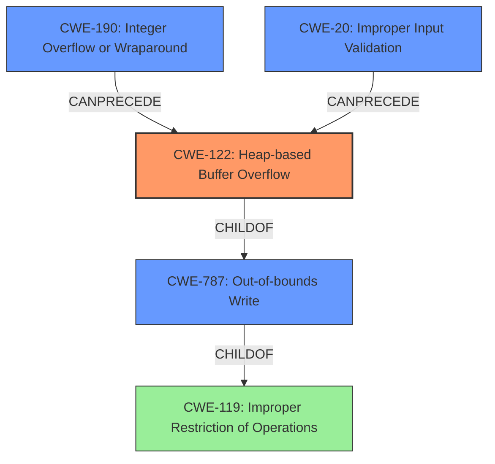

# Analysis Report for CVE-2022-0301

# Vulnerability Analysis Report: CVE-2022-0301

## Description

Heap buffer overflow in DevTools in Google Chrome prior to 97.0.4692.99 allowed an attacker who convinced a user to install a malicious extension to potentially exploit heap corruption via a crafted HTML page.

## Vulnerability Description Key Phrases

**Rootcause:** buffer overflow
**Impact:** heap corruption
**Vector:** crafted HTML page
**Attacker:** attacker who convinced a user to install a malicious extension
**Product:** Google Chrome
**Version:** prior to 97.0.4692.99
**Component:** DevTools

## Analysis (with Relationship Data)

# Summary
| CWE ID | CWE Name | Confidence | CWE Abstraction Level | CWE Vulnerability Mapping Label | CWE-Vulnerability Mapping Notes |
|---|---|---|---|---|---|
| CWE-122 | Heap-based Buffer Overflow | 0.9 | Variant | Allowed | Primary CWE |
| CWE-787 | Out-of-bounds Write | 0.6 | Base | Allowed | Secondary Candidate CWE |

## Evidence and Confidence

*   **Confidence Score:** 0.9
*   **Evidence Strength:** HIGH

- **Analysis and Justification:**  
  - *Explanation:* The vulnerability description explicitly states a "**heap buffer overflow**" in Google Chrome's DevTools. This directly aligns with CWE-122 (Heap-based Buffer Overflow), which is a variant of buffer overflow occurring specifically in the heap memory region. The CVE Reference Links Content Summary also confirms the "**Heap buffer overflow**" as the root cause. The provided description offers sufficient detail to specify the memory region affected, making CWE-122 more accurate than its parent, CWE-119 (Improper Restriction of Operations within the Bounds of a Memory Buffer). CWE-787 (Out-of-bounds Write) is a broader category, but since the overflow is specifically on the heap, CWE-122 is a better fit. The MITRE mapping guidance ALLOWED for CWE-122 reinforces this choice.
  
  - *Relationship Analysis:* CWE-122 is a variant of CWE-119 (Improper Restriction of Operations within the Bounds of a Memory Buffer) and a specific type of buffer overflow. It is also related to other memory corruption vulnerabilities. The description doesn't suggest any other weaknesses are directly involved, but a heap buffer overflow can lead to further exploitation, such as arbitrary code execution.

- **Confidence Score:**  
  - Confidence: 0.9 (High confidence due to the explicit mention of "heap buffer overflow" in the vulnerability description and supporting CVE details.)

---

## Criticism of Analysis

Okay, here's a review of the provided CWE analysis, incorporating the full CWE specifications.

**Overall Assessment:**

The analysis is generally sound and well-justified. The selection of CWE-122 (Heap-based Buffer Overflow) as the primary CWE is appropriate given the vulnerability description.  The inclusion of CWE-787 as a secondary candidate is reasonable, reflecting the broader nature of out-of-bounds writes.  The confidence level is appropriate, given the explicit nature of the vulnerability description.

**Detailed Review:**

**1. CWE-122: Heap-based Buffer Overflow (Primary)**

*   **Correctness:** Correct. The vulnerability description explicitly mentions a "heap buffer overflow," which directly aligns with CWE-122's definition. This is a clear and unambiguous mapping.
*   **Abstraction Level:** Variant is the preferred level, and this choice aligns with that recommendation.
*   **Mapping Guidance:** Correctly followed.  The "Usage: Allowed" mapping guidance for CWE-122 is appropriately considered. The rationale provided within CWE-122 specification "This CWE entry is at the Variant level of abstraction, which is a preferred level of abstraction for mapping to the root causes of vulnerabilities." is applicable here.
*   **Mitigations:** The analysis doesn't explicitly mention mitigations, but it's implied that standard buffer overflow prevention techniques would apply. The CWE-122 specification provides good mitigation examples:
    *   Language/compiler with automatic bounds checking.
    *   Abstraction libraries for risky APIs.
    *   Compiler-based buffer overflow detection mechanisms (e.g., /GS flag, FORTIFY_SOURCE).
*   **Observed Examples:** The provided examples in the CWE-122 specification further solidify the mapping. The chains often involve integer overflows/incorrect conversions leading to the heap overflow, which is a common pattern.
*   **Confidence:** 0.9 is justified, given the direct match in the description.

**2. CWE-787: Out-of-bounds Write (Secondary Candidate)**

*   **Correctness:** Reasonable, though less precise than CWE-122. Since CWE-122 is a child of CWE-787, it's technically correct, but CWE-122 offers a more specific characterization of the vulnerability.
*   **Abstraction Level:** Base is a suitable level, but the more specific Variant CWE-122 is preferred.
*   **Mapping Guidance:** Followed correctly, although the usage guidelines recommend specific alternatives like CWE-122 if the buffer overflow is on the heap. This is precisely the case here, explaining why CWE-122 is the primary.
*   **Mitigations:** The analysis doesn't explicitly mention mitigations, but the same buffer overflow prevention techniques as for CWE-122 apply. The CWE-787 mitigations are similar to CWE-122 but less specific.
*   **Observed Examples:** The examples provided in the CWE-787 specification further clarify its general nature. The chains often involve input validation errors or numeric errors leading to out-of-bounds writes, which makes sense.
*   **Confidence:** The confidence score of 0.6 is justifiable, as this CWE is more general and less specific.

**Areas for potential improvement:**

1.  **Explicitly Discuss Mitigations:** While implied, it would strengthen the analysis to explicitly state that standard buffer overflow mitigations apply to both CWE-122 and CWE-787. Include examples directly from the CWE specifications like ASLR or using memory-safe languages.

2.  **Relationship to CWE-119:**  The analysis mentions the relationship between CWE-122 and CWE-119, but a more explicit statement explaining *why* CWE-119 is *not* the primary CWE could be beneficial. Emphasize that CWE-119 is a broad class, and the availability of more specific CWEs (like CWE-122) makes CWE-119 less appropriate. The CWE-119 guidance "Look at CWE-119's children and consider mapping to CWEs such as CWE-787: Out-of-bounds Write, CWE-125: Out-of-bounds Read, or others." reinforces that the analysis is correct in not selecting CWE-119 as primary.

3.  **Consider Chaining:** The analysis could briefly mention possible "chains" of vulnerabilities that might lead to the heap buffer overflow. While not explicitly stated in the vulnerability description, common chains include integer overflows leading to undersized buffer allocations. CWE-20, "Improper Input Validation" is another possible chain, as a malformed crafted HTML page could result in an improper length being passed in, which then leads to the heap buffer overflow.

**Addressing the Retriever Results**

The retriever results include some interesting CWEs that, while not primary, could be tangentially related or represent potential root causes *leading* to the buffer overflow:

*   **CWE-843 (Type Confusion):**  While not directly implicated in the provided description, a type confusion vulnerability *could* lead to miscalculations of buffer sizes or incorrect data being written to the heap, ultimately resulting in a buffer overflow.  This could be a *precursor* to the buffer overflow.
*   **CWE-193 (Off-by-one Error):** Off-by-one errors are a common cause of buffer overflows. Again, it's a *possible* contributing factor, but not the main vulnerability.
*   **CWE-366 (Race Condition within a Thread):**  In multithreaded environments, race conditions could lead to incorrect state and buffer overflows. This is less likely, but possible depending on the context of the DevTools component.
*   **CWE-126 (Buffer Over-read):** While the primary vulnerability is a *write*, a carefully crafted exploit might *first* trigger a read to leak memory before overwriting it.
*   **CWE-416 (Use After Free):** Less likely to be the *direct* cause, but UAF can lead to memory corruption, which *could* then manifest as a buffer overflow in a later operation.
*   **CWE-190 (Integer Overflow or Wraparound):** This is a more *likely* contributing factor. Integer overflows can cause incorrect buffer size calculations, leading to smaller-than-expected allocations and, therefore, overflows.
*   **CWE-125 (Out-of-bounds Read):** Can potentially lead to sensitive information leak, but is not the primary vulnerability here.
*   **CWE-415 (Double Free):** Not the primary vulnerability but can cause memory corruption.

The final decision for selecting the Primary CWE has been well-reasoned, as the analysis has focused on the most specific and direct cause of the vulnerability, which is appropriate.

**Revised Summary Table:**

| CWE ID | CWE Name | Confidence | CWE Abstraction Level | CWE Vulnerability Mapping Label | CWE-Vulnerability Mapping Notes |
|---|---|---|---|---|---|
| CWE-122 | Heap-based Buffer Overflow | 0.9 | Variant | Allowed | Primary CWE |
| CWE-787 | Out-of-bounds Write | 0.6 | Base | Allowed | Secondary Candidate CWE |
| CWE-190 | Integer Overflow or Wraparound | 0.3 | Base | Allowed | Possible precursor to CWE-122 |
| CWE-20 | Improper Input Validation | 0.3 | Class | Allowed | Input validation failure leading to heap overflow |

**In conclusion,** the analysis is strong and well-supported by the CWE specifications. The recommended improvements would provide further context and strengthen the justification, but the core mapping choices are correct.

## Final Resolution

# Summary
| CWE ID | CWE Name | Confidence | CWE Abstraction Level | CWE Vulnerability Mapping Label | CWE-Vulnerability Mapping Notes |
|---|---|---|---|---|---|
| CWE-122 | Heap-based Buffer Overflow | 0.95 | Variant | Allowed | Primary CWE |
| CWE-787 | Out-of-bounds Write | 0.7 | Base | Allowed | Secondary Candidate CWE |
| CWE-190 | Integer Overflow or Wraparound | 0.4 | Base | Allowed | Possible precursor to CWE-122 |
| CWE-20 | Improper Input Validation | 0.4 | Class | Allowed | Input validation failure leading to heap overflow |

## Evidence and Confidence

*   **Confidence Score:** 0.9
*   **Evidence Strength:** HIGH

## Relationship Analysis
The primary CWE is CWE-122 (Heap-based Buffer Overflow), which is a variant of CWE-787 (**Out-of-bounds Write**) and a child of CWE-119 (**Improper Restriction of Operations within the Bounds of a Memory Buffer**). This hierarchical relationship indicates that CWE-122 is the most specific choice, accurately reflecting the vulnerability's location in the heap. CWE-190 (**Integer Overflow or Wraparound**) and CWE-20 (**Improper Input Validation**) are potential precursors that could lead to the heap buffer overflow. The abstraction levels influenced the selection by favoring the most specific variant (CWE-122) over its more general parent classes (CWE-119, CWE-787).

## Vulnerability Chain
The vulnerability chain starts with potential root causes such as CWE-190 (**Integer Overflow or Wraparound**) or CWE-20 (**Improper Input Validation**). These weaknesses can lead to an undersized buffer allocation on the heap. The immediate result is CWE-122 (**Heap-based Buffer Overflow**), where data is written beyond the allocated buffer's boundaries. The ultimate impact could be heap corruption and potentially arbitrary code execution. There may be missing links in the chain if the specific input validation or integer handling flaws are not explicitly detailed in the vulnerability report.

## Summary of Analysis
The initial analysis correctly identified CWE-122 (**Heap-based Buffer Overflow**) as the primary CWE based on the explicit mention of "heap buffer overflow" in the vulnerability description. The criticism provided valuable suggestions for improvement, including discussing mitigations, explicitly stating why CWE-119 is not the primary CWE, and considering potential vulnerability chains.

The graph relationships influenced the final selection by confirming that CWE-122 is the most specific and appropriate choice, given its hierarchical relationship with CWE-119 and CWE-787. The inclusion of CWE-190 and CWE-20 as secondary CWEs acknowledges the potential for upstream weaknesses that could contribute to the heap buffer overflow.

The selected CWEs are at the optimal level of specificity. CWE-122 accurately reflects the type of buffer overflow (heap-based), while CWE-787 serves as a broader, less specific category. The potential for CWE-190 and CWE-20 to precede CWE-122 provides additional context to the vulnerability. The decision is based on evidence from the vulnerability description, relationship analysis, and mapping guidance.

*Report generated on 2025-03-18 05:46:58*
