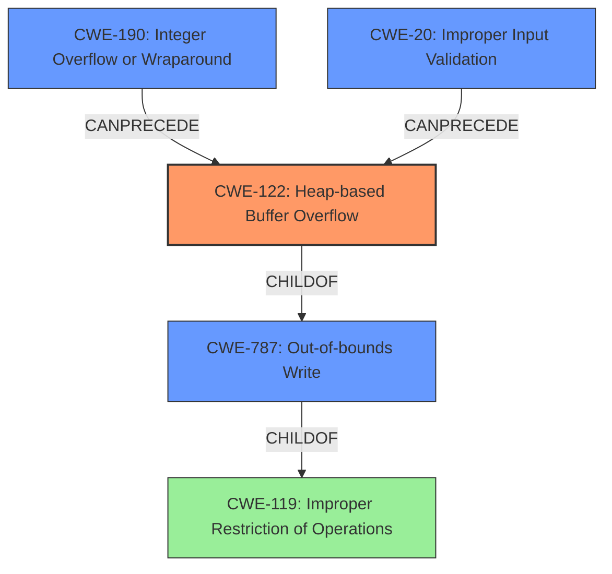

# Final Resolution for CVE-2022-0301

# Summary
| CWE ID | CWE Name | Confidence | CWE Abstraction Level | CWE Vulnerability Mapping Label | CWE-Vulnerability Mapping Notes |
|---|---|---|---|---|---|
| CWE-122 | Heap-based Buffer Overflow | 0.95 | Variant | Allowed | Primary CWE |
| CWE-787 | Out-of-bounds Write | 0.7 | Base | Allowed | Secondary Candidate CWE |
| CWE-190 | Integer Overflow or Wraparound | 0.4 | Base | Allowed | Possible precursor to CWE-122 |
| CWE-20 | Improper Input Validation | 0.4 | Class | Allowed | Input validation failure leading to heap overflow |

## Evidence and Confidence

*   **Confidence Score:** 0.9
*   **Evidence Strength:** HIGH

## Relationship Analysis
The primary CWE is CWE-122 (Heap-based Buffer Overflow), which is a variant of CWE-787 (**Out-of-bounds Write**) and a child of CWE-119 (**Improper Restriction of Operations within the Bounds of a Memory Buffer**). This hierarchical relationship indicates that CWE-122 is the most specific choice, accurately reflecting the vulnerability's location in the heap. CWE-190 (**Integer Overflow or Wraparound**) and CWE-20 (**Improper Input Validation**) are potential precursors that could lead to the heap buffer overflow. The abstraction levels influenced the selection by favoring the most specific variant (CWE-122) over its more general parent classes (CWE-119, CWE-787).

## Vulnerability Chain
The vulnerability chain starts with potential root causes such as CWE-190 (**Integer Overflow or Wraparound**) or CWE-20 (**Improper Input Validation**). These weaknesses can lead to an undersized buffer allocation on the heap. The immediate result is CWE-122 (**Heap-based Buffer Overflow**), where data is written beyond the allocated buffer's boundaries. The ultimate impact could be heap corruption and potentially arbitrary code execution. There may be missing links in the chain if the specific input validation or integer handling flaws are not explicitly detailed in the vulnerability report.

## Summary of Analysis
The initial analysis correctly identified CWE-122 (**Heap-based Buffer Overflow**) as the primary CWE based on the explicit mention of "heap buffer overflow" in the vulnerability description. The criticism provided valuable suggestions for improvement, including discussing mitigations, explicitly stating why CWE-119 is not the primary CWE, and considering potential vulnerability chains.

The graph relationships influenced the final selection by confirming that CWE-122 is the most specific and appropriate choice, given its hierarchical relationship with CWE-119 and CWE-787. The inclusion of CWE-190 and CWE-20 as secondary CWEs acknowledges the potential for upstream weaknesses that could contribute to the heap buffer overflow.

The selected CWEs are at the optimal level of specificity. CWE-122 accurately reflects the type of buffer overflow (heap-based), while CWE-787 serves as a broader, less specific category. The potential for CWE-190 and CWE-20 to precede CWE-122 provides additional context to the vulnerability. The decision is based on evidence from the vulnerability description, relationship analysis, and mapping guidance.