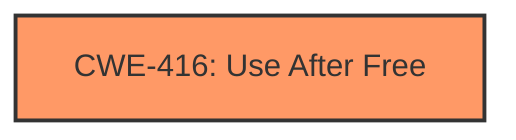

# Final Resolution for CVE-2022-0302

# Summary
| CWE ID | CWE Name | Confidence | CWE Abstraction Level | CWE Vulnerability Mapping Label | CWE-Vulnerability Mapping Notes |
|---|---|---|---|---|---|
| CWE-416 | Use After Free | 0.95 | Variant | Allowed | Primary CWE. The vulnerability description explicitly states "**use after free**" in the Omnibox component. |

## Evidence and Confidence

*   **Confidence Score:** 0.95
*   **Evidence Strength:** HIGH

## Relationship Analysis
The primary impact on the decision was the explicit mention of "use after free" in the vulnerability description, aligning perfectly with **CWE-416 (Use After Free)**. The relationships of **CWE-416** show potential chains (CanFollow) that might be relevant in other contexts but are not explicitly supported by the provided vulnerability description.

## Vulnerability Chain
The chain of events is:
1.  Memory is freed.
2.  The same memory is accessed again. This is the **CWE-416 (Use After Free)**.
3.  This leads to **heap corruption** as a consequence.

## Summary of Analysis
The initial analysis is accurate. The criticism correctly suggests considering related CWEs such as **CWE-362 (Race Condition)** and **CWE-415 (Double Free)**. However, the vulnerability description focuses on the *use* of freed memory, making **CWE-416** the most appropriate primary classification. The available evidence strongly supports this selection, and the confidence remains high (0.95). The choice of **CWE-416** is at the optimal level of specificity (Variant) based on the provided information. The vulnerability description explicitly states "**use after free** in Omnibox... to potentially exploit **heap corruption** via a crafted HTML page," which directly corresponds to **CWE-416**.