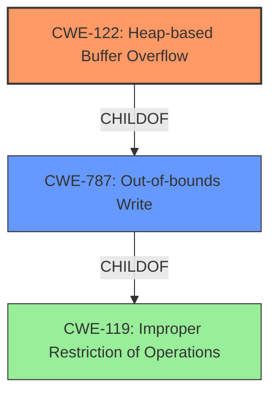

# Final Resolution for CVE-2022-0306

# Summary
| CWE ID | CWE Name | Confidence | CWE Abstraction Level | CWE Vulnerability Mapping Label | CWE-Vulnerability Mapping Notes |
|---|---|---|---|---|---|
| CWE-122 | Heap-based Buffer Overflow | 0.95 | Variant | Allowed | Primary CWE |
| CWE-787 | Out-of-bounds Write | 0.75 | Base | Allowed | Secondary Candidate |

## Evidence and Confidence

*   **Confidence Score:** 0.95
*   **Evidence Strength:** HIGH

## Relationship Analysis
The primary relationship considered was the hierarchical relationship between CWE-122, CWE-787, and CWE-119. CWE-122 (Heap-based Buffer Overflow) is a variant of the more general CWE-119 (Improper Restriction of Operations within the Bounds of a Memory Buffer), while CWE-787 (**Out-of-bounds Write**) is a parent of CWE-122. This influenced the decision to choose CWE-122 due to its higher specificity related to the **heap**. The analysis also considered the mapping guidance for CWE-119, which discourages its use when more specific CWEs are available.

## Vulnerability Chain
The vulnerability chain starts with the **root cause**, a **heap buffer overflow** (CWE-122). This occurs when a program writes data beyond the allocated boundary of a buffer located on the heap. The immediate consequence is an **out-of-bounds write** (CWE-787). The ultimate impact is potential heap corruption, which can lead to arbitrary code execution or other unexpected behaviors. There are no immediately missing links, as the description explicitly points to these issues.

## Summary of Analysis
The initial analysis correctly identified CWE-122 (Heap-based Buffer Overflow) as the primary CWE. This assessment is strongly based on the evidence provided in the vulnerability description: "Heap buffer overflow in PDFium in Google Chrome prior to 97.0.4692.99 allowed a remote attacker to potentially exploit heap corruption via a crafted HTML page." This explicitly mentions a **heap buffer overflow**, which directly corresponds to CWE-122.

The criticism raised several valid points, including the need to explicitly address why CWE-119 was not chosen and to discuss potential mitigations.

The analysis is based on the provided evidence, and the graph relationships support the choice of CWE-122 as the most specific and appropriate classification. The reasoning for rejecting other potential CWEs from the retriever results, such as CWE-843 (Type Confusion) and CWE-190 (Integer Overflow), further strengthens the confidence in the chosen classification. The inclusion of potential mitigations (e.g., safe memory management practices, automatic bounds checking) also adds value to the analysis. The selected CWEs are at the optimal level of specificity, with CWE-122 providing the most accurate description of the **root cause** and CWE-787 serving as a secondary candidate to represent the broader out-of-bounds write aspect.