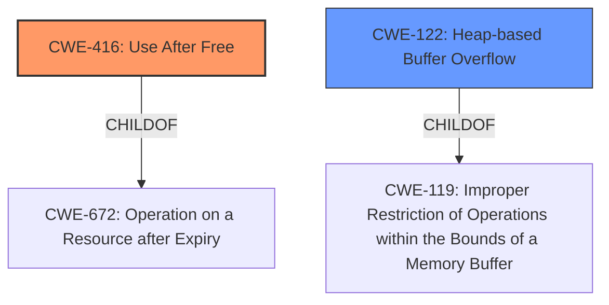

# Final Resolution for CVE-2022-0307

# Summary
| CWE ID | CWE Name | Confidence | CWE Abstraction Level | CWE Vulnerability Mapping Label | CWE-Vulnerability Mapping Notes |
|---|---|---|---|---|---|
| CWE-416 | Use After Free | 1.0 | Variant | Allowed | Primary CWE |
| CWE-122 | Heap-based Buffer Overflow | 0.5 | Variant | Allowed | Secondary Candidate |

## Evidence and Confidence

*   **Confidence Score:** 1.0
*   **Evidence Strength:** HIGH

## Relationship Analysis
The primary relationship impacting the decision is the parent-child relationship, where CWE-416 (Use After Free) is a variant of CWE-672 (Operation on a Resource after Expiry). This confirms that CWE-416 is an appropriate level of specificity. Additionally, CWE-122 (Heap-based Buffer Overflow) is a variant of CWE-119 (Improper Restriction of Operations within the Bounds of a Memory Buffer), which supports its role as a potential secondary issue if the freed memory is reallocated and then overwritten. The CanPrecede and CanFollow relationships for CWE-416 show it can lead to other vulnerabilities like race conditions (CWE-364) or be preceded by issues such as buffer copies without checking size (CWE-120). The abstraction levels of Variant for both selected CWEs indicate an appropriate level of detail.

## Vulnerability Chain
The vulnerability chain starts with a **use-after-free** condition (**CWE-416**) in the Optimization Guide. This occurs when memory is accessed after it has been freed. The consequence of this is **heap corruption**. If the freed memory is reallocated and attacker-controlled data is written to it, this **heap corruption** *could* lead to a **heap-based buffer overflow** (**CWE-122**). The final impact is a remote attacker exploiting the heap corruption via a crafted HTML page, leading to potential arbitrary code execution.

## Summary of Analysis
The initial analysis correctly identified **CWE-416 (Use After Free)** as the primary **weakness**. The vulnerability description explicitly states "**use after free** in Optimization Guide" and the CVE Reference Links Content Summary confirms "**root_cause**: Use after free" and "**weaknesses**: Use after free". This provides strong evidence for the selection of **CWE-416**.

The analysis also considered **CWE-122 (Heap-based Buffer Overflow)** as a secondary candidate due to the mention of "**heap corruption**". While the evidence for this is less direct, the potential for a **heap overflow** as a result of the **use-after-free** condition justifies its inclusion.

The criticism provided valuable suggestions for improvement, including mentioning mitigations for **CWE-416** and clarifying the secondary nature of **CWE-122**. It also suggested explaining why other highly-ranked CWEs were not considered.

Based on the evidence and relationship analysis, the final determination is to maintain **CWE-416** as the primary **weakness** and **CWE-122** as a secondary candidate. The selected CWEs are at the optimal level of specificity (Variant), and the mapping guidance from MITRE supports their usage. Other potential CWEs, such as **CWE-366 (Race Condition)** and **CWE-843 (Type Confusion)**, were not selected due to a lack of direct evidence in the vulnerability description.

The relationship analysis reinforces the selection of **CWE-416** as the primary **rootcause**, as it directly addresses the **use-after-free** condition described in the vulnerability.