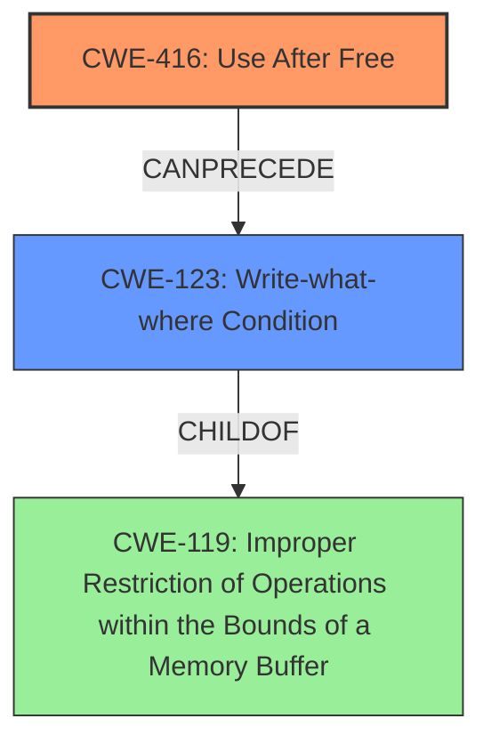

# Analysis Report for CVE-2022-0308

# Vulnerability Analysis Report: CVE-2022-0308

## Description

Use after free in Data Transfer in Google Chrome on Chrome OS prior to 97.0.4692.99 allowed a remote attacker who convinced a user to engage in specific user interaction to potentially exploit heap corruption via a crafted HTML page.

## Vulnerability Description Key Phrases

**Rootcause:** use after free
**Weakness:** heap corruption
**Vector:** crafted HTML page
**Attacker:** remote attacker
**Product:** Google Chrome on Chrome OS
**Version:** prior to 97.0.4692.99
**Component:** Data Transfer

## Analysis (with Relationship Data)

# Summary
| CWE ID | CWE Name | Confidence | CWE Abstraction Level | CWE Vulnerability Mapping Label | CWE-Vulnerability Mapping Notes |
|---|---|---|---|---|---|
| CWE-416 | Use After Free | 1.0 | Variant | Allowed | Primary CWE |

## Evidence and Confidence

*   **Confidence Score:** 1.0
*   **Evidence Strength:** HIGH

- **Analysis and Justification:**  
  - *Explanation:* The vulnerability description explicitly states a "**use after free**" in the Data Transfer component of Google Chrome, leading to potential **heap corruption**. This perfectly matches the definition of CWE-416, which is "The product reuses or references memory after it has been freed." The CVE Reference Links Content Summary also confirms "**Use after free**" as a root cause. The description aligns directly with CWE-416's characteristics, as the memory is being accessed after it has been freed, potentially leading to exploitation. This vulnerability can lead to arbitrary code execution, denial of service, or information disclosure, consistent with the impact of CWE-416. The retriever results also list CWE-416 as the top match.
  
  - *Relationship Analysis:* CWE-416 is a variant-level CWE, which is a preferred level of abstraction. It is related to other memory management issues, but the specific "use after free" condition makes it the most appropriate choice.

- **Confidence Score:**  
  - Confidence: 1.0 (High confidence due to explicit mention of "use after free" and confirmation in CVE reference links)

## Criticism of Analysis

## Critique of the CWE Analysis

The analysis is generally **very strong**, with a clear and well-justified primary CWE mapping to **CWE-416: Use After Free**. The high confidence score (1.0) is appropriate given the explicit mention of "use after free" in the vulnerability description and CVE reference links. The explanation is thorough and accurately links the vulnerability details to the CWE definition.

Here's a breakdown of the strengths and areas for potential improvement:

**Strengths:**

*   **Accurate Primary CWE Mapping:** The selection of CWE-416 is the most appropriate and accurate. The explanation thoroughly justifies this choice, referencing the vulnerability description, CVE details, and the core definition of CWE-416.
*   **Clear Justification:** The reasoning behind the CWE selection is clearly articulated.  It avoids generic explanations and focuses on the specific details of the vulnerability.
*   **Variant-Level Abstraction:** The analysis correctly identifies CWE-416 as a Variant-level CWE, which is the preferred level of abstraction.
*   **Evidence Strength Assessment:** The "Evidence Strength: HIGH" assessment is accurate and supported by the information provided.
*   **Database Examples:** The inclusion of known CWE-416 examples from the database provides valuable context and helps solidify the understanding of the vulnerability.
*   **Comprehensive CWE Specifications:** Including the full CWE specifications for all considered CWEs is excellent. This allows for a detailed comparison and understanding of why certain CWEs were chosen or rejected.
*   **Relationship Analysis:** The analysis addresses the relationship between CWE-416 and other memory management issues, explaining why CWE-416 is the most fitting.

**Areas for Potential Improvement:**

*   **Consideration of Secondary CWEs:** While CWE-416 is the correct primary CWE, the analysis could benefit from *briefly* discussing potential secondary CWEs that might be relevant *as consequences* of the Use-After-Free. For example:

    *   **CWE-119: Improper Restriction of Operations within the Bounds of a Memory Buffer:** This could be a *consequence* if the Use-After-Free leads to memory corruption and writing beyond buffer boundaries. However, it's not the root cause.
    *   **CWE-125: Out-of-bounds Read:** Similar to CWE-119, this could be a consequence.
    *   **CWE-123: Write-what-where:** Use-after-free can lead to the ability to control the content and location of memory writes, achieving a "write-what-where" primitive.
    *   **CWE-415: Double Free:** While the root cause is *use* after free, a complex scenario could lead to a double free as a consequence of the initial UAF.
*   **Relationship to Heap Corruption:** The original vulnerability description mentions "heap corruption." While Use-After-Free is a common cause of heap corruption, the connection could be more explicitly stated. Heap corruption is *not* a CWE, but a consequence of a memory safety violation. The analysis should clarify that heap corruption is a *result* of the UAF, not the cause. The analysis implicitly addresses this, but making it more explicit would be beneficial.
*   **Mitigations:** The current analysis focuses solely on identifying the vulnerability. Expanding to briefly describe the appropriate mitigations from the CWE-416 specifications would add further value. For instance, mentioning the mitigation strategy of language selection (using languages with automatic memory management) or setting pointers to NULL after freeing them could be included.

**Specific Comments based on Retriever Results and Top CWEs:**

*   **CWE-366 (Race Condition within a Thread) and CWE-362 (Concurrent Execution using Shared Resource with Improper Synchronization ('Race Condition')):** These are ranked highly in the retriever results, and it is *possible* that a race condition could *lead* to the use-after-free. However, without more information, it's difficult to say for sure if concurrency is a direct factor. The analysis should explicitly state whether there is evidence of concurrent access to the freed memory. If there is, then CWE-362 or CWE-366 could be a secondary CWE in a chain. The absence of evidence for concurrency is also fine, and should be explicitly stated.
*   **CWE-843 (Access of Resource Using Incompatible Type ('Type Confusion')):** This CWE is less likely given the explicit "use after free" description, but could be a *contributing factor* to the UAF. If the freed memory is reallocated to a different type, a type confusion could result when the original pointer is dereferenced.
*   **CWE-415 (Double Free):**  While UAF is the primary cause, a poorly handled UAF *could* lead to a double free if a cleanup routine attempts to free the same memory again. This is a *potential consequence*, not the root cause.
*   **CWE-1021 (Improper Restriction of Rendered UI Layers or Frames) and CWE-356 (Product UI does not Warn User of Unsafe Actions):** These are likely irrelevant.
*   **CWE-122 (Heap-based Buffer Overflow):**  Heap corruption as a *result* of the UAF *could* manifest as a heap overflow, making this a *potential consequence* of the UAF.
*   **CWE-190 (Integer Overflow or Wraparound) and CWE-252 (Unchecked Return Value):** These are likely irrelevant, unless there's evidence that an integer overflow or an unchecked return value directly contributed to the use-after-free condition.
*   **CWE-413: Improper Resource Locking:** This is also related to race conditions, and *could* be a potential contributing factor if improper locking leads to memory corruption and the subsequent UAF. The analysis should explicitly state whether there is any evidence of improper locking contributing to the UAF.

**Revised Summary Table (with potential addition):**

| CWE ID | CWE Name | Confidence | CWE Abstraction Level | CWE Vulnerability Mapping Label | CWE-Vulnerability Mapping Notes |
|---|---|---|---|---|---|
| CWE-416 | Use After Free | 1.0 | Variant | Allowed | Primary CWE |
| CWE-XXX | Potential consequences of CWE-416 | Low | Variant | Allowed | Further investigation is required to confirm if the exploitation of UAF leads to this condition  |

**In summary,** the analysis is excellent and requires minimal changes. The suggested improvements focus on providing a more complete picture by exploring potential secondary consequences and clarifying the role of heap corruption, as well as considering the potential role of concurrency. However, the core mapping to CWE-416 is correct and well-supported.

## Final Resolution

# Summary
| CWE ID | CWE Name | Confidence | CWE Abstraction Level | CWE Vulnerability Mapping Label | CWE-Vulnerability Mapping Notes |
|---|---|---|---|---|---|
| CWE-416 | Use After Free | 1.0 | Variant | Allowed | Primary CWE |
| CWE-123 | Write-what-where Condition | 0.4 | Base | Allowed | Secondary CWE; a potential consequence of CWE-416 |

## Evidence and Confidence

*   **Confidence Score:** 0.9
*   **Evidence Strength:** MEDIUM

## Relationship Analysis
The primary relationship is that **CWE-416 (Use After Free)** can potentially lead to **CWE-123 (Write-what-where)**. The vulnerability description explicitly mentions a use-after-free condition, which is the root cause. The consequence, potentially, is the ability to write to arbitrary memory locations.

## Vulnerability Chain
The vulnerability chain starts with the **ROOTCAUSE**, **CWE-416 (Use After Free)**, which allows an attacker to reuse or reference memory after it has been freed. This can then lead to the ability to control the content and location of memory writes, achieving a "**Write-what-where**" primitive (**CWE-123**). The final impact is potential **heap corruption** and arbitrary code execution.

## Summary of Analysis
The initial analysis correctly identified **CWE-416 (Use After Free)** as the primary **WEAKNESS**. The vulnerability description explicitly states a "use after free" condition in Google Chrome, which aligns perfectly with the definition of **CWE-416**.

The criticism suggested considering secondary CWEs that might be relevant as consequences of the Use-After-Free. I agree with this suggestion, and I'm adding **CWE-123 (Write-what-where Condition)** as a secondary CWE with a lower confidence score (0.4) because it is a potential, but not guaranteed, consequence. The vulnerability description mentions "potential heap corruption," which could be achieved by exploiting the Use-After-Free to write arbitrary data to arbitrary memory locations. If the **CWE-416** is exploited to achieve arbitrary write, it will become a **CWE-123**.

The relationship analysis shows that **CWE-416** can precede **CWE-123**. **CWE-123** is a base-level CWE, which is a preferred level of abstraction.

The final decision is to classify this vulnerability as **CWE-416 (Use After Free)** primarily, with **CWE-123 (Write-what-where Condition)** as a secondary CWE, contingent on whether the use-after-free is exploited to write arbitrary data to arbitrary memory locations. The selected CWEs are at the optimal level of specificity based on the available evidence. The confidence score is slightly lowered to 0.9 overall, reflecting the addition of the secondary CWE with its own lower confidence score.

*Report generated on 2025-03-18 05:50:43*
