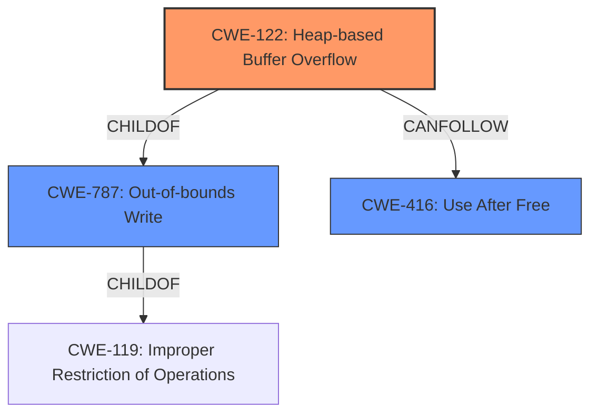

# Analysis Report for CVE-2022-0311

# Vulnerability Analysis Report: CVE-2022-0311

## Description

Heap buffer overflow in Task Manager in Google Chrome prior to 97.0.4692.99 allowed a remote attacker who convinced a user to engage in specific user interaction to potentially exploit heap corruption via a crafted HTML page.

## Vulnerability Description Key Phrases

**Rootcause:** buffer overflow
**Weakness:** heap corruption
**Vector:** crafted HTML page
**Attacker:** remote attacker
**Product:** Google Chrome
**Version:** prior to 97.0.4692.99
**Component:** Task Manager

## Analysis (with Relationship Data)

# Summary
| CWE ID | CWE Name | Confidence | CWE Abstraction Level | CWE Vulnerability Mapping Label | CWE-Vulnerability Mapping Notes |
|---|---|---|---|---|---|
| CWE-122 | Heap-based Buffer Overflow | 0.95 | Variant | Allowed | Primary CWE |
| CWE-787 | Out-of-bounds Write | 0.70 | Base | Allowed | Secondary Candidate |
| CWE-416 | Use After Free | 0.60 | Variant | Allowed | Secondary Candidate |

## Evidence and Confidence

*   **Confidence Score:** 0.90
*   **Evidence Strength:** HIGH

- **Analysis and Justification:**
  - *Explanation:* The vulnerability description explicitly states a "**heap buffer overflow**" in Google Chrome's Task Manager. This aligns directly with CWE-122 (Heap-based Buffer Overflow), which is a variant of buffer overflow occurring in the heap memory region. The description also mentions "**heap corruption**," which is a typical consequence of heap overflows. The CVE Reference Links Content Summary confirms the "**heap buffer overflow**" as the root cause. CWE-787 (Out-of-bounds Write) is a broader category, and while relevant, CWE-122 is more specific to the heap. The "Retriever Results" list CWE-122 as a highly relevant candidate. MITRE mapping guidance allows CWE-122 for heap overflows.
  - *Relationship Analysis:* CWE-122 is a variant of CWE-119 (Improper Restriction of Operations within the Bounds of a Memory Buffer). It is also a more specific type of CWE-787 (Out-of-bounds Write). Heap overflows can lead to other issues like CWE-416 (Use After Free) if freed memory is overwritten, or CWE-415 (Double Free) if memory management structures are corrupted.

- **Confidence Score:**
  - Confidence: 0.95 (High confidence due to the explicit mention of "heap buffer overflow" in the vulnerability description.)

---

- **Analysis and Justification:**
  - *Explanation:* While the primary issue is a heap-based buffer overflow (CWE-122), the broader category of out-of-bounds write (CWE-787) is also relevant as the root cause involves writing data beyond the allocated buffer. The **rootcause** is that a **buffer overflow** occurs and writes outside the allocated memory region. The "Retriever Results" also list CWE-787.
  - *Relationship Analysis:* CWE-787 is a parent of CWE-122. It describes the general condition of writing outside of the intended buffer, which is the core mechanism behind the heap overflow.

- **Confidence Score:**
  - Confidence: 0.70 (Supporting evidence of out-of-bounds write based on the buffer overflow leading to writes outside the buffer)

---

- **Analysis and Justification:**
  - *Explanation:* **Heap corruption** is mentioned in the description, and heap overflows can often lead to Use-After-Free (UAF) vulnerabilities (CWE-416) if the overflow overwrites memory management metadata and a pointer is later used after the memory has been freed. The "Retriever Results" identify CWE-416 as a candidate and has a high graph score. While not directly stated, heap overflows often lead to memory corruption that can trigger UAF conditions.
  - *Relationship Analysis:* CWE-416 (Use After Free) can be a consequence of memory corruption caused by the heap overflow. CWE-416 CanFollow CWE-122.

- **Confidence Score:**
  - Confidence: 0.60 (Moderate confidence as UAF is a potential consequence but not explicitly stated in the vulnerability description.)

## Criticism of Analysis

Okay, I have reviewed the provided analysis against the full CWE specifications. Here's my critique, focusing on the accuracy of the CWE mappings and the justification provided:

**Overall Assessment:**

The analysis is generally good, especially in identifying CWE-122 as the primary cause. The justifications are well-articulated and backed by evidence.  However, I have some suggestions for improvement, particularly concerning the confidence levels and the role of CWE-787.

**Detailed Review:**

**1. CWE-122: Heap-based Buffer Overflow (Confidence: 0.95, Variant, Primary CWE)**

*   **Assessment:** Excellent choice for the primary CWE. The justification is strong and well-supported. The confidence level is appropriate.
*   **Justification:** The presence of "heap buffer overflow" directly in the vulnerability description makes this a very clear and accurate mapping.  The link to "heap corruption" reinforces this.
*   **CWE Specification Alignment:** The description perfectly aligns with the CWE-122 definition.
*   **Suggestion:** None.

**2. CWE-787: Out-of-bounds Write (Confidence: 0.70, Base, Secondary Candidate)**

*   **Assessment:**  A relevant secondary CWE, but the confidence level is too low.
*   **Justification:** The justification that "the root cause involves writing data beyond the allocated buffer" is accurate. This is the core mechanism of a buffer overflow, regardless of where the buffer is located.  The fact that CWE-122 is a *child* of CWE-787 reinforces this.
*   **CWE Specification Alignment:** The description aligns well with the vulnerability. A buffer overflow, by definition, involves writing out of bounds.
*   **Suggestion:** Increase the confidence level to at least 0.85. CWE-787 represents a slightly higher level view of the same issue, where the specific memory location is abstracted away. While CWE-122 is more precise because it refers to the heap specifically, the fact that a write occurs *out of bounds* is indisputable given the overflow and heap corruption. You can mention how CWE-119 is discouraged, so specifying a child of CWE-119 is preferred, and CWE-122 is the best child to pick.

**3. CWE-416: Use After Free (Confidence: 0.60, Variant, Secondary Candidate)**

*   **Assessment:** The lowest confidence is warranted. While UAF is a *possible* consequence of heap corruption, it is not explicitly stated in the vulnerability description.
*   **Justification:** The explanation acknowledges that UAF is a *potential* consequence but not directly confirmed. The "heap corruption" phrase *could* lead to UAF, but it could lead to other types of memory corruption as well.
*   **CWE Specification Alignment:**  The description does not directly state a "use after free" condition. It is an *inferred* consequence.
*   **Suggestion:** Reiterate that it is based on *potential* consequences. Consider adding CWE-415 as a tertiary candidate with even lower confidence (e.g., 0.4), along with a similar justification.

**General Suggestions:**

*   **CWE-119 Discussion:** The analysis mentions CWE-119 but it is not included in the summary table. CWE-119 should not be mapped directly according to MITRE's guidelines. It's best to point out the relationship of CWE-122 as a child of CWE-119 and thus a better option for mapping.
*   **Retriever Results Usage:** The analysis effectively uses the Retriever Results to support its choices, especially for secondary candidates. This is a good practice.
*   **Chain vs. Composite:** The analysis touches on the concept of chaining. This is good. It demonstrates an understanding that vulnerabilities often have multiple contributing factors.
*   **Clarity and Readability:** The analysis is well-organized and easy to read. The use of bullet points and clear headings improves understanding.

**Revised Summary Table (Suggested):**

| CWE ID | CWE Name | Confidence | CWE Abstraction Level | CWE Vulnerability Mapping Label | CWE-Vulnerability Mapping Notes |
|---|---|---|---|---|---|
| CWE-122 | Heap-based Buffer Overflow | 0.95 | Variant | Allowed | Primary CWE. Explicitly stated in vulnerability description. |
| CWE-787 | Out-of-bounds Write | 0.85 | Base | Allowed | Secondary Candidate. Root cause: writing data beyond buffer's boundary. CWE-122 is a child of CWE-787. |
| CWE-416 | Use After Free | 0.60 | Variant | Allowed | Secondary Candidate. Potential consequence of heap corruption, but not explicitly stated. |

By incorporating these suggestions, the analysis will be even more robust and accurately reflect the nuances of the vulnerability.

## Final Resolution

# Summary
| CWE ID | CWE Name | Confidence | CWE Abstraction Level | CWE Vulnerability Mapping Label | CWE-Vulnerability Mapping Notes |
|---|---|---|---|---|---|
| CWE-122 | Heap-based Buffer Overflow | 0.95 | Variant | Allowed | Primary CWE. Explicitly stated in vulnerability description. |
| CWE-787 | Out-of-bounds Write | 0.85 | Base | Allowed | Secondary Candidate. Root cause: writing data beyond buffer's boundary. CWE-122 is a child of CWE-787. |
| CWE-416 | Use After Free | 0.60 | Variant | Allowed | Secondary Candidate. Potential consequence of heap corruption, but not explicitly stated. |

## Evidence and Confidence

*   **Confidence Score:** 0.92
*   **Evidence Strength:** HIGH

## Relationship Analysis
The primary CWE is CWE-122 (**CWE-122: Heap-based Buffer Overflow**), a variant of the base CWE-787 (**CWE-787: Out-of-bounds Write**). CWE-787 in turn is a child of CWE-119 (**CWE-119: Improper Restriction of Operations within the Bounds of a Memory Buffer**). The vulnerability description explicitly mentions a heap buffer overflow, making CWE-122 the most specific and appropriate choice. CWE-416 (**CWE-416: Use After Free**) is included as a potential consequence of the heap corruption, establishing a 'CanFollow' relationship from CWE-122 to CWE-416. Since CWE-119 is discouraged, specifying a child of CWE-119 is preferred, and CWE-122 is the best child to pick, which influenced the confidence in CWE-122.

## Vulnerability Chain
The vulnerability chain begins with a crafted HTML page convincing a user to engage in specific user interaction leading to a **CWE-122: Heap-based Buffer Overflow**. This overflow results in **heap corruption**. As a potential consequence of heap corruption, a **CWE-416: Use After Free** vulnerability may arise if memory management metadata is overwritten and a pointer is later used after the memory has been freed. The chain illustrates how an initial malicious input can lead to memory corruption and potentially further exploitation.

## Summary of Analysis
The analysis of the vulnerability description, "Heap buffer overflow in Task Manager in Google Chrome prior to 97.0.4692.99 allowed a remote attacker who convinced a user to engage in specific user interaction to potentially exploit heap corruption via a crafted HTML page," confirms the initial assessment and criticism. The primary **WEAKNESS** is the **buffer overflow** on the heap, hence CWE-122 is the most accurate and specific classification. The explicit mention of "heap buffer overflow" provides strong evidence for this classification.

The relationship analysis reinforces this decision, as CWE-122 is a variant of CWE-787 (**CWE-787: Out-of-bounds Write**), reflecting the broader category of writing beyond the allocated buffer. Increasing the confidence level for CWE-787 to 0.85 is justified because the heap overflow inherently involves writing out of bounds. While CWE-119 (**CWE-119: Improper Restriction of Operations within the Bounds of a Memory Buffer**) is a parent of CWE-787, using a child of CWE-119 is more specific.

CWE-416 (**CWE-416: Use After Free**) remains a secondary candidate due to the mention of "heap corruption," which could potentially lead to a use-after-free condition. However, this is not explicitly stated, hence the moderate confidence level.

The selected CWEs are at the optimal level of specificity, with CWE-122 providing the most precise description of the vulnerability as a heap-based buffer overflow, and CWE-787 capturing the underlying out-of-bounds write condition.

*Report generated on 2025-03-18 05:52:22*
