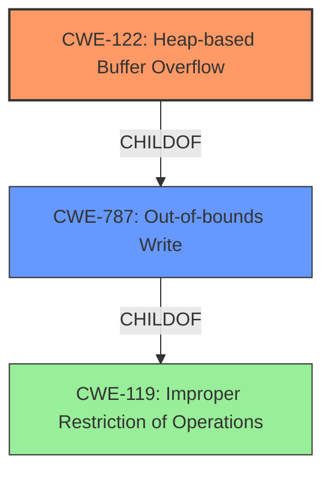

# Analysis Report for CVE-2022-0318

# Vulnerability Analysis Report: CVE-2022-0318

## Description

Heap-based Buffer Overflow in vim/vim prior to 8.2.

## Vulnerability Description Key Phrases

**Weakness:** Heap-based Buffer Overflow
**Product:** vim/vim
**Version:** prior to 8.2

## Analysis (with Relationship Data)

# Summary
| CWE ID | CWE Name | Confidence | CWE Abstraction Level | CWE Vulnerability Mapping Label | CWE-Vulnerability Mapping Notes |
|---|---|---|---|---|---|
| CWE-122 | Heap-based Buffer Overflow | 0.95 | Variant | Allowed | Acceptable-Use |
| CWE-787 | Write What Where Condition | 0.60 | Base | Allowed | Acceptable-Use |

## Evidence and Confidence

*   **Confidence Score:** 0.90
*   **Evidence Strength:** HIGH

- **Analysis and Justification:**  
  - *Explanation:* The vulnerability is explicitly described as a **Heap-based Buffer Overflow** in vim/vim. The "CVE Reference Links Content Summary" corroborates this by stating "Heap-based buffer overflow in Vim." and "Out-of-bounds write." The core issue is that the program writes data beyond the allocated buffer in the heap. CWE-122 (Heap-based Buffer Overflow) directly addresses this type of vulnerability. The "Retriever Results" also lists CWE-122 as a candidate.

  - *Relationship Analysis:* CWE-122 is a variant of CWE-119 (Improper Restriction of Operations Within the Bounds of a Memory Buffer). CWE-787 (Write What Where Condition) is a more general case of writing to an arbitrary memory location and could be a secondary candidate due to out-of-bounds write, but the description emphasizes the heap.

- **Confidence Score:**  
  - Confidence: 0.95 (High confidence due to direct match in description and CVE details)

---

## Criticism of Analysis

Okay, I've reviewed the provided analysis against the full CWE specifications. Here's my critique:

**Overall Assessment:**

The primary CWE assignment of **CWE-122: Heap-based Buffer Overflow** is highly accurate and well-supported by the provided information. The confidence level of 0.95 is justified. The inclusion of **CWE-787: Out-of-bounds Write** as a secondary, less confident mapping is also reasonable, as it represents the underlying mechanism. However, the confidence score of 0.60 for CWE-787 might be a bit high, as CWE-122 is more specific and the primary concern.

**Detailed Critique:**

*   **CWE-122: Heap-based Buffer Overflow**

    *   **Correctness:** Excellent. The vulnerability description explicitly mentions "Heap-based Buffer Overflow," making this a direct and appropriate mapping. The CVE Reference Links Content Summary further reinforces this.
    *   **Abstraction Level:**  The analysis correctly identifies CWE-122 as a *Variant* which is the ideal level for direct mapping.
    *   **Mapping Guidance:**  The analysis accurately follows the mapping guidance which allows using this CWE.
    *   **Evidence & Justification:** The explanation provided is clear and concise. It effectively links the vulnerability description to the CWE definition. The "Relationship Analysis" correctly acknowledges that CWE-122 is a child of CWE-119 (Improper Restriction of Operations within the Bounds of a Memory Buffer) and that CWE-787 is a more general case.
    *   **Confidence:** 0.95 is appropriate given the direct evidence.
    *   **CWE Examples:** The provided examples are all valid instances of CWE-122, further supporting the mapping.
    *   **Potential Mitigations:** The analysis doesn't explicitly discuss mitigations, but the CWE specification provides excellent options, including:
        *   Using languages/compilers with automatic bounds checking.
        *   Using abstraction libraries.
        *   Employing automatic buffer overflow detection mechanisms (e.g., /GS flag in Visual Studio, FORTIFY_SOURCE in GCC).

*   **CWE-787: Out-of-bounds Write**

    *   **Correctness:** While not incorrect, it's less precise than CWE-122.  CWE-787 is a more general *Base* class. A heap-based buffer overflow *is* an out-of-bounds write, but it's more specific in that the buffer resides in the heap.
    *   **Abstraction Level:** Correctly identifies CWE-787 as a *Base* which is general.
    *   **Mapping Guidance:**  The analysis accurately follows the mapping guidance which allows using this CWE.
    *   **Evidence & Justification:** The justification is that a heap-based buffer overflow *results* in an out-of-bounds write. This is a valid point, but the emphasis should be on *why* it's happening in the heap, which is why CWE-122 is superior.
    *   **Confidence:**  I'd suggest lowering the confidence to 0.50. While technically correct, it's not the *best* fit, and the analysis should primarily focus on CWE-122.
    *   **CWE Examples:**  The provided examples are valid instances of CWE-787.
    *   **Potential Mitigations:** The CWE specification's mitigations are applicable but less targeted than those for CWE-122.  The general mitigations for CWE-787 are useful but do not give specific context for heap mitigations.

**Suggestions for Improvement:**

1.  **Strengthen the Differentiation:**  While acknowledging that CWE-787 is a broader category, emphasize why CWE-122 is the more *precise* and *actionable* mapping. State that the analysis should focus on heap-specific attack vectors, which might include techniques for manipulating heap metadata or exploiting specific heap allocators.
2.  **Mitigation Emphasis:**  Expand on the specific mitigations for CWE-122. For instance, discuss heap hardening techniques, safe memory allocation strategies (using `calloc` instead of `malloc`), and the use of memory debugging tools like Valgrind to detect heap overflows during development. Consider ASan (AddressSanitizer).
3.  **Retriever Results Analysis:** Briefly discuss why the retrievers might have ranked other CWEs higher. For example, many buffer overflow issues involve integer overflows (CWE-190) or incorrect buffer size calculations (CWE-131) *leading to* the overflow. These could be contributing factors, but CWE-122 is the direct result.
4.  **CWE-119 Discussion:** While the analysis mentions CWE-119, it could benefit from explicitly stating *why* CWE-119 is discouraged as a direct mapping in this case.  Explain that CWE-119 is too broad and that the analysis has enough information to map to the more specific CWE-122.

**Revised Summary Table:**

| CWE ID | CWE Name | Confidence | CWE Abstraction Level | CWE Vulnerability Mapping Label | CWE-Vulnerability Mapping Notes |
|---|---|---|---|---|---|
| CWE-122 | Heap-based Buffer Overflow | 0.95 | Variant | Allowed | Acceptable-Use |
| CWE-787 | Out-of-bounds Write | 0.50 | Base | Allowed | Acceptable-Use, Secondary Mapping |

**In Summary:**

The analysis is strong in its identification of CWE-122. Minor adjustments to highlight its superiority over CWE-787 and to expand on mitigation strategies would further improve the assessment. The most important change is to lower the confidence on CWE-787 to reflect its less precise nature.

## Final Resolution

# Summary
| CWE ID | CWE Name | Confidence | CWE Abstraction Level | CWE Vulnerability Mapping Label | CWE-Vulnerability Mapping Notes |
|---|---|---|---|---|---|
| CWE-122 | Heap-based Buffer Overflow | 0.95 | Variant | Allowed | Acceptable-Use, Primary CWE |
| CWE-787 | Out-of-bounds Write | 0.50 | Base | Allowed | Acceptable-Use, Secondary Candidate |

## Evidence and Confidence

*   **Confidence Score:** 0.95
*   **Evidence Strength:** HIGH

## Relationship Analysis
The primary relationship influencing the classification is the hierarchical relationship where **CWE-122 (Heap-based Buffer Overflow)** is a specific type of **CWE-119 (Improper Restriction of Operations Within the Bounds of a Memory Buffer)**, and also where **CWE-122 (Heap-based Buffer Overflow)** is a specific case of **CWE-787 (Out-of-bounds Write)**.
Given the explicit mention of a "Heap-based Buffer Overflow" in the vulnerability description, **CWE-122** is the more specific and appropriate choice. **CWE-787** is a valid, but less precise, secondary mapping. The analysis correctly identified **CWE-122** as a *Variant* and **CWE-787** as a *Base*, influencing the decision to prioritize the more specific variant.

## Vulnerability Chain
The vulnerability chain starts with the allocation of a buffer on the heap. The **ROOTCAUSE** is the incorrect handling of buffer boundaries. This leads directly to **CWE-122 (Heap-based Buffer Overflow)**, where data is written beyond the allocated buffer. The impact is potential code execution or denial of service due to memory corruption.

## Summary of Analysis
The initial analysis and criticism both agree that **CWE-122 (Heap-based Buffer Overflow)** is the most appropriate primary classification.
The vulnerability description explicitly states "Heap-based Buffer Overflow in vim/vim prior to 8.2," providing direct evidence for this classification.
The relationship analysis confirms that **CWE-122** is a more specific variant of the more general **CWE-787 (Out-of-bounds Write)**, making it the preferred choice.

The decision to classify this vulnerability as **CWE-122** is based on the evidence directly provided in the vulnerability description: "Heap-based Buffer Overflow". The graph relationships confirm this by showing that **CWE-122** is a specific type of buffer overflow, making it more precise than the base class **CWE-787**. This classification is at the optimal level of specificity because it accurately reflects the location (heap) where the buffer overflow occurs.

*Report generated on 2025-03-18 05:53:02*
