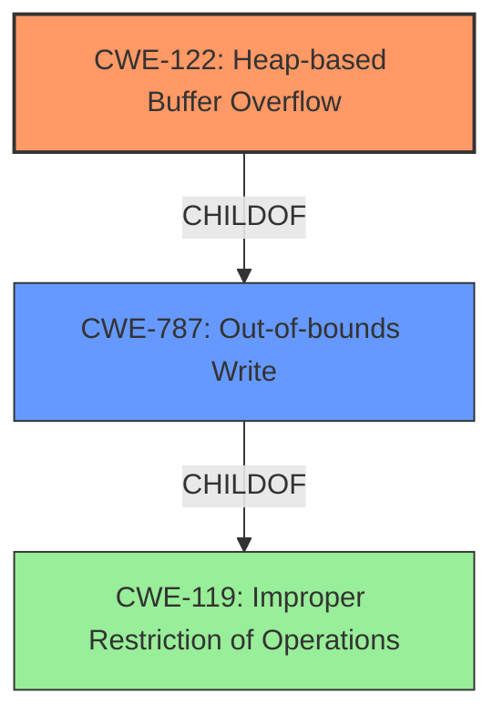

# Final Resolution for CVE-2022-0318

# Summary
| CWE ID | CWE Name | Confidence | CWE Abstraction Level | CWE Vulnerability Mapping Label | CWE-Vulnerability Mapping Notes |
|---|---|---|---|---|---|
| CWE-122 | Heap-based Buffer Overflow | 0.95 | Variant | Allowed | Acceptable-Use, Primary CWE |
| CWE-787 | Out-of-bounds Write | 0.50 | Base | Allowed | Acceptable-Use, Secondary Candidate |

## Evidence and Confidence

*   **Confidence Score:** 0.95
*   **Evidence Strength:** HIGH

## Relationship Analysis
The primary relationship influencing the classification is the hierarchical relationship where **CWE-122 (Heap-based Buffer Overflow)** is a specific type of **CWE-119 (Improper Restriction of Operations Within the Bounds of a Memory Buffer)**, and also where **CWE-122 (Heap-based Buffer Overflow)** is a specific case of **CWE-787 (Out-of-bounds Write)**.
Given the explicit mention of a "Heap-based Buffer Overflow" in the vulnerability description, **CWE-122** is the more specific and appropriate choice. **CWE-787** is a valid, but less precise, secondary mapping. The analysis correctly identified **CWE-122** as a *Variant* and **CWE-787** as a *Base*, influencing the decision to prioritize the more specific variant.

## Vulnerability Chain
The vulnerability chain starts with the allocation of a buffer on the heap. The **ROOTCAUSE** is the incorrect handling of buffer boundaries. This leads directly to **CWE-122 (Heap-based Buffer Overflow)**, where data is written beyond the allocated buffer. The impact is potential code execution or denial of service due to memory corruption.

## Summary of Analysis
The initial analysis and criticism both agree that **CWE-122 (Heap-based Buffer Overflow)** is the most appropriate primary classification.
The vulnerability description explicitly states "Heap-based Buffer Overflow in vim/vim prior to 8.2," providing direct evidence for this classification.
The relationship analysis confirms that **CWE-122** is a more specific variant of the more general **CWE-787 (Out-of-bounds Write)**, making it the preferred choice.

The decision to classify this vulnerability as **CWE-122** is based on the evidence directly provided in the vulnerability description: "Heap-based Buffer Overflow". The graph relationships confirm this by showing that **CWE-122** is a specific type of buffer overflow, making it more precise than the base class **CWE-787**. This classification is at the optimal level of specificity because it accurately reflects the location (heap) where the buffer overflow occurs.