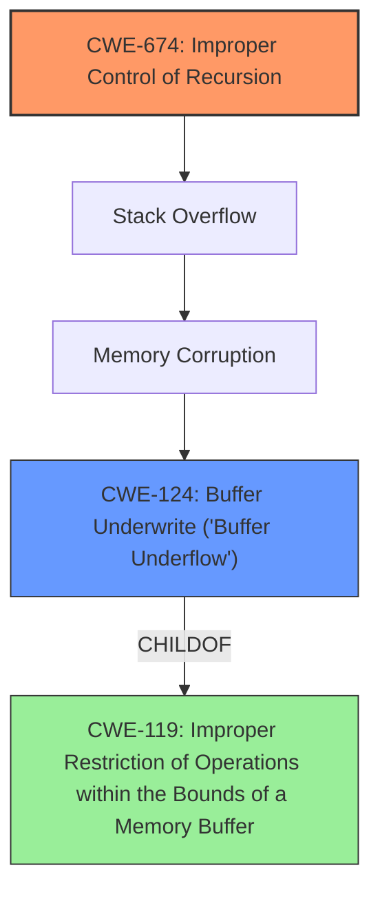

# Final Resolution for CVE-2022-0351

# Summary
| CWE ID | CWE Name | Confidence | CWE Abstraction Level | CWE Vulnerability Mapping Label | CWE-Vulnerability Mapping Notes |
|---|---|---|---|---|---|
| CWE-674 | Improper Control of Recursion | 0.85 | Class | Allowed-with-Review | Primary CWE: Root Cause |
| CWE-124 | Buffer Underwrite ('Buffer Underflow') | 0.70 | Base | Allowed | Secondary CWE: Result of Stack Overflow |

## Evidence and Confidence

*   **Confidence Score:** 0.80
*   **Evidence Strength:** HIGH

## Relationship Analysis
The primary relationship identified is the chain where **CWE-674 (Improper Control of Recursion)** leads to a stack overflow, which in turn leads to memory corruption, and finally manifests as **CWE-124 (Buffer Underwrite)**. **CWE-124** is a child of **CWE-119 (Improper Restriction of Operations within the Bounds of a Memory Buffer)**. The analysis considers that **CWE-674** is a Class-level weakness, noting the potential for more specific Base or Variant level CWEs if recursion implementation details were available.

## Vulnerability Chain
The vulnerability chain starts with **CWE-674 (Improper Control of Recursion)**, where the lack of proper limits on recursion depth during expression parsing in Vim allows deeply nested parentheses to cause a stack overflow. This stack overflow leads to memory corruption, ultimately resulting in **CWE-124 (Buffer Underwrite)** as the program attempts to access memory locations before the start of the buffer. The **ROOTCAUSE** is the missing recursion limit, and the final impact is the buffer underwrite.

## Summary of Analysis
The initial analysis correctly identified **CWE-124 (Buffer Underwrite)** based on the vulnerability description. However, the criticism highlighted that the **ROOTCAUSE** is the improper control of recursion, which leads to a stack overflow and subsequent memory corruption. The CVE summary explicitly mentions "insufficient recursion limit," supporting the higher confidence in **CWE-674 (Improper Control of Recursion)**.

The graph relationships influenced the final selection by clarifying the chain of events. **CWE-674** is the starting point, leading to memory corruption and then **CWE-124**.

The selected CWEs are at the optimal level of specificity given the available evidence. While **CWE-674** is a Class-level weakness, the specific details of the recursion implementation are not provided, making it the most appropriate choice. **CWE-124** accurately describes the resulting buffer underwrite.