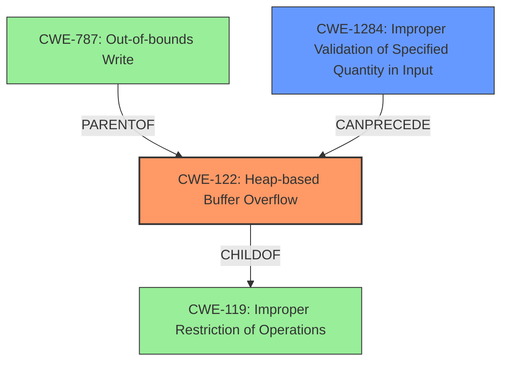

# Final Resolution for CVE-2022-0367

# Summary
| CWE ID | CWE Name | Confidence | CWE Abstraction Level | CWE Vulnerability Mapping Label | CWE-Vulnerability Mapping Notes |
|---|---|---|---|---|---|
| **CWE-122** | **Heap-based Buffer Overflow** | 0.9 | Variant | Allowed | Acceptable-Use |
| **CWE-1284** | **Improper Validation of Specified Quantity in Input** | 0.75 | Base | Allowed | Acceptable-Use |

## Evidence and Confidence

*   **Confidence Score:** 0.9
*   **Evidence Strength:** HIGH

## Relationship Analysis
The primary weakness is **CWE-122 (Heap-based Buffer Overflow)**, which is a variant of **CWE-119 (Improper Restriction of Operations within the Bounds of a Memory Buffer)**. The overflow occurs because of **CWE-1284 (Improper Validation of Specified Quantity in Input)**. **CWE-787 (Out-of-bounds Write)** is a parent of **CWE-122** and represents the actual write beyond buffer boundaries, but **CWE-122** is more specific. The vulnerability chain starts with missing input validation (**CWE-1284**), which leads to the **heap-based buffer overflow** (**CWE-122**).

## Vulnerability Chain
The vulnerability chain begins with **CWE-1284 (Improper Validation of Specified Quantity in Input)**, where the write offset address is not validated. This lack of validation leads directly to **CWE-122 (Heap-based Buffer Overflow)** when an attacker provides an invalid offset, resulting in out-of-bounds memory access. The root cause is the missing input validation, and the impact is a heap overflow.

## Summary of Analysis
The initial analysis and criticism were both accurate and helpful. The vulnerability is indeed a **heap-based buffer overflow**, as explicitly stated in the vulnerability description: "A **heap-based buffer overflow** flaw was found in libmodbus in function modbus_reply() in src/modbus.c."

The decision to classify this as **CWE-122 (Heap-based Buffer Overflow)** is justified because it accurately reflects the type of buffer overflow. The secondary classification of **CWE-1284 (Improper Validation of Specified Quantity in Input)** is also correct, as the overflow is caused by insufficient input validation of the write offset address.

The criticism suggested increasing the confidence level for **CWE-1284** and considering alternative CWEs, which was helpful. The confidence level for **CWE-1284** has been increased to 0.75 to reflect its direct role in the vulnerability.

The following alternative CWEs were considered and excluded:

*   **CWE-119 (Improper Restriction of Operations within the Bounds of a Memory Buffer):** This is too general, as the specific issue is a **heap-based buffer overflow**.
*   **CWE-787 (Out-of-bounds Write):** While this applies, **CWE-122** is a more specific description of the vulnerability.
*   **CWE-131 (Incorrect Calculation of Buffer Size):** This is not the primary cause; the buffer size itself might be correctly calculated, but there is no check on whether the input exceeds the pre-allocated buffer size.
*   **Integer Errors:** Integer overflows/underflows are not the root cause of this vulnerability.

The selected CWEs are at the optimal level of specificity because **CWE-122** accurately describes the type of overflow, and **CWE-1284** explains the root cause (missing input validation).