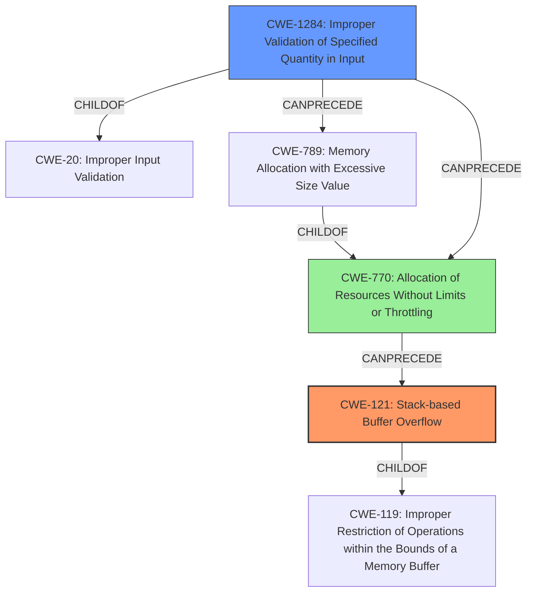

# Analysis Report for CVE-2022-0435

# Vulnerability Analysis Report: CVE-2022-0435

## Description

A stack overflow flaw was found in the Linux kernels TIPC protocol functionality in the way a user sends a packet with malicious content where the number of domain member nodes is higher than the 64 allowed. This flaw allows a remote user to crash the system or possibly escalate their privileges if they have access to the TIPC network.

## Vulnerability Description Key Phrases

**Rootcause:** stack overflow
**Impact:** ['crash the system', 'escalate privileges']
**Vector:** packet with malicious content
**Attacker:** remote user
**Product:** Linux kernels
**Component:** TIPC protocol functionality

## Analysis (with Relationship Data)

# Summary
| CWE ID | CWE Name | Confidence | CWE Abstraction Level | CWE Vulnerability Mapping Label | CWE-Vulnerability Mapping Notes |
|---|---|---|---|---|---|
| CWE-121 | Stack-based Buffer Overflow | 0.95 | Variant | Allowed | Primary CWE |
| CWE-1284 | Improper Validation of Specified Quantity in Input | 0.75 | Base | Allowed | Secondary Candidate |

## Evidence and Confidence

*   **Confidence Score:** 0.9
*   **Evidence Strength:** HIGH

- **Analysis and Justification:**  
  - *Explanation:* "The vulnerability is a **stack overflow** in the Linux kernel's TIPC protocol functionality. The root cause is a missing validation of the `member_cnt` field in a received `tipc_mon_domain` structure before allocating memory. This allows an attacker to send a crafted packet with a large `member_cnt` value, leading to a **stack overflow** when a later, valid domain record is processed via `memcpy`. CWE-121 (Stack-based Buffer Overflow) is the most accurate mapping because it specifically describes a buffer overflow occurring on the stack. The evidence provided clearly supports this classification, detailing the mechanism of the overflow."
  
  - *Relationship Analysis:* "CWE-121 is a variant of CWE-119 (Improper Restriction of Operations within the Bounds of a Memory Buffer). It is more specific than CWE-119 because it explicitly identifies the stack as the location of the buffer overflow. CWE-121 can be caused by other weaknesses like CWE-190 (Integer Overflow or Wraparound) or CWE-131 (Incorrect Calculation of Buffer Size), but the direct cause described in the vulnerability is the lack of validation leading to excessive memory allocation on the stack."

- **Confidence Score:**  
  - *Example:* Confidence: 0.95 (High confidence due to direct evidence of a stack-based buffer overflow)

---
- **Analysis and Justification:**  
  - *Explanation:* "CWE-1284 (Improper Validation of Specified Quantity in Input) is a secondary candidate because the **stack overflow** occurs due to the `tipc_mon_rcv` function not validating that the `member_cnt` field in a received `tipc_mon_domain` structure is below `MAX_MON_DOMAIN` before allocating memory. This aligns with the description of CWE-1284, which is that the product receives input that is expected to specify a quantity, but it does not validate or incorrectly validates that the quantity has the required properties. This lack of input validation is what ultimately leads to the stack overflow, making it a contributing factor. However, the primary weakness is the resulting **stack overflow** itself."
  
  - *Relationship Analysis:* "CWE-1284 is a child of CWE-20 (Improper Input Validation). The relationship analysis shows that CWE-1284 can precede CWE-789 (Memory Allocation with Excessive Size Value). In this case, improper input validation leads to excessive memory allocation. CWE-1284 helps explain how the overflow happened due to the lack of validation on the input 'member_cnt' field."

- **Confidence Score:**  
  - *Example:* Confidence: 0.75 (Moderate confidence; input validation issue contributes to the stack overflow)

## Criticism of Analysis

Okay, I've reviewed the provided analysis and CWE specifications. Here's a critique, focusing on the accuracy, completeness, and justification of the CWE mappings.

**Overall Assessment:**

The analysis is generally good, and the primary CWE mapping to CWE-121 (Stack-based Buffer Overflow) is accurate and well-justified. The inclusion of CWE-1284 (Improper Validation of Specified Quantity in Input) as a secondary CWE is also relevant and helps to explain the root cause. However, there are some areas for improvement in terms of completeness and potentially considering other related CWEs.

**Detailed Critique:**

1.  **CWE-121: Stack-based Buffer Overflow (Primary CWE)**

    *   **Accuracy:** Excellent. The vulnerability description clearly states that a stack overflow occurs due to a crafted packet. The CVE summary also directly mentions a stack overflow.
    *   **Justification:** The explanation provided is strong, clearly linking the missing validation of `member_cnt` to the subsequent stack overflow when `memcpy` is used.
    *   **Completeness:** Could be improved by acknowledging the root cause: lack of proper size limit verification, leading to the allocation size exceeding the stack space.
    *   **Mapping Guidance:** The analysis follows the mapping guidance in the CWE specification. The guidance mentions that CWE-119 is commonly misused and discouraged in favor of lower level CWEs, such as CWE-787 or CWE-125, but explicitly choosing CWE-121 over CWE-787 is good here.

2.  **CWE-1284: Improper Validation of Specified Quantity in Input (Secondary CWE)**

    *   **Accuracy:** Good.  The `member_cnt` field *is* a quantity, and the `tipc_mon_rcv` function fails to validate that quantity against `MAX_MON_DOMAIN`.
    *   **Justification:** The explanation adequately connects the lack of input validation to the excessive memory allocation that ultimately triggers the stack overflow.
    *   **Completeness:** This is a good secondary CWE and is well justified.
    *   **Mapping Guidance:** The analysis follows the mapping guidance.

**Areas for Improvement and Additional Considerations:**

1.  **Chain of Causation & Potential Additional CWEs:**

    *   While CWE-1284 is relevant, it's worth explicitly considering the chain of events and whether other CWEs might contribute to a more complete picture. Specifically:
        *   **CWE-770: Allocation of Resources Without Limits or Throttling:** This CWE might be relevant because the vulnerable code allocates memory without checking if the amount requested exceeds some reasonable limit.  The lack of a limit, in conjunction with the invalid input (CWE-1284), directly enables the overflow. This is particularly strong. Consider adding it as a secondary or tertiary CWE.
        *   **CWE-789: Memory Allocation with Excessive Size Value:**  This is a close relative of CWE-770 and is a *variant*. It directly describes the scenario where a large, untrusted size is used to allocate memory without ensuring it is within limits. If CWE-770 was added, CWE-789 should be a close consideration.
        *   **CWE-131: Incorrect Calculation of Buffer Size:**  It is possible that the check `member_cnt < MAX_MON_DOMAIN` was missing because of an underlying error in how the buffer size was originally calculated. While no calculations are apparent, if it is later determined that an incorrect formula was used, this could be relevant.
        *   **CWE-190: Integer Overflow or Wraparound:** While not explicitly mentioned, it's *possible* that an integer overflow could be involved if the attacker can provide a `member_cnt` value large enough to cause the allocation size calculation to wrap around to a smaller value. This would be a case of allocating too *little* memory, not too much. However, it's less likely given the current description.

2.  **Mitigation Considerations:**

    *   The analysis could benefit from explicitly mentioning which mitigations from the CWE specifications are most relevant and feasible for this specific vulnerability. For example:
        *   For CWE-121, mention the use of compiler flags like `/GS` (Microsoft) or `-fstack-protector-strong` (GCC/Clang) to enable stack canaries. Also, discuss address space layout randomization (ASLR).
        *   For CWE-1284, emphasize the importance of "accept known good" input validation and the need to define and enforce strict limits on the size of the `member_cnt` field.
        *   For CWE-770 and CWE-789, discuss OS-level resource limits.

3.  **Abstraction Level:**

    *   The choice of CWE-121 (Variant) and CWE-1284 (Base) are generally appropriate.  The overall goal is to be as specific as possible while still being accurate. The analysis does a good job of balancing this.

**Revised Summary Table:**

| CWE ID  | CWE Name                                   | Confidence | CWE Abstraction Level | CWE Vulnerability Mapping Label | CWE-Vulnerability Mapping Notes                                                                                                                                                |
| ------- | ------------------------------------------ | ---------- | --------------------- | ------------------------------- | ------------------------------------------------------------------------------------------------------------------------------------------------------------------------------ |
| CWE-121 | Stack-based Buffer Overflow                | 0.95       | Variant               | Allowed                       | Primary CWE                                                                                                                                                                |
| CWE-1284 | Improper Validation of Specified Quantity in Input | 0.75      | Base                  | Allowed                       | Secondary Candidate; contributing factor to the stack overflow.                                                                                                                 |
| CWE-770 | Allocation of Resources Without Limits or Throttling | 0.60  | Base | Allowed | Tertiary Candidate; lack of allocation throttling allows excessive memory to be reserved. |

**Conclusion:**

The analysis is sound, and the primary CWE mapping is accurate. By considering additional related CWEs and explicitly discussing relevant mitigations, the analysis can be further strengthened to provide a more complete understanding of the vulnerability and its potential impact. The addition of CWE-770 is recommended.

## Final Resolution

# Summary
| CWE ID | CWE Name | Confidence | CWE Abstraction Level | CWE Vulnerability Mapping Label | CWE-Vulnerability Mapping Notes |
|---|---|---|---|---|---|
| CWE-121 | Stack-based Buffer Overflow | 0.95 | Variant | Allowed | Primary CWE |
| CWE-1284 | Improper Validation of Specified Quantity in Input | 0.75 | Base | Allowed | Secondary Candidate |
| CWE-770 | Allocation of Resources Without Limits or Throttling | 0.60 | Base | Allowed | Tertiary Candidate |

## Evidence and Confidence

*   **Confidence Score:** 0.9
*   **Evidence Strength:** HIGH

## Relationship Analysis
The primary weakness is a **stack overflow** (CWE-121), a variant of **CWE-119 (Improper Restriction of Operations within the Bounds of a Memory Buffer)**. The **stack overflow** is caused by an improperly validated input quantity (CWE-1284), which is a child of **CWE-20 (Improper Input Validation)**. Furthermore, **CWE-770 (Allocation of Resources Without Limits or Throttling)** contributes to the vulnerability by allowing excessive memory allocation, exacerbating the **stack overflow**. CWE-1284 can precede **CWE-789 (Memory Allocation with Excessive Size Value)**, and **CWE-789** is a child of **CWE-770**. Thus, the chain is **improper input validation (CWE-1284) -> excessive resource allocation (CWE-770) -> stack overflow (CWE-121)**.

## Vulnerability Chain
The vulnerability chain starts with the lack of validation of the `member_cnt` field (**CWE-1284**). This leads to an allocation of resources without limits or throttling (**CWE-770**), allowing the attacker to specify a large size value. Subsequently, a **stack overflow** occurs (**CWE-121**) when a valid domain record is processed via `memcpy`, as the allocated memory exceeds the stack space. The root cause is the missing validation, and the impact is a system crash or potential privilege escalation.

## Summary of Analysis
The initial analysis correctly identified **CWE-121 (Stack-based Buffer Overflow)** as the primary issue, and **CWE-1284 (Improper Validation of Specified Quantity in Input)** as a secondary contributing factor. The criticism suggested considering **CWE-770 (Allocation of Resources Without Limits or Throttling)**, which I agree with. The evidence "the vulnerable code allocates memory without checking if the amount requested exceeds some reasonable limit" supports the inclusion of **CWE-770**. The graph relationships show how these weaknesses interact: **CWE-1284** allows an attacker to specify an excessive size, **CWE-770** allows the allocation to proceed without limits, and **CWE-121** is the resulting **stack overflow**. These CWEs are at the optimal level of specificity because they accurately describe the vulnerability based on the provided evidence and relationship analysis. The selection of **CWE-121** as primary is more specific than **CWE-119** due to it specifying *where* the buffer overflow happens. **CWE-1284** is a base class that helps explain the root cause, and **CWE-770** highlights that resources are allocated without limits.

*Report generated on 2025-03-18 05:54:49*
