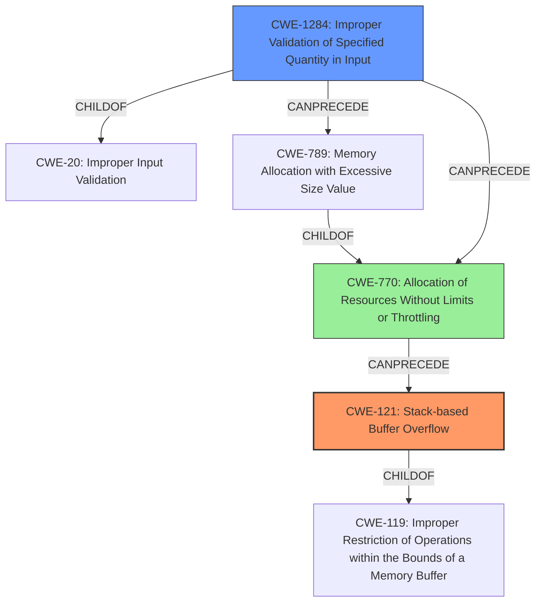

# Final Resolution for CVE-2022-0435

# Summary
| CWE ID | CWE Name | Confidence | CWE Abstraction Level | CWE Vulnerability Mapping Label | CWE-Vulnerability Mapping Notes |
|---|---|---|---|---|---|
| CWE-121 | Stack-based Buffer Overflow | 0.95 | Variant | Allowed | Primary CWE |
| CWE-1284 | Improper Validation of Specified Quantity in Input | 0.75 | Base | Allowed | Secondary Candidate |
| CWE-770 | Allocation of Resources Without Limits or Throttling | 0.60 | Base | Allowed | Tertiary Candidate |

## Evidence and Confidence

*   **Confidence Score:** 0.9
*   **Evidence Strength:** HIGH

## Relationship Analysis
The primary weakness is a **stack overflow** (CWE-121), a variant of **CWE-119 (Improper Restriction of Operations within the Bounds of a Memory Buffer)**. The **stack overflow** is caused by an improperly validated input quantity (CWE-1284), which is a child of **CWE-20 (Improper Input Validation)**. Furthermore, **CWE-770 (Allocation of Resources Without Limits or Throttling)** contributes to the vulnerability by allowing excessive memory allocation, exacerbating the **stack overflow**. CWE-1284 can precede **CWE-789 (Memory Allocation with Excessive Size Value)**, and **CWE-789** is a child of **CWE-770**. Thus, the chain is **improper input validation (CWE-1284) -> excessive resource allocation (CWE-770) -> stack overflow (CWE-121)**.

## Vulnerability Chain
The vulnerability chain starts with the lack of validation of the `member_cnt` field (**CWE-1284**). This leads to an allocation of resources without limits or throttling (**CWE-770**), allowing the attacker to specify a large size value. Subsequently, a **stack overflow** occurs (**CWE-121**) when a valid domain record is processed via `memcpy`, as the allocated memory exceeds the stack space. The root cause is the missing validation, and the impact is a system crash or potential privilege escalation.

## Summary of Analysis
The initial analysis correctly identified **CWE-121 (Stack-based Buffer Overflow)** as the primary issue, and **CWE-1284 (Improper Validation of Specified Quantity in Input)** as a secondary contributing factor. The criticism suggested considering **CWE-770 (Allocation of Resources Without Limits or Throttling)**, which I agree with. The evidence "the vulnerable code allocates memory without checking if the amount requested exceeds some reasonable limit" supports the inclusion of **CWE-770**. The graph relationships show how these weaknesses interact: **CWE-1284** allows an attacker to specify an excessive size, **CWE-770** allows the allocation to proceed without limits, and **CWE-121** is the resulting **stack overflow**. These CWEs are at the optimal level of specificity because they accurately describe the vulnerability based on the provided evidence and relationship analysis. The selection of **CWE-121** as primary is more specific than **CWE-119** due to it specifying *where* the buffer overflow happens. **CWE-1284** is a base class that helps explain the root cause, and **CWE-770** highlights that resources are allocated without limits.