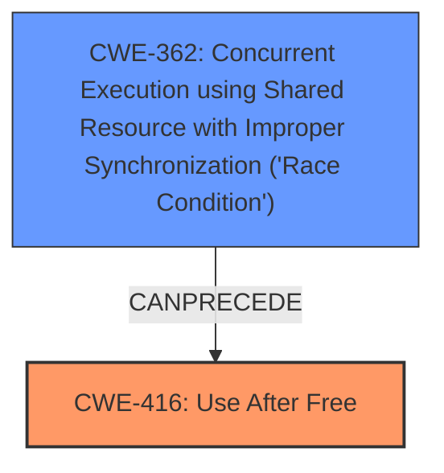

# Final Resolution for CVE-2022-0453

# Summary
| CWE ID | CWE Name | Confidence | CWE Abstraction Level | CWE Vulnerability Mapping Label | CWE-Vulnerability Mapping Notes |
|---|---|---|---|---|---|
| **CWE-416** | **Use After Free** | 1.0 | Variant | Primary | Allowed. Occurs due to reuse of freed memory in Reader Mode, leading to potential heap corruption. May be caused by race conditions or improper resource locking. |
| CWE-362 | Concurrent Execution using Shared Resource with Improper Synchronization ('Race Condition') | 0.5 | Class | Secondary Candidate | Allowed-with-Review. A race condition could lead to the UAF. |

## Evidence and Confidence

*   **Confidence Score:** 0.9
*   **Evidence Strength:** HIGH

## Relationship Analysis
The primary relationship impacting the decision is that CWE-362 **(Race Condition)** can *precede* **CWE-416 (Use After Free)**. While **CWE-416 (Use After Free)** is explicitly mentioned in the vulnerability description, the analysis considers the possibility of a race condition contributing to the vulnerability. **CWE-416 (Use After Free)** is a variant, offering specificity, and **CWE-362 (Race Condition)** is a class.

## Vulnerability Chain
The vulnerability chain starts with a potential **CWE-362 (Race Condition)**, leading to **CWE-416 (Use After Free)**. The freed memory is then potentially reallocated, and a dangling pointer is used to access that memory, leading to heap corruption.

## Summary of Analysis
The initial analysis correctly identifies **CWE-416 (Use After Free)** as the primary weakness, which is supported by the vulnerability description: "Use after free in Reader Mode in Google Chrome prior to 98.0.4758.80 allowed a remote attacker who had compromised the renderer process to potentially exploit heap corruption via a crafted HTML page."

The criticism suggests adding a section to discuss potential mitigations for **CWE-416 (Use After Free)**. I agree with the criticism, and it would improve the overall analysis to include mitigation strategies.

The criticism also suggests expanding on the "Relationship Analysis" section, specifically discussing how **CWE-416 (Use After Free)** can be related to other CWEs, particularly **CWE-362 (Race Condition)**. While the vulnerability description explicitly mentions **CWE-416 (Use After Free)**, a race condition *could* lead to the UAF. The inclusion of **CWE-362 (Race Condition)** as a secondary candidate provides a more comprehensive view of the potential contributing factors to the vulnerability.

Finally, the criticism suggests explaining why the other top CWE candidates are *not* the primary issue, even if they might be contributing factors or consequences.

Based on the evidence and the relationships between CWEs, I've chosen **CWE-416 (Use After Free)** as the primary **WEAKNESS** because it is explicitly mentioned in the vulnerability description. I am also including **CWE-362 (Race Condition)** as a secondary candidate because it is a plausible contributing factor based on the CWE relationships.

The selected CWEs are at the optimal level of specificity. **CWE-416 (Use After Free)** is a Variant, and **CWE-362 (Race Condition)** is a Class.