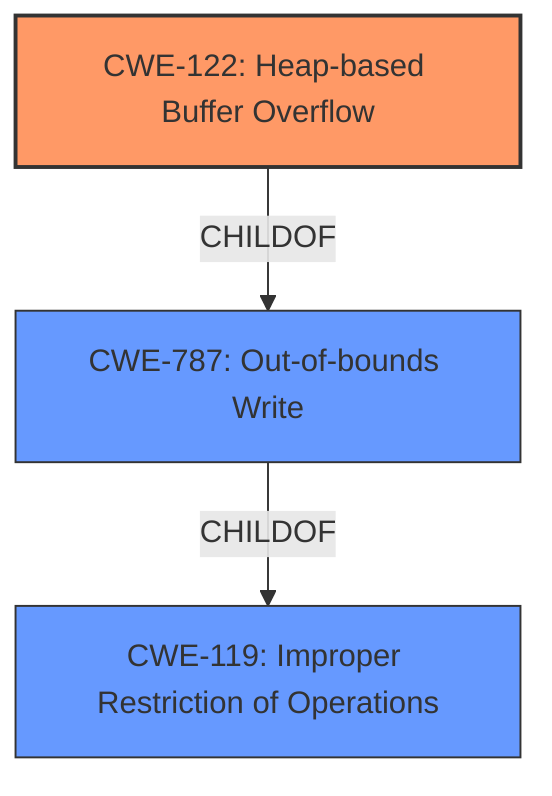

# Final Resolution for CVE-2022-0454

# Summary
| CWE ID | CWE Name | Confidence | CWE Abstraction Level | CWE Vulnerability Mapping Label | CWE-Vulnerability Mapping Notes |
|---|---|---|---|---|---|
| CWE-122 | Heap-based Buffer Overflow | 0.9 | Variant | Allowed | Primary CWE. Specifically identifies the location of the **buffer overflow** in the heap. Mitigations include using safer languages, abstraction libraries, and enabling compiler-based overflow detection mechanisms (e.g., /GS flag). |

## Evidence and Confidence

*   **Confidence Score:** 0.9
*   **Evidence Strength:** HIGH

## Relationship Analysis
The primary relationship impacting the decision is the parent-child relationship between CWE-119 (Improper Restriction of Operations within the Bounds of a Memory Buffer), CWE-787 (Out-of-bounds Write), and CWE-122 (**Heap-based Buffer Overflow**). CWE-122 is a variant of both CWE-119 and CWE-787, making it more specific to the vulnerability described. The specificity of the heap location makes CWE-122 the optimal choice.

## Vulnerability Chain
The vulnerability chain starts with an unspecified programming error that leads to a **heap-based buffer overflow**. This **buffer overflow** (CWE-122) allows a remote attacker to potentially exploit heap corruption, leading to arbitrary code execution. There are no missing links given the initial vulnerability description.

## Summary of Analysis
The initial analysis and the criticism both converged on CWE-122 (Heap-based Buffer Overflow) as the most appropriate classification. The vulnerability description explicitly mentions "Heap **buffer overflow**," providing strong evidence for this classification.

The graph relationships confirm that CWE-122 is a specific type of out-of-bounds write that occurs on the heap. While other CWEs like CWE-787 (Out-of-bounds Write) and CWE-119 (Improper Restriction of Operations within the Bounds of a Memory Buffer) are related, CWE-122 provides the most accurate and specific description of the vulnerability.

The MITRE mapping guidance allows for the use of CWE-122, and its mitigations, such as using safer languages and memory management techniques, align with preventing heap overflows.

The retriever results also suggest "CWE-843: Access of Resource Using Incompatible Type ('Type Confusion')". If there was evidence that the overflow was triggered because ANGLE was rendering graphics data with an incorrect type/format, then CWE-843 could have contributed in the chain of events leading to the overflow, but more information would be needed to make that determination.

Therefore, the final decision is to classify the vulnerability as CWE-122 (Heap-based Buffer Overflow) because it is the most specific and accurate representation of the root cause, supported by the evidence and relationship analysis.