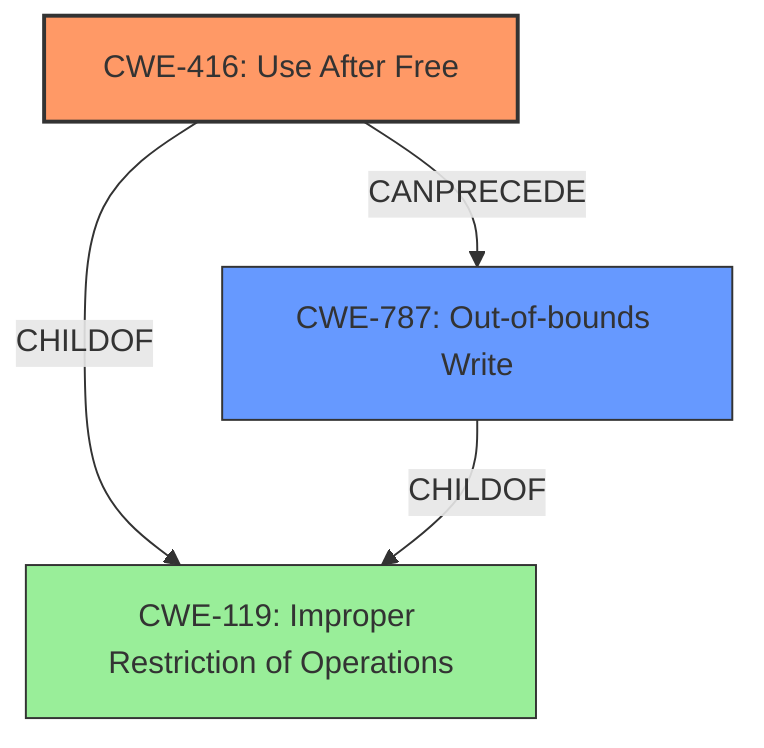

# Analysis Report for CVE-2022-0456

# Vulnerability Analysis Report: CVE-2022-0456

## Description

Use after free in Web Search in Google Chrome prior to 98.0.4758.80 allowed a remote attacker to potentially exploit heap corruption via profile destruction.

## Vulnerability Description Key Phrases

**Rootcause:** profile destruction
**Weakness:** heap corruption
**Attacker:** remote attacker
**Product:** Google Chrome
**Version:** prior to 98.0.4758.80
**Component:** Web Search

## Analysis (with Relationship Data)

# Summary
| CWE ID | CWE Name | Confidence | CWE Abstraction Level | CWE Vulnerability Mapping Label | CWE-Vulnerability Mapping Notes |
|---|---|---|---|---|---|
| CWE-416 | Use After Free | 0.9 | Variant | Allowed | Primary CWE |

## Evidence and Confidence

*   **Confidence Score:** 0.9
*   **Evidence Strength:** HIGH

- **Analysis and Justification:**  
  - *Explanation:* The vulnerability description explicitly states "Use after free" in "Web Search in Google Chrome prior to 98.0.4758.80 allowed a remote attacker to potentially exploit **heap corruption** via **profile destruction**." The CVE Reference Links Content Summary also confirms the root cause as "Use after free" and identifies "Use after free" as a weakness. This aligns directly with CWE-416 (Use After Free), which describes the product reusing or referencing memory after it has been freed. The description and summary provide strong evidence supporting this classification. The retriever results also ranked CWE-416 as the top candidate.
  
  - *Relationship Analysis:* CWE-416 is a Variant-level CWE, offering a specific description of the weakness. While other CWEs like CWE-664 (Improper Control of a Resource Through Its Lifetime) might be relevant, CWE-416 provides the most accurate and specific representation of the vulnerability.

- **Confidence Score:**  
  - Confidence: 0.9 (High confidence due to explicit mention of "Use after free" in both the vulnerability description and CVE reference).

## Criticism of Analysis

Okay, let's break down this CWE analysis and see how it stacks up against the full CWE specifications.

**Overall Assessment:**

The analysis correctly identifies CWE-416 (Use After Free) as the primary vulnerability. The confidence score of 0.9 is justified, given the explicit mention of "Use after free" in both the vulnerability description and the CVE summary. The justification is thorough and well-reasoned.

**Detailed Review:**

| Item | Comment |
|---|---|
| **Summary Table** | Good overview. Provides a clear, concise view of the chosen CWE. |
| **Confidence Score:** 0.9 | Justified. The evidence is very strong due to the explicit mention of "Use After Free" in both the initial description and the CVE reference summary. |
| **Evidence Strength:** HIGH | Accurate.  The presence of explicit statements about "Use after Free" constitutes high-strength evidence. |
| **Analysis and Justification Section** | Well-written and clearly explains the reasoning behind the CWE-416 selection. It correctly points out that while other CWEs might be *related*, CWE-416 is the most *specific* and *accurate*. |
| **Relationship Analysis** | Correctly identifies that a more general CWE like CWE-664 exists, but that CWE-416 is more specific and thus a better fit. |
| **CWE Examples from Database:** | Good inclusion of examples to show that the analysis is well founded. |
| **Relevant CWE Specifications:** | The inclusion of full CWE specifications is beneficial, as it allows for a more in-depth review and comparison against the analysis's reasoning. |

**Critique of Selected CWE and Alternatives (based on specifications):**

*   **CWE-416 (Use After Free):**
    *   **Strengths:** The analysis is correct. The description of CWE-416 precisely matches the vulnerability: "The product reuses or references memory after it has been freed."  The "profile destruction" mentioned in the original description strongly suggests a freeing of memory associated with the profile. The subsequent "heap corruption" is a common consequence of UAF.
    *   **Mapping Guidance Adherence:** The analysis follows the "Allowed" usage of CWE-416, which is "at the Variant level of abstraction, which is a preferred level of abstraction for mapping to the root causes of vulnerabilities."
    *   **Mitigation Relevance:** The provided mitigations for CWE-416 are relevant:
        *   "Choose a language that provides automatic memory management." (Good long-term architectural solution).
        *   "When freeing pointers, be sure to set them to NULL once they are freed." (Common, though sometimes insufficient, defensive programming practice).

*   **Alternative CWEs Considered (from Retriever Results):**
    *   **CWE-366 (Race Condition within a Thread):** While a race condition *could* potentially *lead* to a UAF, there's no explicit indication of concurrency or threading issues in the provided vulnerability description.  It's a plausible *cause* in *some* UAF scenarios, but not directly indicated here.  Therefore, it's not the primary weakness.
        *   **Mapping Guidance Adherence:** The analysis implicitly acknowledges the "Allowed" usage of CWE-366 (Base level).
        *   **Mitigation Relevance:** Mitigations for CWE-366 (locking, thread-safe abstractions) are not directly applicable without evidence of a race condition.
    *   **CWE-843 (Access of Resource Using Incompatible Type ('Type Confusion')):**  While "heap corruption" can sometimes involve type confusion, the primary description focuses on memory being accessed *after* it's freed, not on accessing valid memory with an incorrect type.
        *   **Mapping Guidance Adherence:** The analysis implicitly acknowledges the "Allowed" usage of CWE-843 (Base level).
        *   **Mitigation Relevance:** Mitigations for CWE-843 (type-safe languages, careful use of casting) are not the primary focus here.
    *   **CWE-415 (Double Free):** A double free could certainly *cause* heap corruption, and if a pointer is used after a double free that would also result in a use after free condition. However, the provided description states simply that it's a use after free. A double free is a specific *kind* of release issue, so it could be argued that CWE-415 is also applicable. However, without more information, it is difficult to say whether it is a double free or some other memory management issue that is causing the use after free.
        *   **Mapping Guidance Adherence:** The analysis implicitly acknowledges the "Allowed" usage of CWE-415 (Variant level).
        *   **Mitigation Relevance:** Mitigations for CWE-415 (choosing a language with memory management, setting pointers to null, static analysis tools) are similar to use after free mitigations.
    *   **CWE-1021 (Improper Restriction of Rendered UI Layers or Frames):** This is not applicable. The vulnerability description makes no mention of UI layering or framing issues.
        *   **Mapping Guidance Adherence:** Not applicable.
        *   **Mitigation Relevance:** Not applicable.
    *   **CWE-122 (Heap-based Buffer Overflow):** The vulnerability description does not specifically mention a buffer overflow, although heap corruption could be caused by this. Without more information, there is no way to know for sure.
        *   **Mapping Guidance Adherence:** The analysis implicitly acknowledges the "Allowed" usage of CWE-122 (Variant level).
        *   **Mitigation Relevance:** Mitigations for CWE-122 (language selection, abstraction libraries, compiler flags) do not seem directly applicable based on the evidence provided.
    *   **CWE-190 (Integer Overflow or Wraparound):** This is not directly applicable, as the description does not mention integer overflow issues.
        *   **Mapping Guidance Adherence:** The analysis implicitly acknowledges the "Allowed" usage of CWE-190 (Base level).
        *   **Mitigation Relevance:** Not applicable.
    *   **CWE-362 (Concurrent Execution using Shared Resource with Improper Synchronization ('Race Condition')):** See CWE-366 above.
        *   **Mapping Guidance Adherence:** The analysis implicitly acknowledges the "Allowed with Review" usage of CWE-362 (Class level).
        *   **Mitigation Relevance:** Not applicable.
    *   **CWE-911 (Improper Update of Reference Count):** While this is a possible cause of use-after-free, it doesn't fit as well as CWE-416 since the use after free condition was the root cause of this vulnerability.
        *   **Mapping Guidance Adherence:** The analysis implicitly acknowledges the "Allowed" usage of CWE-911 (Base level).
        *   **Mitigation Relevance:** There is some overlap in mitigations, but those for CWE-416 are more appropriate.
    *   **CWE-787 (Out-of-bounds Write):** While related to heap corruption, out-of-bounds write isn't the core issue.
        *   **Mapping Guidance Adherence:** The analysis implicitly acknowledges the "Allowed" usage of CWE-787 (Base level).
        *   **Mitigation Relevance:** Not applicable.

**Recommendations:**

1.  **Maintain High Confidence:**  The choice of CWE-416 with a 0.9 confidence level is excellent.
2.  **Consider Chain:** The analysis could briefly mention that in more complex scenarios, CWE-416 might be *preceded* by CWE-366 (Race Condition) or a lack of proper resource locking (CWE-413), but that those are not explicitly present in the current description.
3.  **Expand Mitigation Discussion:** While not strictly *required*, a slightly expanded discussion of the practical limitations of the "set pointers to NULL after free" mitigation could be added. This mitigation is not thread-safe, and in complex data structures, it's easy to miss pointers, leading to continued risk. Also, mentioning more modern mitigations like AddressSanitizer (ASan) or MemorySanitizer (MSan) during testing could be beneficial.

**In Summary:**

The analysis is well-reasoned, accurate, and thorough. The choice of CWE-416 is strongly supported by the available evidence. The critique above is mainly for enhancing the analysis with a more in-depth discussion of related issues and practical mitigation considerations.

## Final Resolution

# Summary
| CWE ID | CWE Name | Confidence | CWE Abstraction Level | CWE Vulnerability Mapping Label | CWE-Vulnerability Mapping Notes |
|---|---|---|---|---|---|
| CWE-416 | Use After Free | 0.9 | Variant | Allowed | Primary CWE |
| CWE-787 | Out-of-bounds Write | 0.4 | Base | Allowed | Secondary Candidate |

## Evidence and Confidence

*   **Confidence Score:** 0.85
*   **Evidence Strength:** MEDIUM

## Relationship Analysis
The primary relationship that impacted the decision was the parent-child relationship between CWE-119 (Improper Restriction of Operations within the Bounds of a Memory Buffer) and CWE-416 (Use After Free), and CWE-787 (Out-of-bounds Write). CWE-416 is a variant of the more general CWE-119. Also, CWE-787 is a child of CWE-119. While the description explicitly mentions "Use after free," the potential for **heap corruption** suggests that an out-of-bounds write (CWE-787) could have occurred as a consequence, contributing to the overall vulnerability.

## Vulnerability Chain
The vulnerability chain starts with a **use after free** condition (CWE-416) in Web Search within Google Chrome. This **weakness** allows a remote attacker to potentially exploit **heap corruption**. The **heap corruption** could lead to an out-of-bounds write (CWE-787), further destabilizing the system and potentially leading to arbitrary code execution. The final impact is achieved through **profile destruction**.

## Summary of Analysis
The initial analysis correctly identified CWE-416 (Use After Free) as the primary **weakness**. The high confidence score is justified due to the explicit mention of "Use after free" in the vulnerability description. The criticism correctly pointed out the possibility of other CWEs being related. The heap corruption aspect of the vulnerability suggests that an out-of-bounds write (CWE-787) could also be a contributing factor. While the evidence for CWE-787 is not as strong as for CWE-416, it is a plausible secondary **weakness** that could have contributed to the heap corruption. The analysis is primarily based on the provided evidence, specifically the vulnerability description: "Use after free in Web Search in Google Chrome prior to 98.0.4758.80 allowed a remote attacker to potentially exploit **heap corruption** via **profile destruction**." The selection of CWE-416 as the primary CWE is at the optimal level of specificity because it directly addresses the stated root cause. The inclusion of CWE-787 is at a reasonable level of specificity as a secondary factor related to heap corruption.

*Report generated on 2025-03-18 05:56:45*
