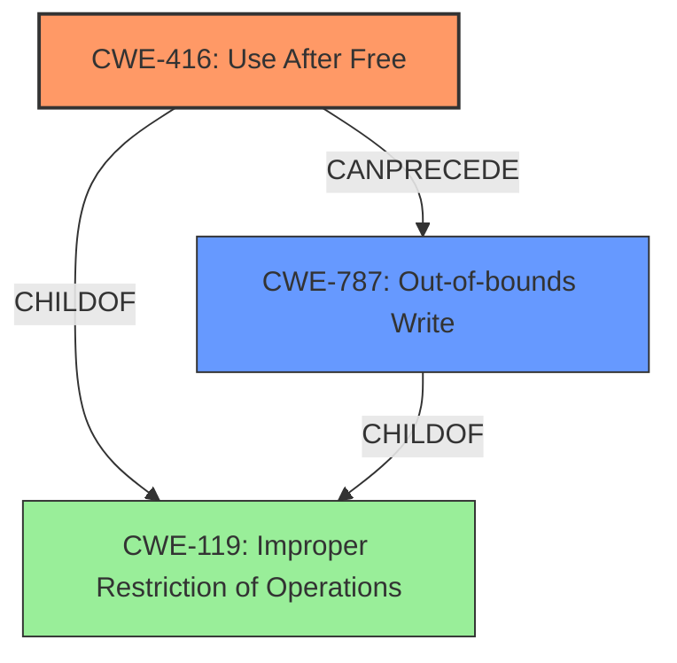

# Final Resolution for CVE-2022-0456

# Summary
| CWE ID | CWE Name | Confidence | CWE Abstraction Level | CWE Vulnerability Mapping Label | CWE-Vulnerability Mapping Notes |
|---|---|---|---|---|---|
| CWE-416 | Use After Free | 0.9 | Variant | Allowed | Primary CWE |
| CWE-787 | Out-of-bounds Write | 0.4 | Base | Allowed | Secondary Candidate |

## Evidence and Confidence

*   **Confidence Score:** 0.85
*   **Evidence Strength:** MEDIUM

## Relationship Analysis
The primary relationship that impacted the decision was the parent-child relationship between CWE-119 (Improper Restriction of Operations within the Bounds of a Memory Buffer) and CWE-416 (Use After Free), and CWE-787 (Out-of-bounds Write). CWE-416 is a variant of the more general CWE-119. Also, CWE-787 is a child of CWE-119. While the description explicitly mentions "Use after free," the potential for **heap corruption** suggests that an out-of-bounds write (CWE-787) could have occurred as a consequence, contributing to the overall vulnerability.

## Vulnerability Chain
The vulnerability chain starts with a **use after free** condition (CWE-416) in Web Search within Google Chrome. This **weakness** allows a remote attacker to potentially exploit **heap corruption**. The **heap corruption** could lead to an out-of-bounds write (CWE-787), further destabilizing the system and potentially leading to arbitrary code execution. The final impact is achieved through **profile destruction**.

## Summary of Analysis
The initial analysis correctly identified CWE-416 (Use After Free) as the primary **weakness**. The high confidence score is justified due to the explicit mention of "Use after free" in the vulnerability description. The criticism correctly pointed out the possibility of other CWEs being related. The heap corruption aspect of the vulnerability suggests that an out-of-bounds write (CWE-787) could also be a contributing factor. While the evidence for CWE-787 is not as strong as for CWE-416, it is a plausible secondary **weakness** that could have contributed to the heap corruption. The analysis is primarily based on the provided evidence, specifically the vulnerability description: "Use after free in Web Search in Google Chrome prior to 98.0.4758.80 allowed a remote attacker to potentially exploit **heap corruption** via **profile destruction**." The selection of CWE-416 as the primary CWE is at the optimal level of specificity because it directly addresses the stated root cause. The inclusion of CWE-787 is at a reasonable level of specificity as a secondary factor related to heap corruption.