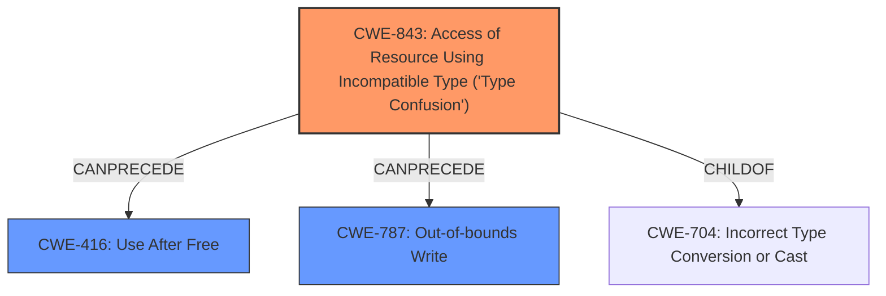

# Analysis Report for CVE-2022-0457

# Vulnerability Analysis Report: CVE-2022-0457

## Description

Type confusion in V8 in Google Chrome prior to 98.0.4758.80 allowed a remote attacker to potentially exploit heap corruption via a crafted HTML page.

## Vulnerability Description Key Phrases

**Rootcause:** confusion in V8
**Impact:** heap corruption
**Vector:** crafted HTML page
**Attacker:** remote attacker
**Product:** Google Chrome
**Version:** prior to 98.0.4758.80

## Analysis (with Relationship Data)

# Summary
| CWE ID  | CWE Name                                                                | Confidence | CWE Abstraction Level | CWE Vulnerability Mapping Label | CWE-Vulnerability Mapping Notes |
| :-------- | :---------------------------------------------------------------------- | :--------- | :-------------------- | :------------------------------ | :------------------------------ |
| CWE-843 | Access of Resource Using Incompatible Type ('**Type Confusion**') | 0.95       | Base                  | Allowed                         | Root Cause                      |
| CWE-416 | Use After Free | 0.60       | Variant                  | Allowed                         | Secondary Candidate                      |
| CWE-787 | Out-of-bounds Write | 0.50       | Base                  | Allowed                         | Secondary Candidate                      |

## Evidence and Confidence

*   **Confidence Score:** 0.90
*   **Evidence Strength:** HIGH

- **Analysis and Justification:**
  - *Explanation:* The vulnerability is described as a "**type confusion in V8**" leading to "**heap corruption**". The CVE description confirms this as "**Type Confusion in V8**." CWE-843 (Access of Resource Using Incompatible Type ('**Type Confusion**')) directly aligns with the root cause. The "Retriever Results" also list CWE-843 as the top match. The vulnerability involves incorrect handling of types within the V8 JavaScript engine, which allows for incompatible access to resources, ultimately leading to heap corruption. MITRE mapping guidance indicates that CWE-843 is ALLOWED for this type of vulnerability.

  - *Relationship Analysis:* CWE-843 is a base-level CWE, making it a suitable choice. While CWE-704 (Incorrect Type Conversion or Cast) is a parent, CWE-843 is more specific by describing the "Access of Resource Using Incompatible Type", providing a more accurate description of the vulnerability.

- **Confidence Score:**
  - Confidence: 0.95 (High confidence due to direct match with vulnerability description and CVE reference.)

- **Analysis and Justification:**
  - *Explanation:* The **heap corruption** mentioned in the vulnerability description can potentially lead to a use-after-free condition. While the primary cause is type confusion (CWE-843), the impact suggests memory corruption. CWE-416 (Use After Free) describes a situation where memory is accessed after it has been freed, which could be a consequence of the **type confusion** leading to **heap corruption**. The retriever lists it as a potential candidate.
  - *Relationship Analysis:* CWE-416 is a variant-level CWE. CWE-416 can follow CWE-843, since the type confusion may result in incorrect memory operations, potentially freeing memory and then attempting to use it.
- **Confidence Score:**
  - Confidence: 0.60 (Moderate confidence because this is a potential consequence rather than the direct root cause.)

- **Analysis and Justification:**
  - *Explanation:* The **heap corruption** mentioned in the vulnerability description can also lead to an out-of-bounds write. While the primary cause is type confusion (CWE-843), the impact suggests memory corruption. CWE-787 (Out-of-bounds Write) describes a situation where data is written beyond the intended buffer, which could be a consequence of the **type confusion** leading to **heap corruption**.
  - *Relationship Analysis:* CWE-787 is a base-level CWE. CWE-787 can follow CWE-843, since the type confusion may result in incorrect memory operations, potentially writing to memory locations beyond allocated buffers.
- **Confidence Score:**
  - Confidence: 0.50 (Moderate confidence because this is a potential consequence rather than the direct root cause.)

## Criticism of Analysis

Okay, let's review the provided analysis and CWE mappings for the V8 type confusion vulnerability, considering the full CWE specifications.

**Overall Assessment:**

The analysis is generally good and well-reasoned.  The primary CWE mapping to CWE-843 is highly appropriate, given the direct mention of "type confusion" in the vulnerability description and CVE. The secondary mappings to CWE-416 and CWE-787 are plausible consequences of heap corruption, although it's important to keep in mind that these are *potential* outcomes rather than definitive causes in this particular case.

**Detailed Critique:**

1.  **CWE-843: Access of Resource Using Incompatible Type ('Type Confusion')**

    *   **Confidence:** 0.95 (Excellent). The reasoning is solid, and the justification is based directly on the vulnerability description. The CVE reference summary also points directly at "Type Confusion in V8".
    *   **Abstraction Level:** Base. This is appropriate. CWE-843 is a base-level CWE and accurately captures the core issue.
    *   **CWE-Vulnerability Mapping Notes:** "Root Cause." Correct.
    *   **Mapping Guidance:** The analysis correctly notes the "Allowed" usage, emphasizing careful reading of the name and description.
    *   **Relationship Analysis:** The analysis acknowledges CWE-704 (Incorrect Type Conversion or Cast) as a parent. It rightly explains why CWE-843 is more specific and better suited.
    *   **Example Usage:** The examples provided from the CWE database are generally relevant.
    *   **Potential Improvement:** None. The analysis and mapping for CWE-843 are well-justified.

2.  **CWE-416: Use After Free**

    *   **Confidence:** 0.60 (Good, but needs refinement). The reasoning connects heap corruption to a *potential* use-after-free. This is a reasonable hypothesis, but there's no explicit evidence of UAF in the initial vulnerability description.
    *   **Abstraction Level:** Variant. This is appropriate for a potential consequence.
    *   **CWE-Vulnerability Mapping Notes:** "Secondary Candidate." Correct.
    *   **Mapping Guidance:** The analysis correctly notes the "Allowed" usage.
    *   **Relationship Analysis:** The explanation that CWE-416 *can follow* CWE-843 is accurate.
    *    **Example Usage:** The examples provided from the CWE database are generally relevant.
    *   **Potential Improvement:** I would slightly rephrase the explanation to emphasize the *potential* nature of this consequence.  For example: "The heap corruption mentioned in the vulnerability description *could potentially lead* to a use-after-free condition."  Also, acknowledge that without further investigation, the UAF aspect is speculative.

3.  **CWE-787: Out-of-bounds Write**

    *   **Confidence:** 0.50 (Fair, but needs similar refinement as CWE-416). Similar to CWE-416, the reasoning connects heap corruption to a *potential* out-of-bounds write. This is also a reasonable hypothesis, but it is not explicitly stated in the provided information.
    *   **Abstraction Level:** Base. This is appropriate for a potential consequence.
    *   **CWE-Vulnerability Mapping Notes:** "Secondary Candidate." Correct.
    *   **Mapping Guidance:** The analysis correctly notes the "Allowed" usage.
    *   **Relationship Analysis:** The explanation that CWE-787 *can follow* CWE-843 is accurate.
    *    **Example Usage:** The examples provided from the CWE database are generally relevant.
    *   **Potential Improvement:** As with CWE-416, rephrase the explanation to emphasize the *potential* nature of this consequence. "The heap corruption mentioned in the vulnerability description *could potentially lead to* an out-of-bounds write". It's also worth noting that the description only mentions heap corruption, and if the type confusion occurs without actually overflowing any buffers, out-of-bounds write may not occur.

**Summary Table Critique**

| CWE ID  | CWE Name                                                                | Confidence | CWE Abstraction Level | CWE Vulnerability Mapping Label | CWE-Vulnerability Mapping Notes |
| :-------- | :---------------------------------------------------------------------- | :--------- | :-------------------- | :------------------------------ | :------------------------------ |
| CWE-843 | Access of Resource Using Incompatible Type ('**Type Confusion**') | 0.95       | Base                  | Allowed                         | Root Cause                      |
| CWE-416 | Use After Free | 0.60       | Variant                  | Allowed                         | Secondary Candidate                      |
| CWE-787 | Out-of-bounds Write | 0.50       | Base                  | Allowed                         | Secondary Candidate                      |

**Revised Summary Table (Suggested Changes):**

| CWE ID  | CWE Name                                                                | Confidence | CWE Abstraction Level | CWE Vulnerability Mapping Label | CWE-Vulnerability Mapping Notes |
| :-------- | :---------------------------------------------------------------------- | :--------- | :-------------------- | :------------------------------ | :------------------------------ |
| CWE-843 | Access of Resource Using Incompatible Type ('**Type Confusion**') | 0.95       | Base                  | Allowed                         | Root Cause                      |
| CWE-416 | Use After Free | 0.60       | Variant                  | Allowed                         | Potential Consequence                      |
| CWE-787 | Out-of-bounds Write | 0.50       | Base                  | Allowed                         | Potential Consequence                      |

**Key Takeaways:**

*   **Excellent Primary Mapping:** The choice of CWE-843 is excellent and well-supported.
*   **Plausible Secondary Mappings:** CWE-416 and CWE-787 are reasonable *potential* consequences.
*   **Transparency is Crucial:** Clearly state the hypothetical nature of the secondary mappings. Use wording like "potential consequence" to distinguish them from the confirmed root cause.

By making these small adjustments, the analysis becomes even more precise and transparent, accurately reflecting the information available in the vulnerability description and related CVE details.

## Final Resolution

# Summary 

| CWE ID  | CWE Name                                                                | Confidence | CWE Abstraction Level | CWE Vulnerability Mapping Label | CWE-Vulnerability Mapping Notes |
| :-------- | :---------------------------------------------------------------------- | :--------- | :-------------------- | :------------------------------ | :------------------------------ |
| CWE-843 | Access of Resource Using Incompatible Type ('**Type Confusion**') | 0.95       | Base                  | Allowed                         | Primary CWE Root Cause                      |
| CWE-416 | Use After Free | 0.60       | Variant                  | Allowed                         | Secondary Candidate Potential Consequence                      |
| CWE-787 | Out-of-bounds Write | 0.50       | Base                  | Allowed                         | Secondary Candidate Potential Consequence                      |

## Evidence and Confidence

*   **Confidence Score:** 0.90
*   **Evidence Strength:** HIGH

## Relationship Analysis
The primary relationship that impacted the decision was the parent-child relationship between CWE-704 (Incorrect Type Conversion or Cast) and CWE-843 (**Type Confusion**). While CWE-704 is a parent, CWE-843 is more specific and directly relates to the vulnerability description mentioning "**Type Confusion**". The chain relationships indicate that CWE-843 can precede both CWE-416 and CWE-787, suggesting a potential sequence where **type confusion** leads to memory corruption, resulting in either use-after-free or out-of-bounds write conditions. The abstraction levels also played a role, as CWE-843 is a base-level CWE, making it a more suitable choice than the class-level CWE-704 or pillar-level CWEs.

## Vulnerability Chain
The vulnerability chain starts with the **type confusion** (**CWE-843**) within the V8 engine. This **type confusion** can lead to incorrect memory operations, potentially resulting in **heap corruption**. The **heap corruption** can then lead to either a use-after-free condition (**CWE-416**) or an out-of-bounds write (**CWE-787**). The final impact is the ability for a remote attacker to potentially exploit the **heap corruption** via a crafted HTML page.

## Summary of Analysis
The initial analysis correctly identified CWE-843 as the primary **root cause**, given the direct match with the vulnerability description that mentions "**type confusion**". The criticism correctly points out that CWE-416 and CWE-787 are potential consequences of **heap corruption**, and the analysis has been updated to reflect this. The graph relationships confirm the potential chain of events, where **type confusion** can precede use-after-free or out-of-bounds write. The selected CWEs are at the optimal level of specificity, with CWE-843 being a base-level CWE that directly addresses the **type confusion** issue, and CWE-416 and CWE-787 being variant and base-level CWEs respectively, representing potential consequences. The decision is primarily based on the provided evidence, specifically the vulnerability description stating "**Type Confusion in V8**". The mapping guidance for CWE-843 indicates that it is ALLOWED for this type of vulnerability, further supporting the decision. The confidence remains high due to the direct match and the clear relationship between **type confusion** and potential memory corruption consequences. The description only mentions **heap corruption**, and if the type confusion occurs without actually overflowing any buffers or freeing memory and then using it, out-of-bounds write or use after free may not occur.

*Report generated on 2025-03-18 05:57:35*
