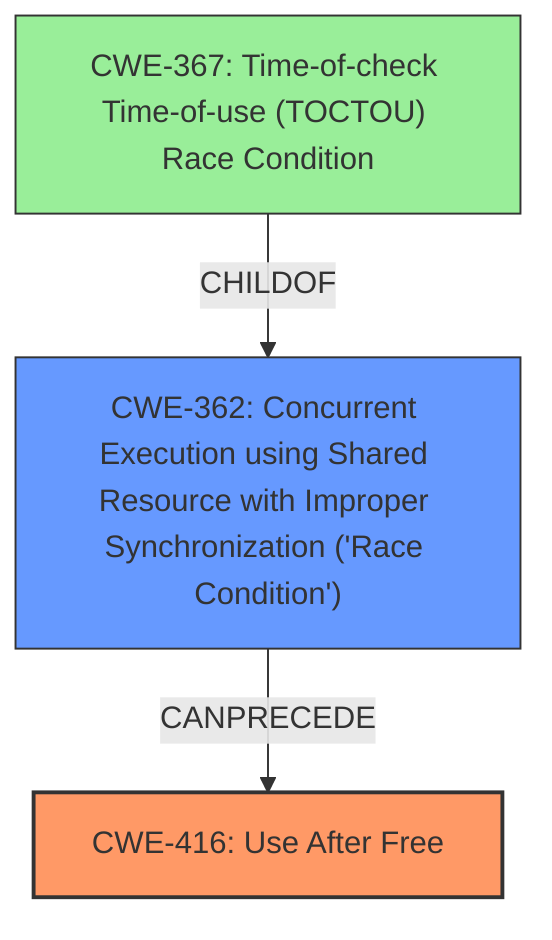

# Analysis Report for CVE-2022-0465

# Vulnerability Analysis Report: CVE-2022-0465

## Description

Use after free in Extensions in Google Chrome prior to 98.0.4758.80 allowed a remote attacker to potentially exploit heap corruption via user interaction.

## Vulnerability Description Key Phrases

**Rootcause:** use after free
**Weakness:** heap corruption
**Vector:** user interaction
**Attacker:** remote attacker
**Product:** Google Chrome
**Version:** prior to 98.0.4758.80
**Component:** Extensions

## Analysis (with Relationship Data)

# Summary
| CWE ID | CWE Name | Confidence | CWE Abstraction Level | CWE Vulnerability Mapping Label | CWE-Vulnerability Mapping Notes |
|---|---|---|---|---|---|
| CWE-416 | Use After Free | 1.0 | Variant | Allowed | This CWE entry is at the Variant level of abstraction, which is a preferred level of abstraction for mapping to the root causes of vulnerabilities. |

## Evidence and Confidence

*   **Confidence Score:** 1.0
*   **Evidence Strength:** HIGH

- **Analysis and Justification:**  
  - *Explanation:* The vulnerability description explicitly states "**Use after free** in Extensions in Google Chrome". The **root cause** is a **use-after-free** condition, which directly corresponds to CWE-416 (Use After Free). The vulnerability allows a remote attacker to potentially exploit **heap corruption** via user interaction. The CVE Reference Links Content Summary confirms the **root_cause** as "Use after free in Extensions" and lists "Use after free" as a weakness. This high level of alignment between the description and the characteristics of CWE-416 justifies its selection as the primary CWE.

  - *Relationship Analysis:* There are no direct relationships provided in the reference material that are relevant to the root cause.

- **Confidence Score:**  
  - Confidence: 1.0 (The vulnerability description explicitly mentions "Use after free", and the CVE reference confirms it.)

## Criticism of Analysis

Okay, here's a review of the analysis, considering the full CWE specifications you provided.

**Overall Assessment:**

The analysis correctly identifies CWE-416 (Use After Free) as the primary weakness with a high confidence score. The justification is solid, as the vulnerability description explicitly mentions "Use after free." The provided evidence strongly supports this mapping.

**Detailed Review:**

*   **CWE-416 Mapping:**

    *   **Accuracy:** The mapping to CWE-416 is accurate and well-justified. The description of CWE-416 aligns perfectly with the vulnerability description. The Variant level of abstraction is appropriate.
    *   **Confidence:** The confidence score of 1.0 is justified given the explicit mention of "Use after free" in the vulnerability description.
    *   **Relationship Analysis:** No relationships are provided within the initial input. This could potentially be improved with information from the source material, depending on the context of UAF within Chrome Extensions.
    *   **Mitigations:** The analysis doesn't explicitly mention mitigations, but it's not required. However, it would be valuable to consider potential mitigations in a more comprehensive analysis. The specification provides a few examples: language selection (using languages with automatic memory management) and setting freed pointers to NULL (though the usefulness of this can be limited in complex data structures).

*   **Retriever Results Review:**  Let's examine the top retriever results and why they might be relevant or irrelevant, especially in terms of potential root causes or contributing factors:

    *   **CWE-416 (Use After Free):**  Correctly identified as the top result.

    *   **CWE-366 (Race Condition within a Thread):**  Potentially relevant. Use-after-free vulnerabilities can sometimes be triggered or exacerbated by race conditions. If multiple threads are accessing the same memory, one thread might free the memory while another is still using it. This is also supported by the observed examples, which include chains of race conditions leading to use-after-free. Therefore, while UAF is the direct fault, a race condition could be a contributing factor. This is an area where further investigation might be warranted, but without source code, it's impossible to confirm. The 'CanFollow -> CWE-362' relationship is defined in the CWE Specifications.

    *   **CWE-843 (Access of Resource Using Incompatible Type ('Type Confusion')):**  Less likely to be directly related, but not impossible. In some complex scenarios, type confusion could lead to incorrect memory management, which could then contribute to a UAF. However, this is a more indirect path.

    *   **CWE-415 (Double Free):** A double-free could be indirectly related. If a double-free occurs and corrupts memory management data structures, it *could* potentially lead to a subsequent use-after-free. However, the primary issue reported is UAF, not double free. So this is a less direct connection.

    *   **CWE-122 (Heap-based Buffer Overflow):** While heap corruption is mentioned in the original description, the root cause is specifically a *use after free*. It is possible the heap corruption arises from the use after free itself (e.g., writing to freed memory corrupting the heap), making CWE-416 the more direct cause.

    *   **CWE-1021 (Improper Restriction of Rendered UI Layers or Frames):** Highly unlikely to be related. This CWE is about clickjacking and UI redress attacks, which don't directly relate to memory management issues like UAF.

    *   **CWE-190 (Integer Overflow or Wraparound):** Could be indirectly related. An integer overflow could lead to an incorrect calculation related to memory allocation or object sizing, potentially leading to a UAF. This is, however, a less direct and less probable connection.

    *   **CWE-131 (Incorrect Calculation of Buffer Size):** Similar to CWE-190, an incorrect buffer size calculation could *potentially* contribute to a UAF, perhaps by freeing memory prematurely. This is an indirect connection.

    *   **CWE-367 (Time-of-check Time-of-use (TOCTOU) Race Condition):** This is a specific *type* of race condition. The comments under CWE-366 note how race condition research often involves TOCTOU. Therefore, this is a more specific instance of CWE-366 and could be relevant if the UAF happens because a check on the state of memory is invalidated before it's used.

    *   **CWE-362 (Concurrent Execution using Shared Resource with Improper Synchronization ('Race Condition')):** This is a broader class that *includes* CWE-366 and CWE-367.

*   **Missing Information:** The analysis lacks context around *how* the use-after-free is triggered. Understanding the specific sequence of events that leads to the UAF would allow for a more precise assessment and potentially reveal contributing factors. Knowing what kind of object is being freed and then used is also critical.

**Recommendations:**

1.  **Maintain CWE-416 as the Primary Mapping:** The analysis is correct in identifying CWE-416 as the primary vulnerability.

2.  **Investigate Potential Contributing Factors:** Explore the possibility of contributing factors, especially race conditions (CWE-366, CWE-367). Investigate the code paths that lead to the free and subsequent use to see if there's a concurrency aspect.

3.  **Consider Mitigations:** While not strictly required, adding a section on potential mitigations (drawing from the CWE specification) would enhance the analysis. This could include using memory-safe languages, employing stricter memory management practices, or implementing synchronization mechanisms if race conditions are involved.

4.  **Add Context on Triggering Conditions:** Provide more details on *how* the UAF is triggered. What specific user interactions or extension behaviors lead to the vulnerability?

5.  **Acknowledge Heap Corruption:** The original vulnerability description mentions heap corruption. The analysis could explicitly state that the heap corruption is a *consequence* of the use-after-free, rather than a separate, independent weakness. The use-after-free allows an attacker to write arbitrary data into the heap, leading to corruption.

In summary, the analysis is a good starting point, but could be improved by investigating potential contributing factors (particularly race conditions) and providing more context around the vulnerability's triggering conditions and potential mitigations.

## Final Resolution

# Summary
| CWE ID | CWE Name | Confidence | CWE Abstraction Level | CWE Vulnerability Mapping Label | CWE-Vulnerability Mapping Notes |
|---|---|---|---|---|---|
| CWE-416 | **Use After Free** | 0.9 | Variant | Allowed | Primary CWE. This CWE entry is at the Variant level of abstraction, which is a preferred level of abstraction for mapping to the **root causes** of vulnerabilities. |
| CWE-362 | **Concurrent Execution using Shared Resource with Improper Synchronization ('Race Condition')** | 0.6 | Class | Allowed-with-Review | Secondary Candidate. This CWE entry is a Class and might have Base-level children that would be more appropriate. |

## Evidence and Confidence

*   **Confidence Score:** 0.8
*   **Evidence Strength:** MEDIUM

## Relationship Analysis
The primary relationship impacting the decision is the potential for a race condition to contribute to the **Use After Free**. While the vulnerability description explicitly mentions **Use After Free**, the criticism suggests that a race condition (CWE-362 **Concurrent Execution using Shared Resource with Improper Synchronization ('Race Condition')**) could be a contributing factor. CWE-362 is a class-level CWE and has child CWEs that might be more specific, such as CWE-367 (Time-of-check Time-of-use (TOCTOU) Race Condition). However, without more information about the specific code, it is difficult to determine if a more specific CWE is appropriate. The abstraction level influenced the decision by prompting consideration of more specific child CWEs, but the lack of evidence prevented a more precise classification.

## Vulnerability Chain
The vulnerability chain starts with a potential **race condition** (CWE-362 **Concurrent Execution using Shared Resource with Improper Synchronization ('Race Condition')**) where a shared resource is accessed concurrently without proper synchronization. This can lead to a situation where memory is freed by one thread while another thread is still using it, resulting in a **Use After Free** (CWE-416). The consequence of the **Use After Free** is **heap corruption**, as stated in the vulnerability description. The missing link is the exact sequence of events that trigger the **race condition**.

## Summary of Analysis
The initial analysis correctly identified CWE-416 (**Use After Free**) as the primary weakness. The criticism highlighted the possibility of a contributing **race condition**. The final determination is to keep CWE-416 as the primary CWE because it is explicitly mentioned in the vulnerability description: "Use after free in Extensions in Google Chrome". The addition of CWE-362 (**Concurrent Execution using Shared Resource with Improper Synchronization ('Race Condition')**) as a secondary CWE acknowledges the possibility of a **race condition** contributing to the vulnerability, as suggested by the criticism. The relationship analysis and the retriever results support this possibility. However, the evidence is not strong enough to warrant replacing CWE-416 as the primary CWE. The selection of CWE-416 is at the optimal level of specificity because it directly describes the **root cause** mentioned in the vulnerability description. The inclusion of CWE-362 adds context and acknowledges a potential contributing factor, improving the overall assessment. The confidence score is slightly reduced to 0.8 to reflect the uncertainty regarding the presence of a **race condition**.

*Report generated on 2025-03-18 06:01:31*
