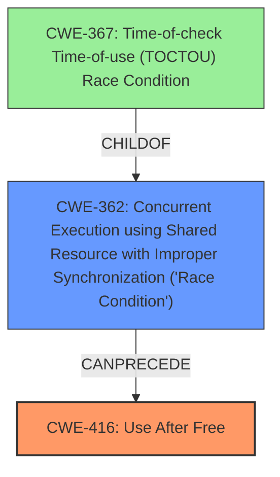

# Final Resolution for CVE-2022-0465

# Summary
| CWE ID | CWE Name | Confidence | CWE Abstraction Level | CWE Vulnerability Mapping Label | CWE-Vulnerability Mapping Notes |
|---|---|---|---|---|---|
| CWE-416 | **Use After Free** | 0.9 | Variant | Allowed | Primary CWE. This CWE entry is at the Variant level of abstraction, which is a preferred level of abstraction for mapping to the **root causes** of vulnerabilities. |
| CWE-362 | **Concurrent Execution using Shared Resource with Improper Synchronization ('Race Condition')** | 0.6 | Class | Allowed-with-Review | Secondary Candidate. This CWE entry is a Class and might have Base-level children that would be more appropriate. |

## Evidence and Confidence

*   **Confidence Score:** 0.8
*   **Evidence Strength:** MEDIUM

## Relationship Analysis
The primary relationship impacting the decision is the potential for a race condition to contribute to the **Use After Free**. While the vulnerability description explicitly mentions **Use After Free**, the criticism suggests that a race condition (CWE-362 **Concurrent Execution using Shared Resource with Improper Synchronization ('Race Condition')**) could be a contributing factor. CWE-362 is a class-level CWE and has child CWEs that might be more specific, such as CWE-367 (Time-of-check Time-of-use (TOCTOU) Race Condition). However, without more information about the specific code, it is difficult to determine if a more specific CWE is appropriate. The abstraction level influenced the decision by prompting consideration of more specific child CWEs, but the lack of evidence prevented a more precise classification.

## Vulnerability Chain
The vulnerability chain starts with a potential **race condition** (CWE-362 **Concurrent Execution using Shared Resource with Improper Synchronization ('Race Condition')**) where a shared resource is accessed concurrently without proper synchronization. This can lead to a situation where memory is freed by one thread while another thread is still using it, resulting in a **Use After Free** (CWE-416). The consequence of the **Use After Free** is **heap corruption**, as stated in the vulnerability description. The missing link is the exact sequence of events that trigger the **race condition**.

## Summary of Analysis
The initial analysis correctly identified CWE-416 (**Use After Free**) as the primary weakness. The criticism highlighted the possibility of a contributing **race condition**. The final determination is to keep CWE-416 as the primary CWE because it is explicitly mentioned in the vulnerability description: "Use after free in Extensions in Google Chrome". The addition of CWE-362 (**Concurrent Execution using Shared Resource with Improper Synchronization ('Race Condition')**) as a secondary CWE acknowledges the possibility of a **race condition** contributing to the vulnerability, as suggested by the criticism. The relationship analysis and the retriever results support this possibility. However, the evidence is not strong enough to warrant replacing CWE-416 as the primary CWE. The selection of CWE-416 is at the optimal level of specificity because it directly describes the **root cause** mentioned in the vulnerability description. The inclusion of CWE-362 adds context and acknowledges a potential contributing factor, improving the overall assessment. The confidence score is slightly reduced to 0.8 to reflect the uncertainty regarding the presence of a **race condition**.