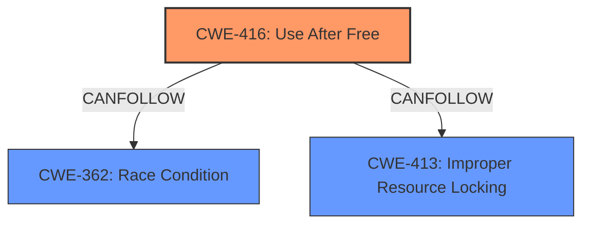

# Analysis Report for CVE-2022-0469

# Vulnerability Analysis Report: CVE-2022-0469

## Description

Use after free in Cast in Google Chrome prior to 98.0.4758.80 allowed a remote attacker who convinced a user to engage in specific interactions to potentially exploit heap corruption via a crafted HTML page.

## Vulnerability Description Key Phrases

**Rootcause:** use after free
**Weakness:** heap corruption
**Vector:** crafted HTML page
**Attacker:** remote attacker
**Product:** Google Chrome
**Version:** prior to 98.0.4758.80
**Component:** Cast

## Analysis (with Relationship Data)

# Summary
| CWE ID | CWE Name | Confidence | CWE Abstraction Level | CWE Vulnerability Mapping Label | CWE-Vulnerability Mapping Notes |
|---|---|---|---|---|---|
| CWE-416 | Use After Free | 1.0 | Variant | Allowed | Primary CWE |

## Evidence and Confidence

*   **Confidence Score:** 1.0
*   **Evidence Strength:** HIGH

- **Analysis and Justification:**  
  - *Explanation:* The vulnerability description clearly states "**use after free** in Cast in Google Chrome". This directly maps to CWE-416 (Use After Free), which occurs when a program attempts to use memory after it has been freed, potentially leading to **heap corruption**. The provided "Vulnerability Description Key Phrases" also lists **use after free** as the **rootcause**. The CVE Reference Links Content Summary also confirms "**Use after free**". The Retriever Results also shows a high score for CWE-416. CWE-416 is a Variant level CWE, which is the preferred level of abstraction. The MITRE mapping guidance for CWE-416 indicates this is ALLOWED.
  
  - *Relationship Analysis:* There are several CWEs related to memory management (such as CWE-415 Double Free), but the description specifically mentions "use after free", making CWE-416 the most accurate choice.

- **Confidence Score:**  
  - Confidence: 1.0 (High confidence due to direct evidence from the vulnerability description and confirmed by the reference links)

## Criticism of Analysis

Okay, I have reviewed your analysis of CVE-2022-0469 and its mapping to CWE-416, including the provided CWE specifications. Here's my critique:

**Overall Assessment:**

The analysis is well-reasoned and the mapping to CWE-416 is accurate and justified. The confidence level of 1.0 is appropriate given the direct evidence in the vulnerability description. The inclusion of example CVEs and relevant CWE specifications is helpful in understanding the weakness.

**Strengths:**

*   **Clear Justification:** The reasoning for selecting CWE-416 is clearly explained, referencing the vulnerability description and CVE summary.
*   **Correct Abstraction Level:** Identifying CWE-416 as a "Variant" is correct and aligned with the CWE's mapping guidance, which recommends using this level of abstraction when possible.
*   **Comprehensive Evidence:** The analysis uses information from the vulnerability description, CVE summary, and Retriever Results to support the mapping.
*   **Relationship Analysis:** The justification considers other related CWEs, like CWE-415, and explains why CWE-416 is the best fit.
*   **Confidence Level:** The high confidence level is justified given the strong evidence.
*   **Use of CWE Examples:** Including known examples of CWE-416 adds context and demonstrates the applicability of the mapping.
*   **Detailed CWE Specifications:** Inclusion of complete CWE specifications for all considered CWEs enhances the understanding and justification.

**Areas for potential improvement/considerations**

1.  **Mitigation Details:** While not strictly necessary for a basic mapping, mentioning relevant mitigations from the CWE specification could enhance the analysis. Briefly indicating which mitigations are applicable and which are not (and why) could be beneficial.

    *   For example, Mitigation 1 for CWE-416 is "Choose a language that provides automatic memory management." This might be considered a long-term architectural change, rather than a short-term fix for the identified vulnerability in Chrome.
    *   Mitigation 2 for CWE-416 is "When freeing pointers, be sure to set them to NULL once they are freed." This could be a more directly applicable mitigation strategy (although its effectiveness can vary depending on the complexity of the code).

2.  **Heap Corruption Context:** The initial description mentions "heap corruption". While CWE-416 is the root cause, briefly elaborating on how the Use-After-Free leads to heap corruption could be helpful for a broader understanding.  Explain that after the memory is freed, it could be reallocated for a different purpose.  Then, when the original, dangling pointer is used, it corrupts this newly allocated memory region.

3. **CWE Chaining Considerations:** While the primary mapping to CWE-416 is correct, consider that real-world UAF vulnerabilities often exist as part of a more complex chain of events.

    *   For example, the observed examples of CWE-416 often involve race conditions (CWE-362) or improper resource locking (CWE-413) as a preceding step.
    *   The analysis could acknowledge that while CWE-416 is the immediate cause of the vulnerability, there might be other underlying weaknesses contributing to the issue. However, without more information about the specific vulnerability, it is difficult to accurately assess potential chaining situations.

**Specific comments on the Retriever Results:**

* The retriever results also suggested CWE-366 (Race Condition within a Thread). The description indicates the vulnerability was triggered by a crafted HTML page, which suggests this was likely not a race condition. The analysis should acknowledge that while it might have been suggested, it isn't a likely root cause.

**Revised Summary Table (with optional enhancements):**

| CWE ID | CWE Name | Confidence | CWE Abstraction Level | CWE Vulnerability Mapping Label | CWE-Vulnerability Mapping Notes |
|---|---|---|---|---|---|
| CWE-416 | Use After Free | 1.0 | Variant | Allowed | Primary CWE. Exploitation occurs via crafted HTML. Mitigations include setting freed pointers to NULL, although effectiveness varies. Often part of a chain. For example, race conditions can lead to use-after-free.  Specifically, after memory is freed, it could be reallocated for a different purpose. Then, when the original, dangling pointer is used, it corrupts this newly allocated memory region. |

**In summary, the analysis is strong and well-justified. The suggested improvements are relatively minor and aim to provide a more comprehensive understanding of the vulnerability and its potential mitigations.**

## Final Resolution

# Summary
| CWE ID | CWE Name | Confidence | CWE Abstraction Level | CWE Vulnerability Mapping Label | CWE-Vulnerability Mapping Notes |
|---|---|---|---|---|---|
| CWE-416 | Use After Free | 1.0 | Variant | Allowed | Primary CWE. Exploitation occurs via crafted HTML. Mitigations include setting freed pointers to NULL, although effectiveness varies. Often part of a chain. For example, race conditions can lead to use-after-free. Specifically, after memory is freed, it could be reallocated for a different purpose. Then, when the original, dangling pointer is used, it corrupts this newly allocated memory region. |

## Evidence and Confidence

*   **Confidence Score:** 1.0
*   **Evidence Strength:** HIGH

## Relationship Analysis
The primary relationship is that CWE-416 (Use After Free) is a variant-level CWE, making it a good fit for describing the specific nature of the vulnerability. The criticism suggests considering that CWE-416 often exists within a chain of vulnerabilities. While not explicitly stated in the description, a race condition (CWE-362) or improper resource locking (CWE-413) could potentially precede the **use-after-free**. However, without further evidence, focusing on CWE-416 as the direct cause is most appropriate.

## Vulnerability Chain
The vulnerability chain starts with a crafted HTML page that triggers the **use-after-free** condition in the Cast feature of Google Chrome. The root cause is the improper management of memory, specifically the failure to prevent access to freed memory. This leads to **heap corruption** because the freed memory might be reallocated and then corrupted when the original dangling pointer is used. The impact is that a remote attacker can potentially exploit the **heap corruption** to execute arbitrary code.

## Summary of Analysis
The initial analysis correctly identifies CWE-416 (Use After Free) as the primary weakness. The vulnerability description explicitly states "**use after free**," providing direct evidence for this classification. The criticism's suggestion to consider potential vulnerability chaining is valid, but without specific evidence of a preceding race condition or improper resource locking, focusing on CWE-416 as the direct cause is most appropriate. The chosen CWE is at the optimal level of specificity (Variant) and aligns with MITRE's mapping guidance. The confidence level remains at 1.0 due to the strong evidence supporting the classification. The phrase "**use after free** in Cast in Google Chrome prior to 98.0.4758.80 allowed a remote attacker who convinced a user to engage in specific interactions to potentially exploit **heap corruption** via a crafted HTML page" is the primary evidence.

*Report generated on 2025-03-18 06:02:43*
