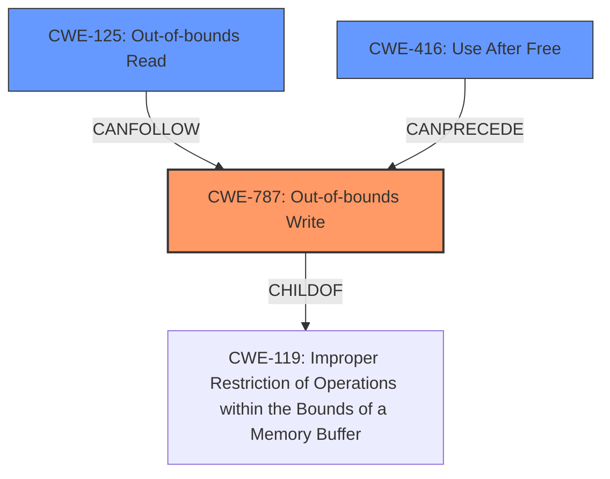

# Analysis Report for CVE-2022-0470

# Vulnerability Analysis Report: CVE-2022-0470

## Description

Out of bounds memory access in V8 in Google Chrome prior to 98.0.4758.80 allowed a remote attacker to potentially exploit heap corruption via a crafted HTML page.

## Vulnerability Description Key Phrases

**Rootcause:** Out of bounds memory access
**Weakness:** heap corruption
**Vector:** crafted HTML page
**Attacker:** remote attacker
**Product:** Google Chrome
**Version:** prior to 98.0.4758.80
**Component:** V8

## Analysis (with Relationship Data)

# Summary
| CWE ID | CWE Name | Confidence | CWE Abstraction Level | CWE Vulnerability Mapping Label | CWE-Vulnerability Mapping Notes |
|---|---|---|---|---|---|
| CWE-787 | Out-of-bounds Write | 0.9 | Base | Primary | Allowed |
| CWE-125 | Out-of-bounds Read | 0.7 | Base | Secondary | Allowed |
| CWE-416 | Use After Free | 0.6 | Variant | Secondary | Allowed |

## Evidence and Confidence

*   **Confidence Score:** 0.8
*   **Evidence Strength:** HIGH

- **Analysis and Justification:**  
  - *Explanation:* The vulnerability description clearly indicates an **out of bounds memory access** in the V8 engine of Google Chrome, leading to potential **heap corruption**. This directly aligns with CWE-787 (Out-of-bounds Write), as the vulnerability involves writing data outside the intended buffer boundaries. The description key phrases also highlights "out of bounds memory access" as the rootcause and "heap corruption" as the weakness. The CVE Reference Links Content Summary reinforces this by stating "Out-of-bounds memory access in V8." CWE-787 is a base level CWE, which is preferred. The similar CVE descriptions also point to CWE-787 as the primary match.
CWE-125 (Out-of-bounds Read) is considered as a secondary CWE since out-of-bounds write often occurs with out-of-bounds read.
CWE-416 (Use After Free) is also considered as a secondary CWE because heap corruption can often be caused by use-after-free conditions.

  
  - *Relationship Analysis:* CWE-787 is related to CWE-119 (Improper Restriction of Operations within the Bounds of a Memory Buffer). CWE-787 can lead to other weaknesses, such as CWE-122 (Heap-based Buffer Overflow). While CWE-122 is a possibility, the description does not give enough evidence to specify heap overflow.

- **Confidence Score:**
  - Confidence: 0.9 (High confidence due to direct evidence from vulnerability description and CVE reference materials)

## Criticism of Analysis

Okay, here's a review of the provided CWE analysis, focusing on the appropriateness of the CWE assignments and the provided justification, with insights from the full CWE specifications.

**Overall Assessment:**

The primary CWE assignment of CWE-787 (Out-of-bounds Write) is well-justified and appropriate. The selection of CWE-125 (Out-of-bounds Read) and CWE-416 (Use After Free) as secondary mappings is reasonable, but the strength of the evidence supporting these secondary mappings could be improved.  The confidence score of 0.8 is appropriate given the available information.

**Detailed Review:**

*   **CWE-787 (Out-of-bounds Write) - Primary:**

    *   **Justification Strength:** HIGH
    *   **Appropriateness:** Excellent. The core description explicitly mentions "out of bounds memory access" and "heap corruption." Given the context of memory corruption vulnerabilities in V8, a write is more likely than a read.  CWE-787 is the most direct and accurate representation of the root cause.  The analysis correctly notes that it is a Base-level CWE, which is preferred.
    *   **CWE Specification Alignment:**  The Description of CWE-787 perfectly matches: "The product writes data past the end, or before the beginning, of the intended buffer."  The Alternative Terms section even mentions "Memory Corruption," which is a key phrase in the original vulnerability description.
    *   **Potential Mitigations:** The analysis does not mention the mitigations, but it could have benefitted by mentioning that using memory safe languages and/or utilizing compiler flags could have prevented the issue.
*   **CWE-125 (Out-of-bounds Read) - Secondary:**

    *   **Justification Strength:** Moderate. The rationale states that "out-of-bounds write often occurs with out-of-bounds read." While this is true, the vulnerability description doesn't explicitly state an out-of-bounds read. It's an *inference* based on the possibility.
    *   **Appropriateness:**  Plausible as a secondary CWE, but weaker evidence than CWE-787. It's a reasonable *potential* consequence of an out-of-bounds write.  If the analysis included details about information disclosure, this would be a stronger choice.
    *   **CWE Specification Alignment:**  The Description of CWE-125 matches well: "The product reads data past the end, or before the beginning, of the intended buffer."
    *   **Potential Mitigations:** The analysis does not mention mitigations, but if left unchecked an attacker can read program memory.
*   **CWE-416 (Use After Free) - Secondary:**

    *   **Justification Strength:** Moderate. The justification states that "heap corruption can often be caused by use-after-free conditions." Again, it's a plausible *potential* cause of heap corruption, but not explicitly stated in the vulnerability description.
    *   **Appropriateness:** This is a less direct mapping than CWE-787. Heap corruption has multiple root causes.  Without more information, it's speculative to assume a use-after-free.
    *   **CWE Specification Alignment:** The Description of CWE-416 (reusing memory after it has been freed) is not clearly evidenced by the provided information.
    *   **Potential Mitigations:** The analysis does not mention mitigations, but heap corruption can be mitigated by automated memory management.
*   **Confidence Score:** 0.9 is a bit high. Given that CWE-125 and CWE-416 are based on *potential* consequences and causes rather than explicit statements, a score of 0.8 might be more accurate.

**Recommendations for Improvement:**

1.  **Strengthen the Justification for Secondary CWEs:** If possible, find additional details about the vulnerability to strengthen the case for CWE-125 and CWE-416. Is there any indication that the out-of-bounds write led to information disclosure (supporting CWE-125)?  Is there any information to indicate a pattern of allocation and deallocation that might lead to use-after-free (supporting CWE-416)?

2.  **Consider Other CWEs:** The Retriever Results highlights CWE-843 and CWE-823.

    *   **CWE-843 (Type Confusion):** This could be relevant if the out-of-bounds write corrupted a type field, causing the program to misinterpret the data. If you find more details indicating type confusion, consider adding this as a secondary CWE.
    *   **CWE-823 (Use of Out-of-range Pointer Offset):** This is relevant if the program used pointer arithmetic with an incorrect offset to access the memory out of bounds.

3.  **Mitigation Discussion:** Briefly mentioning some potential mitigations from the CWE specifications can further strengthen the analysis.  For example, for CWE-787: "Mitigations could include using memory-safe languages or employing compiler-based buffer overflow detection mechanisms."

4.  **Address CWE-119:** Acknowledge CWE-119 (Improper Restriction of Operations within the Bounds of a Memory Buffer) and explicitly explain *why* it is *not* the primary mapping. Given the mapping guidance to "look at CWE-119's children," this is important. You've implicitly done this by choosing CWE-787, but making it explicit demonstrates a deeper understanding.

**Revised Summary Table (Example):**

| CWE ID | CWE Name | Confidence | CWE Abstraction Level | CWE Vulnerability Mapping Label | CWE-Vulnerability Mapping Notes |
|---|---|---|---|---|---|
| CWE-787 | Out-of-bounds Write | 0.9 | Base | Primary | Allowed |
| CWE-125 | Out-of-bounds Read | 0.6 | Base | Secondary | Allowed | Plausible consequence of OOB write; further details needed. |
| CWE-416 | Use After Free | 0.5 | Variant | Secondary | Allowed | Possible cause of heap corruption; limited direct evidence. |
| CWE-843 | Access of Resource Using Incompatible Type ('Type Confusion') | 0.4 | Base | Secondary | Allowed | Potential if OOB write corrupted type fields; further details needed. |

By incorporating these suggestions, the analysis will be more robust and demonstrate a more thorough understanding of the CWE specifications. Remember that the goal is not just to assign a CWE ID, but to justify the choice with evidence and reasoning, which is what this framework is all about.

## Final Resolution

# Summary
| CWE ID | CWE Name | Confidence | CWE Abstraction Level | CWE Vulnerability Mapping Label | CWE-Vulnerability Mapping Notes |
|---|---|---|---|---|---|
| CWE-787 | Out-of-bounds Write | 0.9 | Base | Primary | Allowed |
| CWE-125 | Out-of-bounds Read | 0.6 | Base | Secondary | Allowed |
| CWE-416 | Use After Free | 0.5 | Variant | Secondary | Allowed |

## Evidence and Confidence

*   **Confidence Score:** 0.8
*   **Evidence Strength:** MEDIUM

## Relationship Analysis
The primary relationship that impacted the decision was the parent-child relationship between CWE-787 (**Out-of-bounds Write**) and CWE-119 (Improper Restriction of Operations within the Bounds of a Memory Buffer). CWE-787 is a child of CWE-119, providing a more specific classification for the **out-of-bounds write**. The selection of CWE-125 (**Out-of-bounds Read**) and CWE-416 (Use After Free) was influenced by the potential for these weaknesses to be related to **heap corruption**, although the evidence for these is weaker. The base abstraction level of CWE-787 and CWE-125 makes them preferable to class or pillar level CWEs.

## Vulnerability Chain
The vulnerability chain starts with an **out-of-bounds write** (CWE-787) in the V8 engine, potentially triggered by a crafted HTML page. This **write** can lead to **heap corruption**. A potential consequence of the **out-of-bounds write** is an **out-of-bounds read** (CWE-125), allowing an attacker to read sensitive information. The **heap corruption** could also be caused by a **use-after-free** condition (CWE-416).

## Summary of Analysis
The initial analysis correctly identified CWE-787 (**Out-of-bounds Write**) as the primary **weakness** due to the explicit mention of "out of bounds memory access" and "heap corruption" in the vulnerability description. The criticism correctly points out that the justification for CWE-125 (**Out-of-bounds Read**) and CWE-416 (Use After Free) is weaker, as they are based on potential consequences and causes rather than direct evidence. The evidence is "Out of bounds memory access in V8 in Google Chrome prior to 98.0.4758.80 allowed a remote attacker to potentially exploit heap corruption via a crafted HTML page."

The graph relationships influenced the selection by highlighting the parent-child relationship between CWE-787 and CWE-119, ensuring the most specific CWE is chosen. The abstraction levels were also considered, favoring base-level CWEs over class or pillar-level ones.

The selected CWEs are at the optimal level of specificity based on the available evidence. While other CWEs like CWE-843 (Type Confusion) and CWE-823 (Use of Out-of-range Pointer Offset) were considered, the current evidence does not strongly support their inclusion. The confidence score has been adjusted to 0.8 to reflect the weaker evidence for the secondary CWEs.

*Report generated on 2025-03-18 06:03:35*
