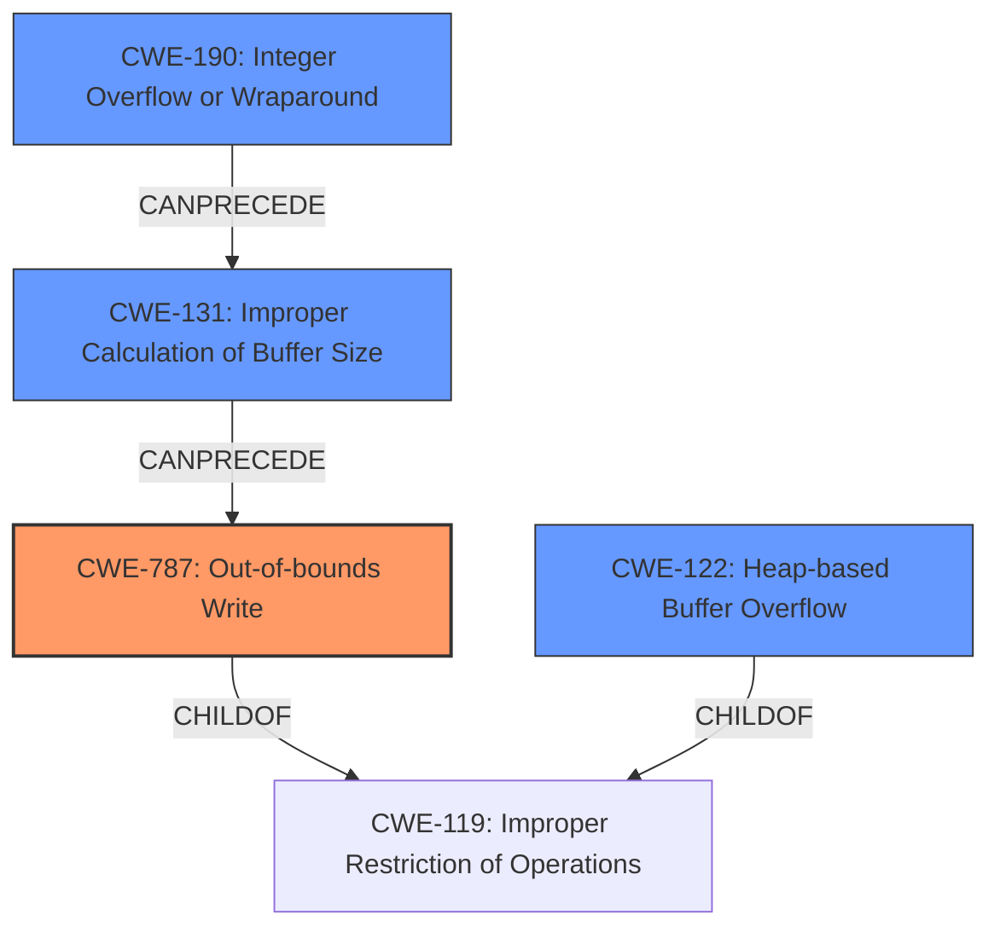

# Analysis Report for CVE-2022-0500

# Vulnerability Analysis Report: CVE-2022-0500

## Description

A flaw was found in unrestricted eBPF usage by the BPF_BTF_LOAD, leading to a possible out-of-bounds memory write in the Linux kernels BPF subsystem due to the way a user loads BTF. This flaw allows a local user to crash or escalate their privileges on the system.

## Vulnerability Description Key Phrases

**Rootcause:** unrestricted eBPF usage by the BPF_BTF_LOAD
**Impact:** ['crash', 'privilege escalation']
**Attacker:** local user
**Product:** Linux kernels
**Component:** BPF subsystem

## Analysis (with Relationship Data)

# Summary
| CWE ID | CWE Name | Confidence | CWE Abstraction Level | CWE Vulnerability Mapping Label | CWE-Vulnerability Mapping Notes |
|---|---|---|---|---|---|
| CWE-787 | Out-of-bounds Write | 0.95 | Base | Allowed | Primary CWE |
| CWE-122 | Heap-based Buffer Overflow | 0.70 | Variant | Allowed | Secondary Candidate |
| CWE-190 | Integer Overflow or Wraparound | 0.60 | Base | Allowed | Secondary Candidate |

## Evidence and Confidence

*   **Confidence Score:** 0.90
*   **Evidence Strength:** HIGH

- **Analysis and Justification:**
  - *Explanation:* The vulnerability description clearly states a "**possible out-of-bounds memory write** in the Linux kernels BPF subsystem". The CVE reference summary confirms this, indicating that the root cause is related to how the kernel handles BTF data, leading to an **out-of-bounds memory write**, allowing privilege escalation. CWE-787 (Out-of-bounds Write) directly addresses this weakness. The provided content explicitly describes how the issue arises from **unrestricted eBPF usage by the BPF_BTF_LOAD**, which further confirms the root cause. The retriever results also suggest CWE-787 as a candidate.
  - *Relationship Analysis:* CWE-787 is a base CWE and a child of CWE-119 (Improper Restriction of Operations within the Bounds of a Memory Buffer). It can lead to other issues like resource exhaustion (CWE-400) or privilege escalation (as noted in the description). The retriever results indicate various relationships, but none directly influence the primary mapping decision here.

- **Confidence Score:**
  - Confidence: 0.95 (High confidence due to strong evidence from the vulnerability description and CVE reference details)

---

- **Analysis and Justification:**
  - *Explanation:* The vulnerability description and CVE reference summary mention memory corruption due to the way the kernel handles BTF data. Since the memory is allocated on the heap, CWE-122 (Heap-based Buffer Overflow) is a possible secondary candidate, which is also supported by the retriever. The weakness occurs because of **unrestricted eBPF usage by the BPF_BTF_LOAD**.
  - *Relationship Analysis:* CWE-122 is a variant of CWE-119 (Improper Restriction of Operations within the Bounds of a Memory Buffer) and a parent of other more specific heap overflow variants.

- **Confidence Score:**
  - Confidence: 0.70 (Moderate confidence as it's a possible consequence of memory corruption on the heap.)

---

- **Analysis and Justification:**
  - *Explanation:* While not the primary issue, integer overflows could potentially contribute to the out-of-bounds write. If the size calculation related to BTF data involves an integer overflow, it could lead to allocating insufficient memory, resulting in a subsequent out-of-bounds write. The retriever results rank CWE-190 highly.
  - *Relationship Analysis:* CWE-190 can be related to buffer overflows as noted in its description, "Integer overflows can be primary to buffer overflows when they cause less memory to be allocated."

- **Confidence Score:**
  - Confidence: 0.60 (Low confidence because there is no direct evidence to suggest the integer overflow)

## Criticism of Analysis

Okay, I've reviewed the provided analysis of the eBPF vulnerability (CVE-2022-0500) and the associated CWE mappings, using the full CWE specifications for each referenced weakness. Here's my critique:

**Overall Assessment:**

The primary CWE mapping to CWE-787 (Out-of-bounds Write) is accurate and well-supported by the provided information. The reasoning for selecting CWE-787 as the primary weakness is sound. The secondary candidate CWEs (CWE-122 and CWE-190) are plausible given the potential for heap allocation issues and integer overflows, but the evidence is weaker.  The confidence levels assigned are appropriate for the strength of the evidence.

**Detailed Review:**

*   **CWE-787 (Out-of-bounds Write):**
    *   **Confidence:** The high confidence (0.95) is justified.  The vulnerability description and CVE summary explicitly mention "out-of-bounds memory write."  The root cause analysis points to the lack of proper memory access controls in eBPF, leading to writes outside intended buffer boundaries.
    *   **Justification:** The explanation clearly links the uncontrolled BTF loading and `bpf_per_cpu_ptr` usage to the ability to write to arbitrary memory locations.  The fix (correcting memory access handling in the eBPF verifier with `MEM_RDONLY` and helper function changes) directly addresses preventing out-of-bounds writes.
    *   **CWE Specification Alignment:**
        *   **Description:**  The description of CWE-787 perfectly matches the vulnerability's impact. "The product writes data past the end, or before the beginning, of the intended buffer."
        *   **Mapping Guidance:** The analysis correctly acknowledges that CWE-787 is at the Base level of abstraction, making it an appropriate choice.
    *   **Mitigation Strategies:** The analysis could benefit from explicitly mentioning some of the mitigations from the CWE-787 specification, like the use of memory-safe languages or compiler-based buffer overflow detection mechanisms (e.g., /GS flag in Visual Studio, FORTIFY\_SOURCE in GCC).

*   **CWE-122 (Heap-based Buffer Overflow):**
    *   **Confidence:** The moderate confidence (0.70) is reasonable. The connection to heap allocation relies on the assumption that BTF data and related structures are allocated on the heap, and the overflow occurs there. The description says "memory corruption due to the way the kernel handles BTF data" without specifying heap.
    *   **Justification:** While plausible, the analysis could be strengthened by explicitly stating how and why the overflow would likely occur on the heap. For example, stating that "BTF data is typically allocated dynamically on the heap, thus an overflow is more likely to be a heap-based overflow."
    *   **CWE Specification Alignment:**
        *   **Description:** The definition of CWE-122 aligns well given the heap context. "A heap overflow condition is a buffer overflow, where the buffer that can be overwritten is allocated in the heap portion of memory, generally meaning that the buffer was allocated using a routine such as malloc()."
    *   **Mitigation Strategies:** Again, mentioning specific mitigations from the CWE-122 specification (e.g., automatic bounds checking, abstraction libraries, compiler-based detection) would enhance the analysis.

*   **CWE-190 (Integer Overflow or Wraparound):**
    *   **Confidence:** The low confidence (0.60) is appropriate. There is no direct evidence in the provided text to suggest an integer overflow. It is only a *possible* contributing factor.
    *   **Justification:** The analysis makes a reasonable but speculative connection. While integer overflows *can* lead to undersized allocations, leading to buffer overflows, there's no indication in the description that this is happening.
    *   **CWE Specification Alignment:**
        *   **Description:** The definition of CWE-190 aligns to the potential overflow issue. "The product performs a calculation that can produce an integer overflow or wraparound when the logic assumes that the resulting value will always be larger than the original value."
    *   **Mitigation Strategies:**  The analysis should acknowledge that if CWE-190 is a contributing factor, mitigations like using safe integer libraries or languages with automatic bounds checking would be relevant.

**Suggestions for Improvement:**

1.  **Strengthen Heap Justification:** For CWE-122, provide more explicit reasoning why heap allocation is likely involved, and describe how the overflow would manifest in that context.
2.  **Explore CWE-131: Incorrect Calculation of Buffer Size:** Given that a potential integer overflow (CWE-190) may lead to allocating insufficient memory, consider exploring CWE-131. If a size calculation is performed incorrectly (overflowing integer) then it would lead to an out-of-bounds write.
3.  **Leverage CWE Mitigations:** For each CWE, briefly mention relevant mitigation strategies from the CWE specification. This will strengthen the analysis and demonstrate a deeper understanding of the weakness.
4.  **Consider CWE-119:** The analysis discounts CWE-119 and uses a lower level CWE. This is in line with CWE guidance.
5.  **Address the retriever results:** While the final analysis does not need to address each retriever result, explain why retrievers like CWE-476 are not selected.

By incorporating these suggestions, the analysis can be made even more robust and informative.

## Final Resolution

# Summary
| CWE ID | CWE Name | Confidence | CWE Abstraction Level | CWE Vulnerability Mapping Label | CWE-Vulnerability Mapping Notes |
|---|---|---|---|---|---|
| CWE-787 | Out-of-bounds Write | 0.95 | Base | Allowed | Primary CWE |
| CWE-131 | Improper Calculation of Buffer Size | 0.75 | Base | Allowed | Secondary Candidate |
| CWE-122 | Heap-based Buffer Overflow | 0.70 | Variant | Allowed | Secondary Candidate |
| CWE-190 | Integer Overflow or Wraparound | 0.60 | Base | Allowed | Secondary Candidate |

## Evidence and Confidence

*   **Confidence Score:** 0.90
*   **Evidence Strength:** MEDIUM

## Relationship Analysis
The decision was influenced by the parent-child relationship between CWE-787 and CWE-119, confirming the specificity of the **out-of-bounds write**. The potential chain relationship involving CWE-190, leading to CWE-131 and subsequently CWE-787, was considered. The base abstraction level of CWE-787, CWE-131 and CWE-190 guided the selection towards root cause identification. CWE-122 was considered as a more specific variant of a buffer overflow.

## Vulnerability Chain
The vulnerability chain starts with potentially **CWE-190 (Integer Overflow or Wraparound)** if the size calculation overflows. This leads to **CWE-131 (Improper Calculation of Buffer Size)**, causing an undersized buffer to be allocated. Subsequently, an **CWE-787 (Out-of-bounds Write)** occurs when data is written beyond the allocated buffer's boundaries, resulting in a **Heap-based Buffer Overflow (CWE-122)** on the heap, and ultimately privilege escalation.

## Summary of Analysis
The initial analysis and criticism were both considered, resulting in a refinement of the secondary CWE candidates.

The primary classification of **CWE-787 (Out-of-bounds Write)** remains valid, supported by the explicit mention of "out-of-bounds memory write" in the vulnerability description. This satisfies the core weakness.

The criticism's suggestion to explore **CWE-131 (Improper Calculation of Buffer Size)** was incorporated, recognizing that an incorrect size calculation could directly lead to the out-of-bounds write. This is a strong possibility given the context of the vulnerability. The confidence level is set to 0.75.

The confidence in **CWE-122 (Heap-based Buffer Overflow)** remains moderate (0.70) as it's a likely consequence, given that BTF data is likely allocated on the heap.

The confidence in **CWE-190 (Integer Overflow or Wraparound)** remains low (0.60) due to the lack of direct evidence, but it is retained as a potential contributing factor to the incorrect buffer size calculation.

The graph relationships reinforced the selection of **CWE-787 (Out-of-bounds Write)** as the primary issue, with the other CWEs potentially contributing to the vulnerability chain. The chosen CWEs are at the optimal level of specificity, with base-level CWEs representing the root causes and a variant-level CWE (CWE-122) capturing a specific context.

The final decision is based on the available evidence and considers the potential vulnerability chain from integer overflow to out-of-bounds write, ensuring a comprehensive classification.

*Report generated on 2025-03-18 06:04:27*
