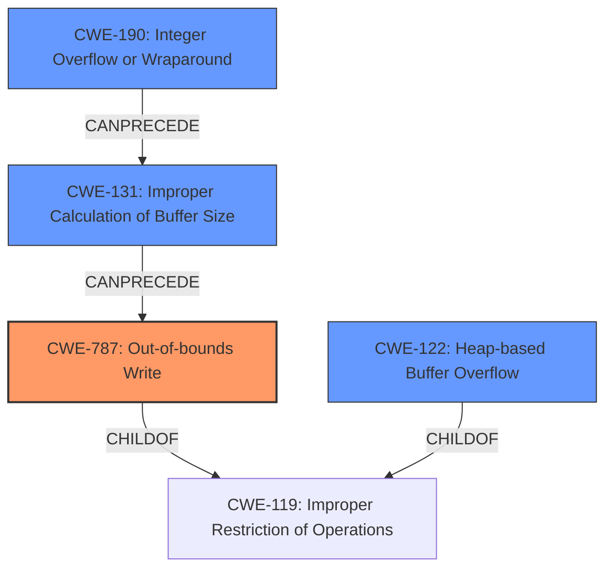

# Final Resolution for CVE-2022-0500

# Summary
| CWE ID | CWE Name | Confidence | CWE Abstraction Level | CWE Vulnerability Mapping Label | CWE-Vulnerability Mapping Notes |
|---|---|---|---|---|---|
| CWE-787 | Out-of-bounds Write | 0.95 | Base | Allowed | Primary CWE |
| CWE-131 | Improper Calculation of Buffer Size | 0.75 | Base | Allowed | Secondary Candidate |
| CWE-122 | Heap-based Buffer Overflow | 0.70 | Variant | Allowed | Secondary Candidate |
| CWE-190 | Integer Overflow or Wraparound | 0.60 | Base | Allowed | Secondary Candidate |

## Evidence and Confidence

*   **Confidence Score:** 0.90
*   **Evidence Strength:** MEDIUM

## Relationship Analysis
The decision was influenced by the parent-child relationship between CWE-787 and CWE-119, confirming the specificity of the **out-of-bounds write**. The potential chain relationship involving CWE-190, leading to CWE-131 and subsequently CWE-787, was considered. The base abstraction level of CWE-787, CWE-131 and CWE-190 guided the selection towards root cause identification. CWE-122 was considered as a more specific variant of a buffer overflow.

## Vulnerability Chain
The vulnerability chain starts with potentially **CWE-190 (Integer Overflow or Wraparound)** if the size calculation overflows. This leads to **CWE-131 (Improper Calculation of Buffer Size)**, causing an undersized buffer to be allocated. Subsequently, an **CWE-787 (Out-of-bounds Write)** occurs when data is written beyond the allocated buffer's boundaries, resulting in a **Heap-based Buffer Overflow (CWE-122)** on the heap, and ultimately privilege escalation.

## Summary of Analysis
The initial analysis and criticism were both considered, resulting in a refinement of the secondary CWE candidates.

The primary classification of **CWE-787 (Out-of-bounds Write)** remains valid, supported by the explicit mention of "out-of-bounds memory write" in the vulnerability description. This satisfies the core weakness.

The criticism's suggestion to explore **CWE-131 (Improper Calculation of Buffer Size)** was incorporated, recognizing that an incorrect size calculation could directly lead to the out-of-bounds write. This is a strong possibility given the context of the vulnerability. The confidence level is set to 0.75.

The confidence in **CWE-122 (Heap-based Buffer Overflow)** remains moderate (0.70) as it's a likely consequence, given that BTF data is likely allocated on the heap.

The confidence in **CWE-190 (Integer Overflow or Wraparound)** remains low (0.60) due to the lack of direct evidence, but it is retained as a potential contributing factor to the incorrect buffer size calculation.

The graph relationships reinforced the selection of **CWE-787 (Out-of-bounds Write)** as the primary issue, with the other CWEs potentially contributing to the vulnerability chain. The chosen CWEs are at the optimal level of specificity, with base-level CWEs representing the root causes and a variant-level CWE (CWE-122) capturing a specific context.

The final decision is based on the available evidence and considers the potential vulnerability chain from integer overflow to out-of-bounds write, ensuring a comprehensive classification.