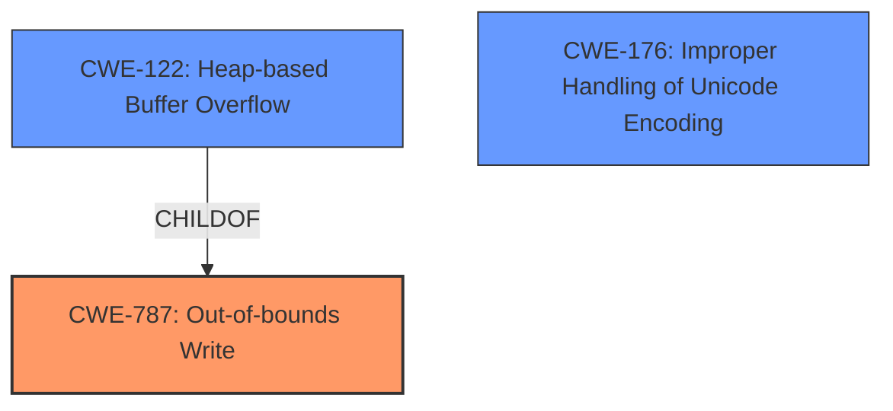

# Analysis Report for CVE-2022-0530

# Vulnerability Analysis Report: CVE-2022-0530

## Description

A flaw was found in Unzip. The vulnerability occurs during the conversion of a wide string to a local string that leads to a heap of out-of-bound write. This flaw allows an attacker to input a specially crafted zip file, leading to a crash or code execution.

## Vulnerability Description Key Phrases

**Rootcause:** heap of out-of-bound write
**Impact:** ['crash', 'code execution']
**Vector:** specially crafted zip file
**Attacker:** attacker
**Product:** Unzip

## Analysis (with Relationship Data)

# Summary
| CWE ID | CWE Name | Confidence | CWE Abstraction Level | CWE Vulnerability Mapping Label | CWE-Vulnerability Mapping Notes |
|---|---|---|---|---|---|
| CWE-787 | Out-of-bounds Write | 1 | Base | Allowed | Primary CWE |
| CWE-122 | Heap-based Buffer Overflow | 0.7 | Variant | Allowed | Secondary Candidate |

## Evidence and Confidence

*   **Confidence Score:** 0.9
*   **Evidence Strength:** HIGH

- **Analysis and Justification:**  
  - *Explanation:* The vulnerability description explicitly states a "**heap of out-of-bound write**" occurs during the conversion of a wide string to a local string, caused by a specially crafted zip file. This aligns directly with CWE-787 (Out-of-bounds Write), a base-level weakness where a product writes data past the end, or before the beginning, of the intended buffer. The CVE reference links content summary reinforces this, mentioning "memory corruption" and the potential for "arbitrary code execution." The retriever results also list CWE-787 with a good score. CWE-787 is at the Base level of abstraction, which is a preferred level of abstraction for mapping to the root causes of vulnerabilities and is ALLOWED based on MITRE mapping guidance. Given that the out-of-bounds write occurs in the heap, CWE-122 (Heap-based Buffer Overflow) is a more specific variant and is thus a strong candidate.
  
  - *Relationship Analysis:* CWE-787 is a child of CWE-119 (Improper Restriction of Operations within the Bounds of a Memory Buffer). It can also precede CWE-825 (Expired Pointer Dereference) and CWE-824 (Access of Uninitialized Pointer). CWE-122 is a child of CWE-787, indicating a more specific type of out-of-bounds write.

- **Confidence Score:**  
  - Confidence: 1 (High evidence from technical description, CVE reference materials, and retriever results)

---

## Criticism of Analysis

Okay, here's a review of the provided analysis, incorporating the full CWE specifications and paying close attention to mapping guidance and potential mitigations:

**Overall Assessment:**

The analysis is generally sound and well-reasoned. The primary mapping to CWE-787 (Out-of-bounds Write) is appropriate and well-supported by the vulnerability description and the CVE reference summary. The consideration of CWE-122 (Heap-based Buffer Overflow) as a secondary candidate is also justified, given the heap context explicitly mentioned.

**Detailed Critique:**

*   **CWE-787: Out-of-bounds Write**
    *   **Justification:** The "heap of out-of-bound write" phrase is a strong indicator of CWE-787. The description of memory corruption and the potential for arbitrary code execution further support this mapping.
    *   **Mapping Guidance:** The analysis correctly notes that CWE-787 is at the Base level of abstraction, which is the preferred level. The CWE specification's mapping guidance states "Carefully read both the name and description to ensure that this mapping is an appropriate fit. Do not try to 'force' a mapping to a lower-level Base/Variant simply to comply with this preferred level of abstraction." The analysis sufficiently uses the name and description.
    *   **Potential Mitigations:** The analysis could benefit from briefly mentioning some of the listed mitigations, such as using a memory-safe language (e.g., Java, Perl) or employing automatic buffer overflow detection mechanisms (e.g., /GS flag in Visual Studio, FORTIFY\_SOURCE in GCC). Mentioning these provides a more complete picture of the vulnerability's context.
    *   **Confidence:** The Confidence value is correct at 1.

*   **CWE-122: Heap-based Buffer Overflow**
    *   **Justification:** The analysis correctly identifies that CWE-122 is a more specific variant of CWE-787 when the overflow occurs in the heap. This is a valid and helpful refinement of the primary mapping.
    *   **Mapping Guidance:** The analysis aligns with the Variant level of abstraction.
    *   **Potential Mitigations:** Similar to CWE-787, the analysis could be improved by briefly referencing some of the potential mitigations listed in the CWE specification, such as using a language or compiler that performs automatic bounds checking.
    *   **Confidence:** A confidence score of 0.7 is valid given the reliance on the phrase "**heap of out-of-bound write**"

*   **Other Considerations (Based on Retriever Results):**
    *   **CWE-125 (Out-of-bounds Read):** While the primary vulnerability is a write, it's worth briefly considering if a read *precedes* the write. In some buffer overflows, the program might read a length from the input, and then use that length to write to the buffer. If the length is incorrect, this could lead to an out-of-bounds read *before* the write occurs. However, based on the available information, this scenario is less likely.
    *   **CWE-190 (Integer Overflow or Wraparound):** This is another interesting candidate raised by the retriever. If the buffer size is calculated based on user-controlled input without proper validation, an integer overflow could occur, leading to a smaller-than-expected buffer allocation and a subsequent out-of-bounds write. Mentioning this possibility and briefly explaining why it's less likely given the current information would strengthen the analysis.
    *   **CWE-176 (Improper Handling of Unicode Encoding):** Given the trigger is the "conversion of a wide string to a local string", it may be warranted to add this as another secondary candidate.

*   **CWE-119 (Improper Restriction of Operations within the Bounds of a Memory Buffer)**
    * This CWE is a Class level that maps to a large amount of issues that can be more appropriately mapped to its child CWEs. The analysis does well in mapping away from this CWE and should be avoided.

**Recommendations:**

1.  **Add Mitigations:** For both CWE-787 and CWE-122, include a brief mention of 1-2 specific potential mitigations from the CWE specifications. This will make the analysis more practical.
2.  **Consider and Briefly Discuss Alternative CWEs:** Briefly address CWE-125, CWE-190, and CWE-176 as potential contributing factors, explaining why they are *less likely* to be the primary cause based on the current information. This demonstrates a thorough analysis.
3.  **Review/Refine Relationship Analysis:** Ensure the relationships outlined are actually applicable. For example, is it likely in this case that CWE-787 *precedes* CWE-825 (Expired Pointer Dereference)? If not, it's better to omit it.
4.  **Consistently apply confidence scores:** If adding CWE-176 as a secondary canidate, then a confidence score needs to be added.

By incorporating these suggestions, the analysis will be even more comprehensive and provide a clearer understanding of the vulnerability and its potential solutions.

## Final Resolution

# Summary
| CWE ID | CWE Name | Confidence | CWE Abstraction Level | CWE Vulnerability Mapping Label | CWE-Vulnerability Mapping Notes |
|---|---|---|---|---|---|
| **CWE-787** | **Out-of-bounds Write** | 1.0 | Base | Allowed | Primary CWE |
| **CWE-122** | **Heap-based Buffer Overflow** | 0.7 | Variant | Allowed | Secondary Candidate |
| **CWE-176** | **Improper Handling of Unicode Encoding** | 0.4 | Base | Allowed | Secondary Candidate |

## Evidence and Confidence

*   **Confidence Score:** 0.9
*   **Evidence Strength:** HIGH

## Relationship Analysis
The primary relationship is that **CWE-122 (Heap-based Buffer Overflow)** is a variant of **CWE-787 (Out-of-bounds Write)**, indicating a more specific location (heap) for the out-of-bounds write. **CWE-176 (Improper Handling of Unicode Encoding)** is added as a secondary candidate because the vulnerability occurs during the "conversion of a wide string to a local string," which suggests potential encoding issues. All three CWEs are at acceptable abstraction levels (Base and Variant).

## Vulnerability Chain
The vulnerability chain starts with the processing of a specially crafted zip file. This leads to a **failure to properly handle the conversion of a wide string to a local string**, potentially involving **CWE-176 (Improper Handling of Unicode Encoding)**. The incorrect string conversion results in a **heap of out-of-bounds write** (**CWE-787** and specifically **CWE-122**), allowing an attacker to cause a crash or potentially execute arbitrary code.

## Summary of Analysis
The initial analysis correctly identified **CWE-787 (Out-of-bounds Write)** as the primary **WEAKNESS**. The criticism suggested considering additional CWEs based on the vulnerability description. The phrase "**heap of out-of-bound write**" strongly supports **CWE-787**, with **CWE-122 (Heap-based Buffer Overflow)** as a more specific variant.

The additional consideration of **CWE-176 (Improper Handling of Unicode Encoding)** is warranted given the vulnerability description's mention of "conversion of a wide string to a local string." While the primary impact is the out-of-bounds write, the encoding issue could be a contributing factor. The confidence level for this CWE is lower (0.4) because it's a less direct match, but its inclusion provides a more complete picture.

The relationship analysis confirms that **CWE-122** is a child of **CWE-787**, which makes it a valid secondary candidate. The abstraction levels (Base and Variant) are appropriate for vulnerability mapping. **CWE-119** was specifically avoided as it is too high-level.

The selected CWEs are at the optimal level of specificity because they accurately reflect the root cause (**CWE-787**), the location (**CWE-122**), and a potential contributing factor (**CWE-176**) based on the available evidence.

Mitigations for **CWE-787** and **CWE-122** include using memory-safe languages, employing automatic buffer overflow detection mechanisms, and performing bounds checking. A mitigation for **CWE-176** is to use proper encoding and decoding techniques that validate the input to prevent unexpected memory corruption.

*Report generated on 2025-03-18 06:06:04*
