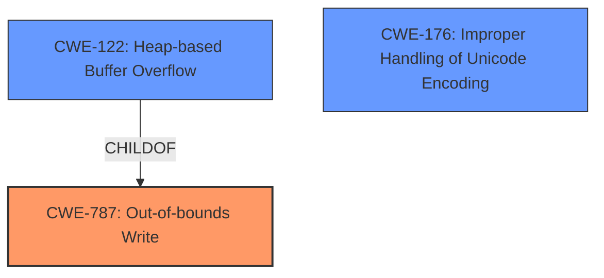

# Final Resolution for CVE-2022-0530

# Summary
| CWE ID | CWE Name | Confidence | CWE Abstraction Level | CWE Vulnerability Mapping Label | CWE-Vulnerability Mapping Notes |
|---|---|---|---|---|---|
| **CWE-787** | **Out-of-bounds Write** | 1.0 | Base | Allowed | Primary CWE |
| **CWE-122** | **Heap-based Buffer Overflow** | 0.7 | Variant | Allowed | Secondary Candidate |
| **CWE-176** | **Improper Handling of Unicode Encoding** | 0.4 | Base | Allowed | Secondary Candidate |

## Evidence and Confidence

*   **Confidence Score:** 0.9
*   **Evidence Strength:** HIGH

## Relationship Analysis
The primary relationship is that **CWE-122 (Heap-based Buffer Overflow)** is a variant of **CWE-787 (Out-of-bounds Write)**, indicating a more specific location (heap) for the out-of-bounds write. **CWE-176 (Improper Handling of Unicode Encoding)** is added as a secondary candidate because the vulnerability occurs during the "conversion of a wide string to a local string," which suggests potential encoding issues. All three CWEs are at acceptable abstraction levels (Base and Variant).

## Vulnerability Chain
The vulnerability chain starts with the processing of a specially crafted zip file. This leads to a **failure to properly handle the conversion of a wide string to a local string**, potentially involving **CWE-176 (Improper Handling of Unicode Encoding)**. The incorrect string conversion results in a **heap of out-of-bounds write** (**CWE-787** and specifically **CWE-122**), allowing an attacker to cause a crash or potentially execute arbitrary code.

## Summary of Analysis
The initial analysis correctly identified **CWE-787 (Out-of-bounds Write)** as the primary **WEAKNESS**. The criticism suggested considering additional CWEs based on the vulnerability description. The phrase "**heap of out-of-bound write**" strongly supports **CWE-787**, with **CWE-122 (Heap-based Buffer Overflow)** as a more specific variant.

The additional consideration of **CWE-176 (Improper Handling of Unicode Encoding)** is warranted given the vulnerability description's mention of "conversion of a wide string to a local string." While the primary impact is the out-of-bounds write, the encoding issue could be a contributing factor. The confidence level for this CWE is lower (0.4) because it's a less direct match, but its inclusion provides a more complete picture.

The relationship analysis confirms that **CWE-122** is a child of **CWE-787**, which makes it a valid secondary candidate. The abstraction levels (Base and Variant) are appropriate for vulnerability mapping. **CWE-119** was specifically avoided as it is too high-level.

The selected CWEs are at the optimal level of specificity because they accurately reflect the root cause (**CWE-787**), the location (**CWE-122**), and a potential contributing factor (**CWE-176**) based on the available evidence.

Mitigations for **CWE-787** and **CWE-122** include using memory-safe languages, employing automatic buffer overflow detection mechanisms, and performing bounds checking. A mitigation for **CWE-176** is to use proper encoding and decoding techniques that validate the input to prevent unexpected memory corruption.