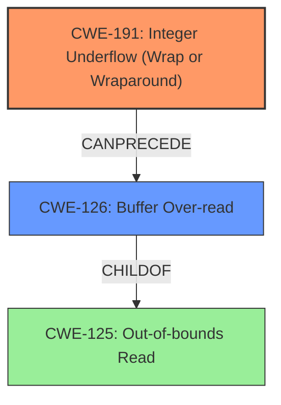

# Analysis Report for CVE-2022-0544

# Vulnerability Analysis Report: CVE-2022-0544

## Description

An integer underflow in the DDS loader of Blender leads to an out-of-bounds read, possibly allowing an attacker to read sensitive data using a crafted DDS image file. This flaw affects Blender versions prior to 2.83.19, 2.93.8 and 3.1.

## Vulnerability Description Key Phrases

**Rootcause:** integer underflow
**Weakness:** out-of-bounds read
**Impact:** read sensitive data
**Vector:** crafted DDS image file
**Product:** Blender
**Version:** ['prior to 2.83.19', '2.93.8', '3.1']
**Component:** DDS loader

## Analysis (with Relationship Data)

# Summary
| CWE ID | CWE Name | Confidence | CWE Abstraction Level | CWE Vulnerability Mapping Label | CWE-Vulnerability Mapping Notes |
|---|---|---|---|---|---|
| CWE-191 | Integer Underflow (Wrap or Wraparound) | 0.95 | Base | Allowed | Primary CWE: The vulnerability's root cause is an integer underflow. |
| CWE-125 | Out-of-bounds Read | 0.95 | Base | Allowed | Secondary CWE: The integer underflow leads to an out-of-bounds read. |

## Evidence and Confidence

*   **Confidence Score:** 0.95
*   **Evidence Strength:** HIGH

- **Analysis and Justification:**  
  - *Explanation:* The vulnerability description explicitly mentions an "**integer underflow**" in the DDS loader, which leads to an "**out-of-bounds read**". The CVE reference summary confirms that the root cause is an integer underflow when the file size is smaller than 128 bytes, causing the `size` variable to become a large value, bypassing bounds checks, and resulting in an out-of-bounds read. This aligns directly with CWE-191 (Integer Underflow) as the primary weakness and CWE-125 (Out-of-bounds Read) as the secondary weakness resulting from the underflow. The retriever results also rank CWE-191 and CWE-125 as highly relevant with good scores and "Allowed" usage. The relationship analysis shows how an integer underflow can directly lead to an out-of-bounds read.

  - *Relationship Analysis:* CWE-191 can precede CWE-125 as the underflow causes an incorrect size calculation that leads to reading beyond the allocated buffer. The CWE-787 (Out-of-bounds Write) was also suggested, however, the vulnerability description specifies an 'out-of-bounds read' and not a write. CWE-129 (Improper Validation of Array Index) was also suggested because there is a lack of validation, but the primary issue is the integer underflow which makes CWE-191 a better fit.

- **Confidence Score:**  
  - Confidence: 0.95 (Strong evidence from the vulnerability description and CVE reference links content summary. Retriever Results support the identification of these CWEs.)

## Criticism of Analysis

Okay, here's a review of the provided analysis, incorporating the full CWE specifications.

**Overall Assessment:**

The analysis is strong and the selected CWEs (CWE-191 and CWE-125) are appropriate and well-justified. The confidence level of 0.95 is reasonable given the available information. The evidence and justification clearly explain the relationship between the integer underflow and the resulting out-of-bounds read.

**Strengths:**

*   **Clear Identification:** The analysis correctly identifies the root cause (integer underflow) and the resulting vulnerability (out-of-bounds read).
*   **Solid Justification:** The explanation provided clearly connects the vulnerability description and CVE reference summary to the selected CWEs.  It leverages the CWE descriptions effectively.
*   **High Confidence:** The high confidence score reflects the solid evidence presented.
*   **Good Understanding of Relationships:** The analysis correctly establishes the relationship between CWE-191 and CWE-125 (CWE-191 leads to CWE-125).
*   **Addressing Alternative CWEs:** The justification addresses and rules out other potential CWEs like CWE-787 and CWE-129, which demonstrates a thorough understanding.
*   **Use of Examples:** Including observed examples for the chosen CWEs strengthens the analysis and shows that similar vulnerabilities have been seen before.

**Areas for Potential Improvement or Discussion:**

*   **Detailed Mitigation Strategies:** While the analysis correctly identifies the CWEs, it could benefit from a more detailed discussion of mitigation strategies specific to this vulnerability, drawing on the "Potential Mitigations" sections within the CWE specifications. While adding a bounds check to resolve the issue is a good start, the specific mitigations for CWE-191 and CWE-125 may add more specific guidance.
*   **CWE-1285: Improper Validation of Specified Index, Position, or Offset in Input** Although you addressed the improper validation of array index as a secondary CWE, CWE-1285 is closely related. However, based on the specification it is only *potentially* relevant. It could be mentioned as an alternative but not included.
*   **Specificity of Out-of-Bounds Read (CWE-125):** Could it be more specific? The CWE specification for CWE-125 has two children: CWE-126 (Buffer Over-read) and CWE-127 (Buffer Under-read). In this case, since the integer *underflow* causes the buffer to read too far *forward* in memory, CWE-126 is a better fit. The analysis already uses good justification so applying the same justification process here is appropriate.

**Detailed Comments and Suggestions based on specific CWE Specifications:**

*   **CWE-191: Integer Underflow (Wrap or Wraparound)**

    *   **Mitigation:**  The analysis could include a discussion of mitigation techniques from the CWE specification, such as using languages with automatic bounds checking or libraries for safe integer handling. In general, languages such as Ada and Java either prevent this from happening or raise an exception.
    *   **Mapping Guidance:** The analysis correctly adheres to the mapping guidance by selecting a Base-level CWE.

*   **CWE-125: Out-of-bounds Read**

    *   **Mitigation:** The analysis could suggest stricter input validation as a mitigation, explicitly mentioning the "accept known good" strategy from the CWE specification. Ensure correct calculations for length arguments, buffer size calculations, and offsets.
    *   **Specificity:** Consider *CWE-126: Buffer Over-read* as a more precise mapping since it reads past the *end* of the buffer due to the underflowed size.  This is supported by the CWE's description: "The product reads from a buffer using buffer access mechanisms such as indexes or pointers that reference memory locations *after* the targeted buffer." This is *because* of the underflow, however.

*   **CWE-1285: Improper Validation of Specified Index, Position, or Offset in Input**

    *   **Relationship:** As the specification notes, this is a close relationship. But it is not appropriate to include as the main CWE. Mentioning it is appropriate but not necessary.
*   **CWE-197: Numeric Truncation Error**

    *   **Relevance:** The analysis does not include this CWE. As per the CWE specification, this is an issue when a primitive is cast to a smaller primitive, which is not apparent in the provided input.
*   **CWE-131: Incorrect Calculation of Buffer Size**

    *   **Relevance:** The analysis does not include this CWE. Since the calculation is incorrect, it's reasonable to include it. However, the *reason* the calculation is incorrect is due to the integer underflow. So it's not a primary issue.
*   **CWE-787: Out-of-bounds Write**

    *   **Relevance:** The analysis does not include this CWE. But the specific report only specifies a 'read', and *not* a write.

**Revised Summary (incorporating suggestions):**

| CWE ID | CWE Name | Confidence | CWE Abstraction Level | CWE Vulnerability Mapping Label | CWE-Vulnerability Mapping Notes |
|---|---|---|---|---|---|
| CWE-191 | Integer Underflow (Wrap or Wraparound) | 0.95 | Base | Allowed | Primary CWE: The vulnerability's root cause is an integer underflow.  Mitigation involves using safe integer handling libraries or languages with built-in overflow/underflow protection. |
| CWE-126 | Buffer Over-read | 0.95 | Variant | Allowed | Secondary CWE: The integer underflow leads to an out-of-bounds read *past the end of the intended buffer*. Mitigation involves stricter input validation and ensuring correct length calculations. |

**Conclusion:**

The analysis is well-done. The suggested improvements, especially focusing on more specific mitigation strategies from the CWE specifications and considering the more specific CWE-126 (Buffer Over-read), would further enhance its quality.

## Final Resolution

# Summary
| CWE ID | CWE Name | Confidence | CWE Abstraction Level | CWE Vulnerability Mapping Label | CWE-Vulnerability Mapping Notes |
|---|---|---|---|---|---|
| CWE-191 | Integer Underflow (Wrap or Wraparound) | 0.95 | Base | Allowed | Primary CWE: The vulnerability's root cause is an integer underflow. |
| CWE-126 | Buffer Over-read | 0.95 | Variant | Allowed | Secondary CWE: The integer underflow leads to an out-of-bounds read. |

## Evidence and Confidence

*   **Confidence Score:** 0.95
*   **Evidence Strength:** HIGH

## Relationship Analysis
The primary relationship is that CWE-191 **Integer Underflow** can precede CWE-126 **Buffer Over-read**. The integer underflow results in an incorrect size calculation, which leads to reading beyond the allocated buffer. CWE-126 is a child of CWE-125 **Out-of-bounds Read**, providing a more specific classification for the type of out-of-bounds read that occurs in this vulnerability. The abstraction levels are appropriate, with CWE-191 at the Base level and CWE-126 at the Variant level, giving the right level of specificity.

## Vulnerability Chain
The vulnerability chain starts with an **Integer Underflow (CWE-191)** in the DDS loader. This underflow leads to an incorrect size calculation. The incorrect size calculation results in a **Buffer Over-read (CWE-126)**, where the application reads data past the end of the intended buffer. This can potentially lead to an attacker reading sensitive data.

## Summary of Analysis
The initial analysis and criticism are both strong. The vulnerability description explicitly mentions an "**integer underflow**" leading to an "**out-of-bounds read**." The CVE reference summary supports that the **ROOTCAUSE** is an integer underflow. The `size` variable becomes a large value, bypassing bounds checks, and resulting in an out-of-bounds read.

The initial analysis correctly identified CWE-191 and CWE-125. The criticism suggested using the more specific CWE-126 instead of CWE-125, and this suggestion is reasonable and well-justified. "The product reads from a buffer using buffer access mechanisms such as indexes or pointers that reference memory locations *after* the targeted buffer." The graph relationships influenced the selection by highlighting the child-parent relationship between CWE-125 and CWE-126, and the chain relationship between CWE-191 and CWE-126.

The selected CWEs are at the optimal level of specificity because CWE-191 is the root cause and CWE-126 is a specific type of out-of-bounds read that accurately describes the vulnerability.

*Report generated on 2025-03-18 06:06:49*
