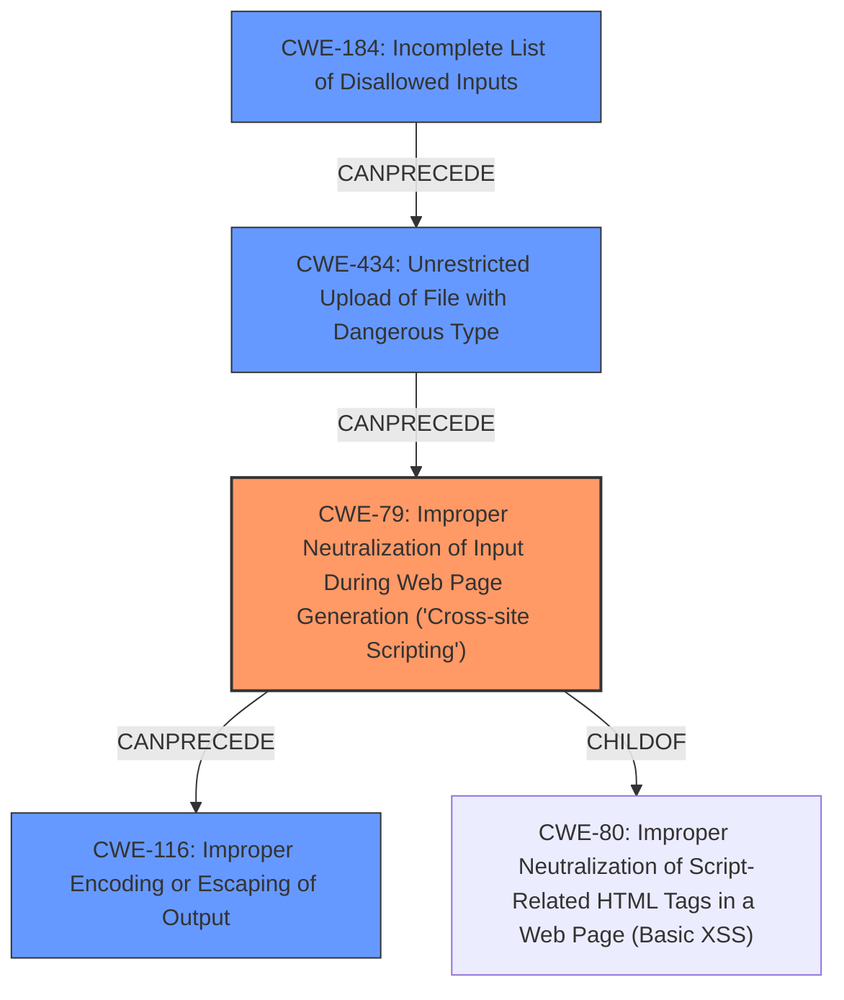

# Final Resolution for CVE-2022-0565

# Summary
| CWE ID | CWE Name | Confidence | CWE Abstraction Level | CWE Vulnerability Mapping Label | CWE-Vulnerability Mapping Notes |
|---|---|---|---|---|---|
| CWE-79 | Improper Neutralization of Input During Web Page Generation ('Cross-site Scripting') | 0.9 | Base | Primary | Allowed |
| CWE-434 | Unrestricted Upload of File with Dangerous Type | 0.7 | Base | Secondary | Allowed |
| CWE-184 | Incomplete List of Disallowed Inputs | 0.6 | Base | Contributing | Allowed |
| CWE-116 | Improper Encoding or Escaping of Output | 0.5 | Class | Contributing | Allowed-with-Review |

## Evidence and Confidence

*   **Confidence Score:** 0.85
*   **Evidence Strength:** HIGH

## Relationship Analysis
The analysis involved examining parent-child relationships to ensure specificity, chain relationships to map the vulnerability's progression, and peer relationships for alternative classifications. Abstraction levels guided the selection of the most appropriate CWEs.

## Vulnerability Chain
The vulnerability chain starts with an **incomplete list of disallowed inputs (CWE-184)**, leading to the **unrestricted upload of a file with a dangerous type (CWE-434)**. This uploaded file is then processed without proper neutralization, resulting in **improper neutralization of input during web page generation (CWE-79)**, which can be exacerbated by **improper encoding or escaping of output (CWE-116)**. The initial flaw is the incomplete input validation, with the final impact being cross-site scripting.

## Summary of Analysis
The initial analysis correctly identified CWE-79 as the primary weakness due to the explicit mention of cross-site scripting in the vulnerability description. The CVE Reference Links Content Summary confirms the lack of proper sanitization of SVG files, which can lead to XSS. The analysis of changes in `SettingsController.php` and `AssetSanitizationListener.php` further reinforces the XSS vulnerability.

The criticism suggested adding CWE-184 or CWE-183 due to the initial reliance on file extension checks. The initial reliance on file extension checks does imply a weakness in defining which file types were considered safe or unsafe, therefore, CWE-184 (Incomplete List of Disallowed Inputs) is added as a contributing factor.

The criticism also suggested adding a relationship to CWE-116. CWE-116 is included because output encoding is a direct cause of XSS, and the mitigations in the fixes implement output encoding to sanitize the uploaded files. "The fix implemented relies heavily on output encoding using the `enshrined/svg-sanitize` library."

The selection of CWE-79, CWE-434, CWE-184, and CWE-116 provides the optimal level of specificity, as it captures the entire vulnerability chain from the initial input validation issues to the final XSS impact.