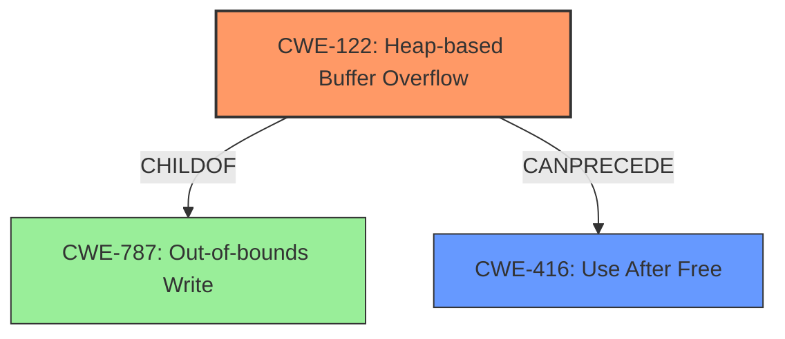

# Final Resolution for CVE-2022-0604

# Summary
| CWE ID | CWE Name | Confidence | CWE Abstraction Level | CWE Vulnerability Mapping Label | CWE-Vulnerability Mapping Notes |
|---|---|---|---|---|---|
| CWE-122 | Heap-based Buffer Overflow | 0.95 | Variant | Primary | Allowed |
| CWE-416 | Use After Free | 0.75 | Variant | Secondary | Allowed |

## Evidence and Confidence

*   **Confidence Score:** 0.9
*   **Evidence Strength:** HIGH

## Relationship Analysis
The primary relationship impacting the decision is the parent-child relationship between CWE-787 (**Out-of-bounds Write**) and CWE-122 (**Heap-based Buffer Overflow**). CWE-122 is a specific type of CWE-787 that occurs on the heap. CWE-416 (**Use After Free**) is considered a potential consequence of heap corruption, making it a secondary weakness. The chain relationship illustrates that a heap overflow (CWE-122) can precede a use-after-free condition (CWE-416).

## Vulnerability Chain
The vulnerability chain starts with the attacker convincing a user to install a malicious extension. The attacker crafts a malicious HTML page that triggers a **heap buffer overflow (CWE-122)** in Chrome's Tab Groups feature. This overflow corrupts the heap, potentially overwriting metadata. If the corrupted memory is later freed and reallocated, and the original pointer is then used, it leads to a **use-after-free condition (CWE-416)**.

## Summary of Analysis
The initial analysis correctly identified CWE-122 as the primary weakness due to the explicit mention of "heap buffer overflow" and "heap corruption." The criticism suggested strengthening the explanation for CWE-416 and increasing the confidence level. It also suggested acknowledging CWE-787.

The vulnerability description states, "Heap buffer overflow in Tab Groups in Google Chrome prior to 98.0.4758.102 allowed an attacker who convinced a user to install a malicious extension and engage in specific user interaction to potentially exploit heap corruption via a crafted HTML page." This statement is direct evidence for CWE-122.

The confidence for CWE-416 is increased to 0.75 by elaborating on the chain of events: the attacker controls a malicious extension and crafted HTML. The **heap overflow** corrupts a Tab Group object, which is then freed. The extension, still running, has a dangling pointer to the freed Tab Group object. Later access triggers the **UAF**.

CWE-787 is acknowledged as the parent of CWE-122, providing a broader context for mitigation strategies. However, CWE-122 is more specific and accurately reflects the vulnerability.

The selected CWEs are at the optimal level of specificity. CWE-122 is a variant that accurately describes the heap-based nature of the buffer overflow. CWE-416 is a variant that represents the potential consequence of heap corruption.