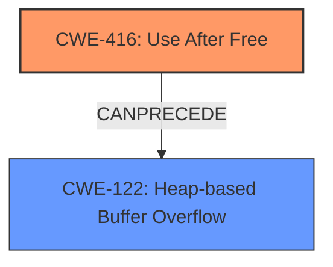

# Analysis Report for CVE-2022-0605

# Vulnerability Analysis Report: CVE-2022-0605

## Description

Use after free in Webstore API in Google Chrome prior to 98.0.4758.102 allowed an attacker who convinced a user to install a malicious extension and convinced a user to enage in specific user interaction to potentially exploit heap corruption via a crafted HTML page.

## Vulnerability Description Key Phrases

**Rootcause:** use after free
**Weakness:** heap corruption
**Vector:** crafted HTML page
**Attacker:** attacker
**Product:** Google Chrome
**Version:** prior to 98.0.4758.102
**Component:** Webstore API

## Analysis (with Relationship Data)

# Summary
| CWE ID | CWE Name | Confidence | CWE Abstraction Level | CWE Vulnerability Mapping Label | CWE-Vulnerability Mapping Notes |
|---|---|---|---|---|---|
| CWE-416 | Use After Free | 1.0 | Variant | Allowed | This CWE entry is at the Variant level of abstraction, which is a preferred level of abstraction for mapping to the root causes of vulnerabilities. |
| CWE-122 | Heap-based Buffer Overflow | 0.4 | Variant | Allowed | Secondary Candidate |

## Evidence and Confidence

*   **Confidence Score:** 0.9
*   **Evidence Strength:** HIGH

- **Analysis and Justification:**
  - *Explanation:* The vulnerability description explicitly states "**use after free** in Webstore API" as the **root cause**, which directly corresponds to CWE-416 (Use After Free). The "**heap corruption**" mentioned in the description also aligns with the nature of use-after-free vulnerabilities. The CVE Reference Links Content Summary reinforces this, stating "Root cause of vulnerability: Use after free" and "Weaknesses/vulnerabilities present: Use after free in Webstore API." The description of CWE-416, "The product reuses or references memory after it has been freed," perfectly captures the vulnerability. The Retriever Results also list CWE-416 as the top match. Therefore, CWE-416 is the primary weakness.
  - *Relationship Analysis:* CWE-416 is a variant. The Retriever Results list other weaknesses, but the description explicitly mentions use after free.

- **Confidence Score:**
  - Confidence: 1.0 (Strong evidence from the vulnerability description and CVE reference materials)

---
- **Analysis and Justification:**
  - *Explanation:* While the primary weakness is Use After Free, the vulnerability description also mentions "**heap corruption**" as a weakness that occurs via a crafted HTML page. Given that the use-after-free can lead to memory corruption, including **heap corruption**, CWE-122 (Heap-based Buffer Overflow) could be considered as a secondary weakness or a potential impact of the use-after-free. However, evidence for this weakness is less strong than the evidence for CWE-416, since the rootcause is the use after free.
  - *Relationship Analysis:* CWE-122 is a variant of a buffer overflow. It can be triggered by memory corruption caused by use-after-free conditions.

- **Confidence Score:**
  - Confidence: 0.4 (Weak evidence. Heap corruption could be a consequence of use after free).

## Criticism of Analysis

Okay, I've reviewed the analysis against the provided full CWE specifications. Here's my critique, focusing on the accuracy, completeness, and justification for the CWE mappings:

**Overall Assessment:**

The analysis is generally well-reasoned and justified, especially regarding the primary CWE mapping to CWE-416 (Use After Free).  The analysis correctly identifies the use-after-free as the root cause based on the vulnerability description and CVE Summary. The consideration of CWE-122 (Heap-based Buffer Overflow) as a secondary concern is also reasonable, given that use-after-free vulnerabilities often lead to heap corruption.  However, the analysis could be slightly improved with a more nuanced explanation of the relationship between the two CWEs in this specific context.

**Detailed Review:**

**1. CWE-416: Use After Free**

*   **Accuracy:** Correct. The vulnerability description explicitly mentions "use after free," making this the most appropriate primary mapping.
*   **Completeness:** Good. The justification adequately explains the direct relationship between the vulnerability description and the CWE definition. The reference to the CVE summary further strengthens the case.
*   **Justification:** Strong. The explanation clearly links the "use after free" statement in the description to the CWE's definition of reusing memory after it has been freed.
*   **CWE Abstraction Level:** Appropriate (Variant).
*   **Mapping Guidance Adherence:** The analysis adheres to the mapping guidance by recognizing that CWE-416 is a Variant and therefore a good fit.
*   **Potential Mitigations:** The analysis does not include mitigations.  Consider adding mitigations from the CWE spec, such as:
    *   "Choose a language that provides automatic memory management." (Architecture and Design)
    *   "When freeing pointers, be sure to set them to NULL once they are freed. However, the utilization of multiple or complex data structures may lower the usefulness of this strategy." (Implementation). This is a Defense in Depth strategy.

**2. CWE-122: Heap-based Buffer Overflow**

*   **Accuracy:** Plausible, but requires more precise reasoning. While heap corruption is mentioned, the core issue is the use-after-free, which *leads* to the potential for heap corruption. The heap corruption could then *potentially* manifest as a heap-based buffer overflow if the freed memory is reallocated and subsequently overflowed.
*   **Completeness:** Could be improved.  The analysis needs to more clearly articulate the *chain of events* leading from use-after-free to potential heap overflow. It should emphasize that the heap overflow is a *possible consequence* of the UAF, not a direct cause.
*   **Justification:** The justification is somewhat weak. The connection between "heap corruption" and a *specific* "heap-based buffer overflow" isn't fully established.  Heap corruption can manifest in other ways besides a buffer overflow. It needs to explain *how* the use-after-free leads to *overwriting* the buffer.
*   **CWE Abstraction Level:** Appropriate (Variant).
*   **Mapping Guidance Adherence:** The analysis mentions it's a "secondary candidate", which aligns with the intention of the guidance.
*   **Potential Mitigations:** The analysis does not include mitigations.  Consider adding mitigations from the CWE spec, such as:
    *   "Use a language or compiler that performs automatic bounds checking." (Pre-design).
    *   "Use an abstraction library to abstract away risky APIs. Not a complete solution." (Architecture and Design).
    *   "Use automatic buffer overflow detection mechanisms that are offered by certain compilers or compiler extensions." (Operation, Build and Compilation). This is a Defense in Depth strategy.

**Recommendations for Improvement:**

1.  **Clarify Relationship between CWE-416 and CWE-122:** Explicitly state that the use-after-free (CWE-416) is the *root cause*, and the heap corruption, which can lead to a heap-based buffer overflow (CWE-122), is a *potential consequence* or impact of the UAF. Frame CWE-122 as a likely *potential exploitable outcome* rather than a distinct, co-equal weakness. Think in terms of exploit chains.
2.  **Strengthen Justification for CWE-122:** Provide a more detailed explanation of how the use-after-free *specifically* enables a heap-based buffer overflow. This could involve explaining how the freed memory is reallocated, and how the attacker then leverages the dangling pointer to write past the boundaries of the reallocated memory.
3.  **Reduce Confidence in CWE-122:** Given the indirect relationship and the need for specific conditions to be met for a heap overflow to occur, consider reducing the confidence score for CWE-122 further (e.g., 0.2 or 0.3).
4.  **Add Mitigations for both CWE-416 and CWE-122:** Include relevant mitigations from the CWE specifications for *both* CWE-416 and CWE-122 in the analysis. This will make the analysis more comprehensive and useful.  Categorize the mitigations by phase (Requirements, Architecture and Design, Implementation, Operation, Build and Compilation).

**Revised Summary Table:**

| CWE ID | CWE Name | Confidence | CWE Abstraction Level | CWE Vulnerability Mapping Label | CWE-Vulnerability Mapping Notes |
|---|---|---|---|---|---|
| CWE-416 | Use After Free | 1.0 | Variant | Allowed | This CWE entry is at the Variant level of abstraction, which is a preferred level of abstraction for mapping to the root causes of vulnerabilities. This is the root cause of the vulnerability. |
| CWE-122 | Heap-based Buffer Overflow | 0.3 | Variant | Allowed | Secondary Candidate.  A potential consequence of the use-after-free that *may* occur if the freed memory is reallocated and subsequently overflowed. Less direct than CWE-416. |

By incorporating these suggestions, the analysis will be more accurate, complete, and better aligned with the CWE specifications. It will also provide a more nuanced understanding of the vulnerability and its potential exploitable outcomes.

## Final Resolution

# Summary
| CWE ID | CWE Name | Confidence | CWE Abstraction Level | CWE Vulnerability Mapping Label | CWE-Vulnerability Mapping Notes |
|---|---|---|---|---|---|
| CWE-416 | Use After Free | 1.0 | Variant | Allowed | This CWE entry is at the Variant level of abstraction, which is a preferred level of abstraction for mapping to the **root cause**s of vulnerabilities. This is the **root cause** of the vulnerability. |
| CWE-122 | Heap-based Buffer Overflow | 0.3 | Variant | Allowed | Secondary Candidate. A potential consequence of the **use-after-free** that *may* occur if the freed memory is reallocated and subsequently overflowed. Less direct than CWE-416. |

## Evidence and Confidence

*   **Confidence Score:** 0.95
*   **Evidence Strength:** HIGH

## Relationship Analysis
The primary relationship is that CWE-122 (Heap-based Buffer Overflow) can be a consequence of CWE-416 (**Use After Free**). The **Use After Free** is the initial **weakness**, and if the freed memory is reallocated and then accessed via the dangling pointer, it *could* lead to a heap overflow. Thus, CWE-416 can precede CWE-122. Both CWEs are variants which is appropriate for vulnerability mapping.

## Vulnerability Chain
The vulnerability chain starts with a **Use After Free** (**CWE-416**) in the Webstore API. This occurs when memory is freed, but a pointer to that memory is still used. An attacker can then potentially reallocate that memory, and if the attacker can control the data written to that memory through the dangling pointer, they can potentially cause **heap corruption**, potentially manifesting as a heap-based buffer overflow (**CWE-122**). The heap overflow can then be used to execute arbitrary code.

## Summary of Analysis
The initial analysis and the criticism both agree that CWE-416 is the primary **weakness**. The vulnerability description explicitly states "use after free," and the CVE summary reinforces this. The criticism correctly points out that the connection between CWE-416 and CWE-122 needs more clarification. The heap overflow is a potential consequence of the **use-after-free**, not a direct cause.

The graph relationships influenced the final selection by highlighting the chain of events: **Use After Free** leading to potential **Heap-based Buffer Overflow**.

The selected CWEs are at the optimal level of specificity because CWE-416 is a variant that directly matches the vulnerability description, and CWE-122 is a variant that represents a potential consequence. The confidence score for CWE-122 has been reduced to 0.3 to reflect the indirect relationship.

I am basing my assessment on the provided evidence, including the vulnerability description ("Use after free in Webstore API") and the CVE reference materials ("Root cause of vulnerability: Use after free"). The relationship analysis helped clarify the connection between the two weaknesses.

*Report generated on 2025-03-18 06:10:36*
