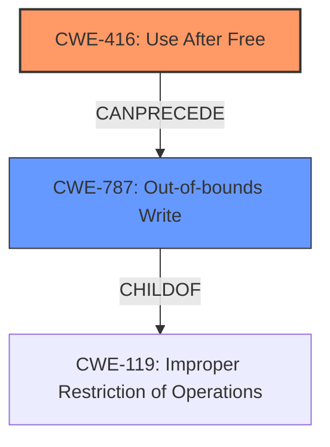

# Final Resolution for CVE-2022-0606

# Summary
| CWE ID | CWE Name | Confidence | CWE Abstraction Level | CWE Vulnerability Mapping Label | CWE-Vulnerability Mapping Notes |
|---|---|---|---|---|---|
| CWE-416 | Use After Free | 0.9 | Variant | Allowed | Primary CWE. The vulnerability description clearly states "**Use after free**" which is directly addressed by **CWE-416 (Use After Free)**. |
| CWE-787 | Out-of-bounds Write | 0.5 | Base | Allowed | Secondary CWE. The vulnerability description mentions "**heap corruption**" as a result of the use-after-free, which can lead to an out-of-bounds write. |

## Evidence and Confidence

*   **Confidence Score:** 0.9
*   **Evidence Strength:** HIGH

## Relationship Analysis
The primary relationship impacting the decision is the CANPRECEDE relationship between **CWE-416 (Use After Free)** and **CWE-787 (Out-of-bounds Write)**. **CWE-416 (Use After Free)** can lead to **CWE-787 (Out-of-bounds Write)** because after memory is freed, a subsequent write to that memory location becomes an out-of-bounds write. **CWE-787 (Out-of-bounds Write)** is a child of **CWE-119 (Improper Restriction of Operations within the Bounds of a Memory Buffer)**, which is a more general class of buffer errors. This hierarchical relationship shows that **CWE-787 (Out-of-bounds Write)** is more specific and therefore more appropriate than **CWE-119 (Improper Restriction of Operations within the Bounds of a Memory Buffer)**.

## Vulnerability Chain
The vulnerability chain starts with the **rootcause** of **CWE-416 (Use After Free)**. The sequence of events is:
1.  Memory is allocated and used.
2.  The memory is freed.
3.  A dangling pointer still references the freed memory.
4.  The dangling pointer is dereferenced, leading to a write to the freed memory, now potentially used by another allocation, resulting in **CWE-787 (Out-of-bounds Write)**.
5.  The impact is heap corruption, which can lead to arbitrary code execution.

## Summary of Analysis
The initial analysis correctly identified **CWE-416 (Use After Free)** as the primary **weakness**, given the explicit mention in the vulnerability description: "Use after free in ANGLE in Google Chrome prior to 98.0.4758.102 allowed a remote attacker to potentially exploit heap corruption via a crafted HTML page."

The criticism correctly pointed out that **CWE-122 (Heap-based Buffer Overflow)** is not a direct consequence of every use-after-free. Instead, **CWE-787 (Out-of-bounds Write)** is a more accurate secondary **weakness**, as the use-after-free condition often leads to writing to memory that has been reallocated or is otherwise out of bounds.

The graph relationships confirm that **CWE-787 (Out-of-bounds Write)** is a suitable secondary **weakness**, as it can be a direct result of **CWE-416 (Use After Free)**. The choice of **CWE-787 (Out-of-bounds Write)** is also supported by its Base abstraction level, which is preferred for vulnerability mapping.

The final decision reflects the evidence from the vulnerability description and the relationships between the CWEs. **CWE-416 (Use After Free)** is the **rootcause**, and **CWE-787 (Out-of-bounds Write)** is a likely consequence given the heap corruption mentioned in the description.