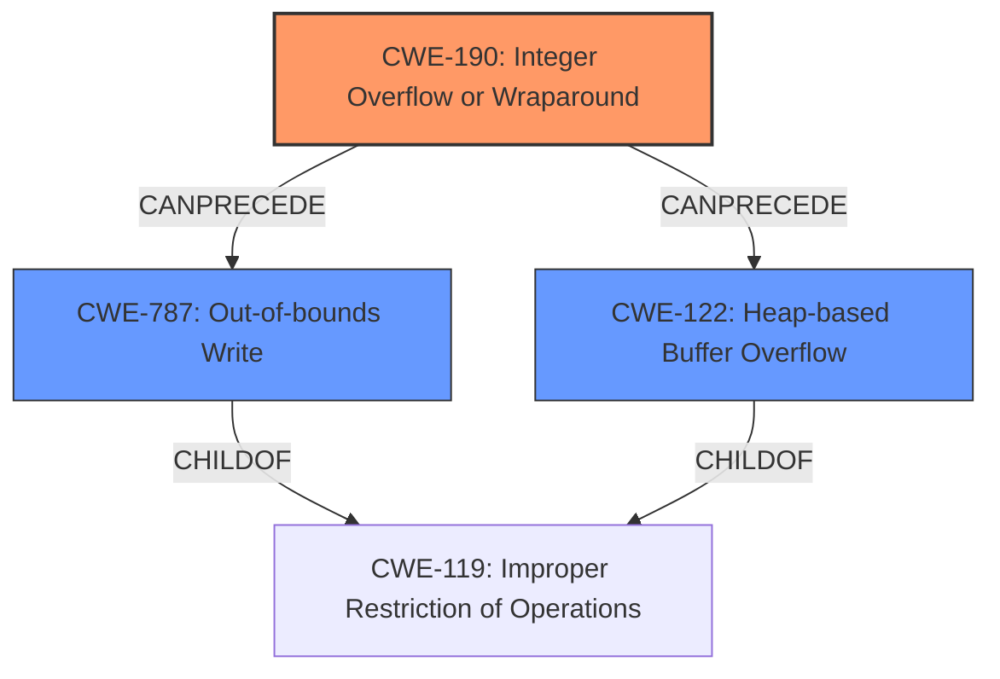

# Final Resolution for CVE-2022-0608

# Summary
| CWE ID | CWE Name | Confidence | CWE Abstraction Level | CWE Vulnerability Mapping Label | CWE-Vulnerability Mapping Notes |
|---|---|---|---|---|---|
| CWE-190 | Integer Overflow or Wraparound | 0.9 | Base | Primary | Allowed |
| CWE-787 | Out-of-bounds Write | 0.5 | Base | Secondary | Allowed |
| CWE-122 | Heap-based Buffer Overflow | 0.5 | Variant | Secondary | Allowed |

## Evidence and Confidence

*   **Confidence Score:** 0.8
*   **Evidence Strength:** HIGH

## Relationship Analysis
The primary weakness is **CWE-190 (Integer Overflow or Wraparound)**, a Base level CWE. The analysis also considered **CWE-787 (Out-of-bounds Write)** and **CWE-122 (Heap-based Buffer Overflow)** as secondary weaknesses. **CWE-787** is a child of **CWE-119 (Improper Restriction of Operations within the Bounds of a Memory Buffer)**, which shows how an integer overflow can lead to an out-of-bounds write. The relationship between **CWE-190**, **CWE-787**, and **CWE-122** indicates a potential vulnerability chain where an integer overflow results in heap corruption, possibly through an out-of-bounds write or a heap-based buffer overflow.

## Vulnerability Chain
The vulnerability chain starts with **CWE-190 (Integer Overflow or Wraparound)**. This leads to heap corruption, which manifests as **CWE-787 (Out-of-bounds Write)** or **CWE-122 (Heap-based Buffer Overflow)**. The initial flaw is the integer overflow, and the impacts are heap corruption and potential out-of-bounds writes or heap-based buffer overflows.

## Summary of Analysis
The initial analysis correctly identifies **CWE-190 (Integer Overflow or Wraparound)** as the primary **ROOTCAUSE**, as supported by the vulnerability description which states "**integer overflow** in Mojo in Google Chrome prior to 98.0.4758.102 allowed a remote attacker to potentially exploit **heap corruption** via a crafted HTML page." The CVE reference summary also confirms the root cause as "**Integer overflow**".

The criticism suggested lowering the confidence level for **CWE-787 (Out-of-bounds Write)**, which I agree with. The heap corruption is a likely outcome, but not guaranteed to be an out-of-bounds write. The confidence level for **CWE-787** is thus adjusted to 0.5.

The suggestion to consider **CWE-680 (Integer Overflow to Buffer Overflow)** is valid. However, given that **CWE-680** is a compound CWE and its usage is discouraged, I will refrain from using it. I agree with the assessment that the current CWEs at their level of specificity are the right choice based on the provided information.

The relationships between **CWE-190**, **CWE-787**, and **CWE-122** confirm the possibility of a vulnerability chain. The abstraction levels of the selected CWEs are appropriate, with **CWE-190** being a Base CWE and **CWE-122** being a Variant CWE.