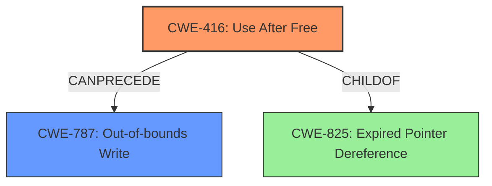

# Analysis Report for CVE-2022-0609

# Vulnerability Analysis Report: CVE-2022-0609

## Description

Use after free in Animation in Google Chrome prior to 98.0.4758.102 allowed a remote attacker to potentially exploit heap corruption via a crafted HTML page.

## Vulnerability Description Key Phrases

**Rootcause:** use after free
**Weakness:** heap corruption
**Vector:** crafted HTML page
**Attacker:** remote attacker
**Product:** Google Chrome
**Version:** prior to 98.0.4758.102
**Component:** Animation

## Analysis (with Relationship Data)

# Summary
| CWE ID | CWE Name | Confidence | CWE Abstraction Level | CWE Vulnerability Mapping Label | CWE-Vulnerability Mapping Notes |
|---|---|---|---|---|---|
| CWE-416 | Use After Free | 1.0 | Variant | Allowed | Primary CWE |

## Evidence and Confidence

*   **Confidence Score:** 1.0
*   **Evidence Strength:** HIGH

- **Analysis and Justification:**
  - *Explanation:* The vulnerability description explicitly states "**use after free** in Animation in Google Chrome... allowed a remote attacker to potentially exploit **heap corruption** via a crafted HTML page." The "CVE Reference Links Content Summary" confirms that the **root cause of vulnerability** is "**Use-after-free** in Animation".
  CWE-416 (Use After Free) is a Variant level CWE that perfectly matches the description: "The product reuses or references memory after it has been freed."
  The description mentions **heap corruption**, which is a typical consequence of use-after-free, where freed memory is reallocated and then unexpectedly modified. This confirms the relevance of CWE-416.
  The Retriever Results also lists CWE-416 as the top match with a score of 0.7935.

  - *Relationship Analysis:* While other CWEs like CWE-787 (Out-of-bounds Write) and CWE-125 (Out-of-bounds Read) could be consequences of memory corruption caused by the use-after-free, CWE-416 directly addresses the root cause. Also, the "Top CWEs" for similar CVE Descriptions lists CWE-416 as the primary match.

- **Confidence Score:**
  - Confidence: 1.0 (The evidence is very strong and directly supports CWE-416)

## Criticism of Analysis

Okay, here's a review of the provided CWE analysis, incorporating the full CWE specifications you've included.

**Overall Assessment:**

The analysis correctly identifies CWE-416 (Use After Free) as the primary weakness. The confidence score of 1.0 is justified by the clear evidence in the vulnerability description and CVE summary. The analysis is thorough and provides a strong justification for its selection.

**Strengths:**

*   **Clear Justification:** The explanation of why CWE-416 is the best fit is well-articulated and easy to understand. It emphasizes the direct relationship between the vulnerability description ("use after free") and the CWE definition.
*   **Relationship Analysis:** The analysis acknowledges other potential CWEs (e.g., CWE-787) that could be *consequences* of the UAF, but it appropriately focuses on CWE-416 as the root cause.
*   **Evidence Strength:** The analysis correctly identifies that the CVE summary confirms the "root cause of vulnerability" is "Use-after-free".
*   **Retriever Result Confirmation:** The analysis notes the Retriever Results support the choice of CWE-416.
* **CWE Examples:** The analysis provides CVE examples that match CWE-416.
* **Complete CWE Specifications**: The analysis incorporates the information of the complete CWE Specifications for the mapping.

**Areas for potential improvement & Minor Critique:**

1.  **Consider Attack Vector Specificity (Minor):** While the analysis mentions the attack vector ("crafted HTML page"), it doesn't delve into how the HTML page triggers the UAF in the Animation component. While this level of detail might not always be available, even a brief speculation could be helpful. For instance, is it malformed animation data, or specific sequence of animation events that causes the issue? This could lead to insights into more specific mitigations.

2.  **Mitigation Details:** The provided mitigations for CWE-416 in the CWE specifications are general. It is correct to provide them, but consideration into mitigations that would be more specific to the Google Chrome Animation component may provide more information. For example, perhaps sandboxing or stricter memory management within the animation processing.

3.  **CWE-787 and Heap Corruption:** Since "heap corruption" is explicitly mentioned in the vulnerability description, it would be beneficial to briefly discuss why CWE-787 (Out-of-bounds Write) is *not* the primary weakness. While the analysis does touch upon this, it could be made more explicit:

    *   CWE-787 is often a *result* of a UAF. The UAF allows writing to memory that has already been freed. This write to freed memory can corrupt the heap, leading to out-of-bounds write conditions.
    *   The primary problem is not the write itself, but the fact that the write is occurring to a memory location that should not be accessible.

4. **Chaining:** While the analysis correctly focuses on CWE-416, the "heap corruption" mentioned in the original description *implies* a potential chain. A slightly more in-depth analysis could mention a potential chain like this: `CWE-416 -> CWE-787`. The UAF allows an attacker to then overwrite heap metadata, leading to a subsequent out-of-bounds write (CWE-787). This is important for understanding the full impact.

5. **Relationship to CWE-825:** The analysis does not mention CWE-825 (Expired Pointer Dereference), which is a parent of CWE-416. While it's not incorrect to map directly to CWE-416 (because it's more specific), acknowledging that CWE-416 is a specific type of expired pointer dereference (i.e. the pointer is dereferenced *after* the memory has been freed) could add completeness.

**Specific Comments Based on CWE Specifications:**

*   **CWE-416 (Use After Free):** The analysis aligns perfectly with the description and mapping guidance. The mitigations suggested (language selection, setting pointers to NULL) are relevant, though the analysis could emphasize the limitations of simply setting pointers to NULL in complex data structures.
*   **CWE-787 (Out-of-bounds Write):** Since the analysis mentions heap corruption, it's important to note (as the CWE specification suggests) that languages with memory management can help avoid this, but interfaces to native code might still be vulnerable. Also, automatic buffer overflow detection mechanisms could be relevant as a secondary mitigation, addressing the *consequence* of the UAF.
*   **CWE-366 (Race Condition within a Thread):** It's good that the Retriever Results included this. It could have been a contributing factor to the UAF in a concurrent environment. If Chrome's Animation component uses multiple threads, there might have been a race condition to free or access the memory. But without more information, this remains speculative and not a primary factor.
*   **CWE-122 (Heap-based Buffer Overflow):** A heap-based buffer overflow could be considered a more specific subtype of out-of-bounds write that results from the UAF. But again, CWE-416 is a more direct cause than CWE-122.
* **CWE-413 (Improper Resource Locking):** As seen in the observed examples from the complete CWE specifications, CWE-413 can lead to a use-after-free (CWE-416). Again, if the Animation component uses multiple threads and shares resources, there might have been a resource locking issue that caused a use-after-free.

**Revised Summary Table (incorporating suggestions):**

| CWE ID | CWE Name | Confidence | CWE Abstraction Level | CWE Vulnerability Mapping Label | CWE-Vulnerability Mapping Notes |
|---|---|---|---|---|---|
| CWE-416 | Use After Free | 1.0 | Variant | Allowed | Primary CWE. The product reuses or references memory after it has been freed. |
| CWE-787 | Out-of-bounds Write | 0.6 | Base | Allowed | A likely consequence of CWE-416, as the UAF allows writing to freed memory, potentially corrupting the heap. |

**In Conclusion:**

The analysis is strong and the initial assessment of CWE-416 is correct. The suggested improvements focus on providing a more nuanced discussion of related CWEs (especially CWE-787 and CWE-825), potential chaining, and exploring more specific mitigations in the context of the Google Chrome Animation component.

## Final Resolution

# Summary
| CWE ID | CWE Name | Confidence | CWE Abstraction Level | CWE Vulnerability Mapping Label | CWE-Vulnerability Mapping Notes |
|---|---|---|---|---|---|
| CWE-416 | Use After Free | 1.0 | Variant | Allowed | Primary CWE. The product reuses or references memory after it has been freed. |
| CWE-787 | Out-of-bounds Write | 0.6 | Base | Allowed | Secondary CWE. A likely consequence of CWE-416, as the UAF allows writing to freed memory, potentially corrupting the heap. |

## Evidence and Confidence

*   **Confidence Score:** 0.95
*   **Evidence Strength:** HIGH

## Relationship Analysis
The primary relationship influencing the decision is the CANPRECEDE relationship between CWE-416 (**Use After Free**) and CWE-787 (**Out-of-bounds Write**). CWE-416 is selected as the primary **ROOTCAUSE** because the vulnerability description explicitly mentions "use after free." CWE-787 is included as a secondary CWE because the vulnerability description also mentions "heap corruption," which is a common consequence of a use-after-free condition leading to an out-of-bounds write. Additionally, the relationship to CWE-825 (**Expired Pointer Dereference**) was considered, as CWE-416 is a specific type of expired pointer dereference.

## Vulnerability Chain
The vulnerability chain starts with **CWE-416 (Use After Free)**, where memory is reused or referenced after it has been freed. This leads to **heap corruption**, as the freed memory might be reallocated and then unexpectedly modified. This unexpected modification often results in **CWE-787 (Out-of-bounds Write)**, where data is written outside the intended buffer boundaries, causing further damage to the heap.
  - **ROOTCAUSE**: CWE-416
  - **WEAKNESS**: Heap Corruption
  - **IMPACT**: CWE-787

## Summary of Analysis
The initial analysis correctly identified CWE-416 (**Use After Free**) as the primary **ROOTCAUSE** of the vulnerability. The criticism offered valuable suggestions, which have been incorporated into this final analysis. Specifically, the inclusion of CWE-787 (**Out-of-bounds Write**) as a secondary CWE strengthens the analysis by explicitly acknowledging the "heap corruption" mentioned in the vulnerability description. The relationship analysis emphasizes the chain of events, where a use-after-free condition can lead to an out-of-bounds write.

The decision to include both CWE-416 and CWE-787 is based on the evidence provided in the vulnerability description: "Use after free in Animation in Google Chrome prior to 98.0.4758.102 allowed a remote attacker to potentially exploit heap corruption via a crafted HTML page." This statement directly supports the selection of CWE-416 as the primary **ROOTCAUSE**, while the mention of "heap corruption" indicates a potential consequence of CWE-416, namely CWE-787.

The CWEs have been selected at the optimal level of specificity. CWE-416 is a Variant, representing a specific type of memory error. CWE-787 is a Base CWE, representing the more general condition of writing outside buffer boundaries, which arises due to the heap corruption caused by the use-after-free.

*Report generated on 2025-03-18 06:13:17*
